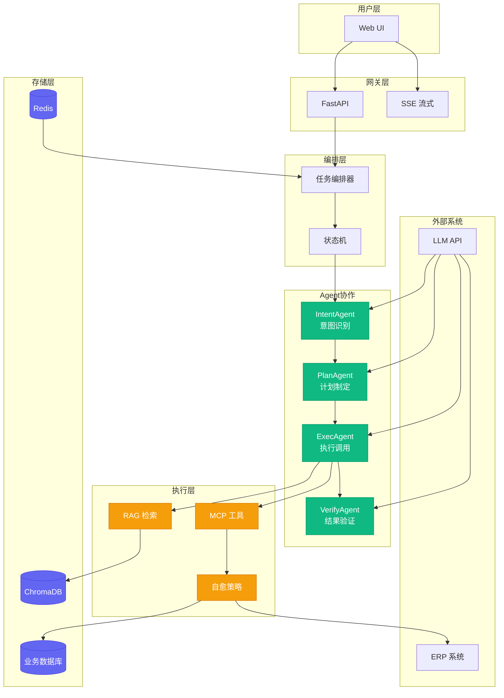

# OpsPilot

<div align="center">

**企业级运维智能领航系统**

基于 LangChain + AgentScope 的多智能体运维平台

[](LICENSE)
[](https://www.python.org/)
[](https://react.dev/)

</div>

---

## 简介

OpsPilot 是一个企业级多智能体运维平台，通过 **MCP 协议** 连接大模型与企业系统，解决单智能体工具过载、决策复杂的问题，提供可迁移的四步落地方法论。

**核心特性**：
- 🔧 **工具调用为核心** - 基于 MCP 协议实现标准化工具接口
- 🤖 **多智能体协作** - Intent/Plan/Exec/Verify 四阶段流水线
- 🛡️ **生产级运行时** - 工具沙箱、SSE 流式、OpenTelemetry 追踪
- 🔄 **自愈策略** - 6 种自动降级与恢复机制

---

## 架构图



---

## 快速开始

### 环境要求

- Python 3.10+
- Node.js 20+
- Redis（可选）

### 安装运行

```bash
# 克隆项目
git clone https://github.com/Aiting-for-you/OpsPilot.git
cd OpsPilot

# 后端
pip install -e .
uvicorn opspilot.api:app --reload --port 8000

# 前端
cd frontend && npm install && npm run dev
```

### 访问地址

| 服务 | 地址 |
|------|------|
| 前端 UI | http://localhost:5173 |
| API 文档 | http://localhost:8000/docs |

---

## 技术栈

| 层次 | 技术 | 说明 |
|------|------|------|
| 决策层 | AgentScope | 多智能体编排、状态机 |
| 执行层 | LangChain | LCEL 链式调用、工具封装 |
| 工具协议 | MCP | Model Context Protocol |
| 向量存储 | ChromaDB | 知识库检索 |
| 会话存储 | Redis | 短期记忆 |
| 前端 | React 19 | TypeScript + Tailwind |

---

## 项目结构

```
OpsPilot/
├── opspilot/           # 后端核心
│   ├── agents/         # Agent 定义
│   ├── runtime/        # 运行时（沙箱/流式/追踪）
│   ├── tools/          # MCP 工具
│   ├── memory/         # 记忆系统
│   └── api/            # FastAPI 路由
├── frontend/           # React 前端
└── docs/               # 设计文档
```

---

## 核心功能

### 工具沙箱

```python
from opspilot.runtime import create_sandbox

sandbox = create_sandbox("auto")
result = await sandbox.execute_shell("kubectl get pods")
```

### SSE 流式输出

```python
from opspilot.runtime import StreamingTaskExecutor

async for event in StreamingTaskExecutor().execute_with_stream(task_id, fn):
    yield event
```

### 外部 MCP Server

```python
from opspilot.mcp import get_external_mcp_manager

manager = get_external_mcp_manager()
manager.add_server({
    "name": "filesystem",
    "command": "npx",
    "args": ["-y", "@modelcontextprotocol/server-filesystem", "/path"],
})
```

---

## 文档

| 文档 | 内容 |
|------|------|
| [架构设计](./docs/02_ARCHITECTURE.md) | 双框架分层设计、幻觉抑制 |
| [MCP 工具](./docs/03_MODULES/mcp_tools.md) | 工具调用、降级策略 |
| [开发日志](./dev/DEV_LOG.md) | 技术决策记录 |

---

## 项目状态

| 模块 | 状态 |
|------|------|
| 核心架构 | ✅ 完成 |
| Runtime | ✅ 完成 |
| 前端 UI | ✅ 完成 |
| MCP 工具 | ✅ 完成 |
| 测试覆盖 | ⏳ 进行中 |

---

## License

[Apache 2.0](LICENSE)
