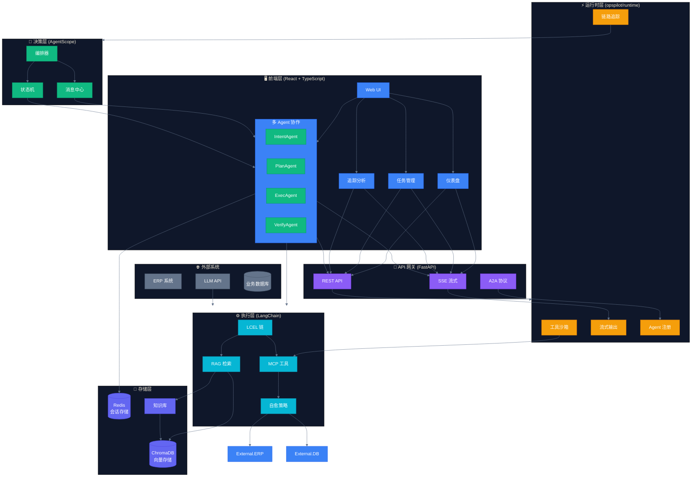
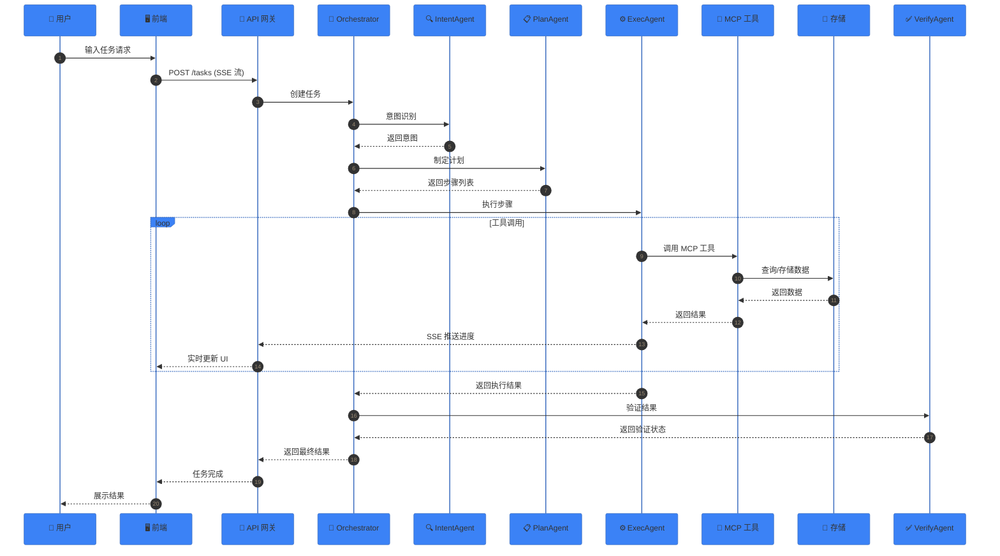
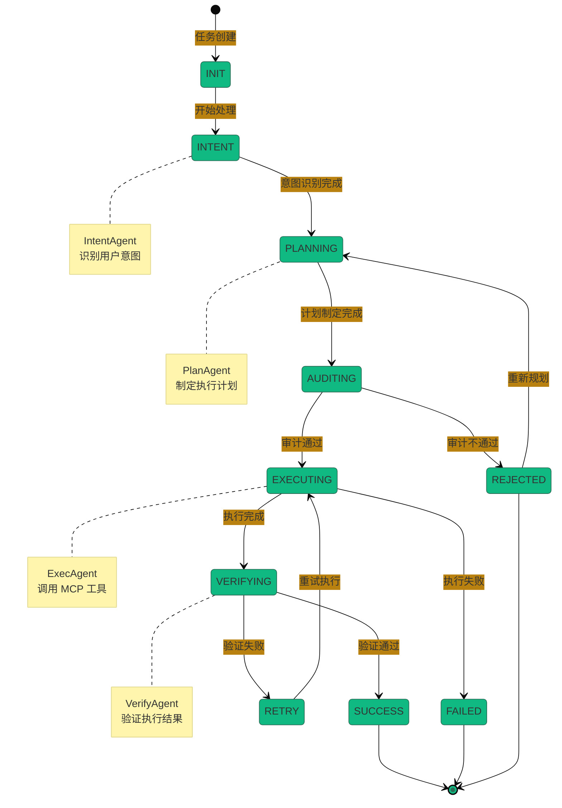
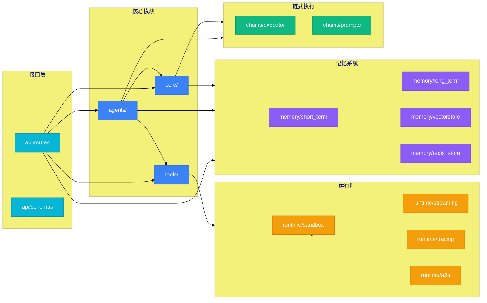

# OpsPilot: 企业级运维智能领航系统

<div align="center">

**基于 LangChain + AgentScope 的企业级多智能体运维平台**

[](https://github.com/Aiting-for-you/OpsPilot)
[](LICENSE)
[](https://www.python.org/)
[](https://react.dev/)

</div>

---

## 📖 目录

- [核心价值](#核心价值)
- [系统架构](#系统架构)
- [技术栈](#技术栈)
- [项目结构](#项目结构)
- [快速开始](#快速开始)
- [核心模块](#核心模块)
- [文档导航](#文档导航)

---

## 核心价值

| 价值点 | 说明 |
|--------|------|
| 🔧 **工具调用为核心** | 基于 MCP 协议实现大模型与企业系统的连接 |
| 🤖 **多智能体协作** | 解决单智能体工具过载、决策复杂的问题 |
| 📋 **可迁移方法论** | 四步落地法，可快速迁移到其他垂直场景 |
| 🛡️ **生产级运行时** | 工具沙箱、SSE 流式、OpenTelemetry 追踪 |

---

## 系统架构

### 总体架构图



### 数据流图



### Agent 协作流程



### 模块依赖关系



---

## 技术栈

<table>
<tr>
<th width="100">层次</th>
<th width="150">技术</th>
<th>说明</th>
</tr>
<tr>
<td>🎯 决策层</td>
<td><strong>AgentScope</strong></td>
<td>多智能体编排、MsgHub 消息中心、FSM 状态机</td>
</tr>
<tr>
<td>⚙️ 执行层</td>
<td><strong>LangChain</strong></td>
<td>LCEL 链式调用、RAG 检索、MCP 工具封装</td>
</tr>
<tr>
<td>🚀 运行时</td>
<td><strong>AgentScope Runtime</strong></td>
<td>工具沙箱、SSE 流式、OpenTelemetry 追踪、A2A 协议</td>
</tr>
<tr>
<td>🖥️ 前端</td>
<td><strong>React 19 + TypeScript</strong></td>
<td>Vite 构建、Tailwind CSS、Zustand 状态管理</td>
</tr>
<tr>
<td>💾 向量存储</td>
<td><strong>ChromaDB</strong></td>
<td>知识库向量检索、LangChain 原生支持</td>
</tr>
<tr>
<td>⚡ 会话存储</td>
<td><strong>Redis</strong></td>
<td>短期记忆、分布式会话</td>
</tr>
<tr>
<td>🔧 工具协议</td>
<td><strong>MCP</strong></td>
<td>Model Context Protocol 标准化工具接口</td>
</tr>
</table>

---

## 项目结构

```
OpsPilot/
├── 📁 opspilot/                    # 后端核心代码
│   ├── 📁 agents/                  # Agent 定义
│   │   ├── agentscope_adapter.py   # AgentScope 适配器
│   │   ├── msg_hub.py              # 消息中心
│   │   └── collaboration.py        # 协作模式
│   ├── 📁 runtime/                 # 运行时模块 ⭐
│   │   ├── sandbox.py              # 工具沙箱
│   │   ├── streaming.py            # SSE 流式输出
│   │   ├── tracing.py              # OpenTelemetry 追踪
│   │   └── a2a.py                  # A2A 协议
│   ├── 📁 chains/                  # LangChain LCEL
│   │   ├── executor.py             # 链式执行器
│   │   └── prompts.py              # 提示模板
│   ├── 📁 tools/                   # MCP 工具
│   │   ├── mcp.py                  # MCP 协议封装
│   │   ├── healing.py              # 6种自愈策略
│   │   └── langchain_tools.py      # LangChain 适配
│   ├── 📁 memory/                  # 记忆系统
│   │   ├── vectorstore.py          # ChromaDB 适配
│   │   ├── redis_store.py          # Redis 适配
│   │   └── consolidation.py        # 记忆巩固
│   ├── 📁 core/                    # 核心引擎
│   ├── 📁 api/                     # FastAPI 路由
│   └── 📁 prompts/                 # 提示词工程
├── 📁 frontend/                    # React 前端
│   ├── 📁 src/
│   │   ├── 📁 pages/               # 页面组件
│   │   │   ├── Dashboard.tsx       # 仪表盘
│   │   │   ├── Tasks.tsx           # 任务管理
│   │   │   ├── Tools.tsx           # 工具调用
│   │   │   ├── Agents.tsx          # Agent 监控
│   │   │   └── Tracing.tsx         # 追踪分析 ⭐
│   │   ├── 📁 hooks/               # 自定义 Hooks
│   │   │   └── useSSE.ts           # SSE 流订阅 ⭐
│   │   └── 📁 services/            # API 服务
│   └── 📦 package.json
├── 📁 docs/                        # 设计文档
├── 📁 tests/                       # 测试用例
├── 📁 benchmarks/                  # 性能基准
└── 📄 pyproject.toml               # Python 依赖
```

---

## 快速开始

### 环境要求

- Python 3.10+
- Node.js 20+
- Redis (可选，默认使用内存存储)

### 后端启动

```bash
# 克隆项目
git clone https://github.com/Aiting-for-you/OpsPilot.git
cd OpsPilot

# 安装依赖
pip install -e .

# 启动服务
uvicorn opspilot.api:app --reload --port 8000
```

### 前端启动

```bash
cd frontend

# 安装依赖
npm install

# 开发模式
npm run dev

# 生产构建
npm run build
```

### 访问地址

| 服务 | 地址 |
|------|------|
| 前端 UI | http://localhost:5173 |
| API 文档 | http://localhost:8000/docs |
| 健康检查 | http://localhost:8000/api/v1/health |

---

## 核心模块

### 🔧 工具沙箱

安全隔离执行运维脚本：

```python
from opspilot.runtime import create_sandbox

sandbox = create_sandbox("auto")  # 自动选择 Docker/本地
result = await sandbox.execute_shell("kubectl get pods")
```

### 📡 SSE 流式输出

实时推送任务执行进度：

```python
from opspilot.runtime import StreamingTaskExecutor

executor = StreamingTaskExecutor()
async for event in executor.execute_with_stream(task_id, execute_fn):
    yield event  # SSE 格式
```

### 🔍 OpenTelemetry 追踪

链路追踪与性能分析：

```python
from opspilot.runtime import traced, get_llm_tracer

@traced("my_function")
async def my_function():
    # 自动追踪
    pass

tracer = get_llm_tracer()
tracer.trace_llm_call(model="gpt-4", prompt="...", completion="...", ...)
```

### 🤝 A2A 协议

Agent 间标准化通信：

```python
from opspilot.runtime import A2AServer, create_agent_card

card = create_agent_card(
    agent_id="intent-agent-001",
    name="IntentAgent",
    skills=[{"id": "intent_recognition", "name": "意图识别"}]
)
server = A2AServer(card, registry)
await server.start()
```

---

## 文档导航

| 文档 | 内容 | 阅读时间 |
|------|------|---------|
| [架构设计](./docs/02_ARCHITECTURE.md) | 双框架分层设计、幻觉抑制机制 | 10 分钟 |
| [MCP 工具体系](./docs/03_MODULES/mcp_tools.md) | 工具调用为核心、降级策略 | 8 分钟 |
| [开发日志](./dev/DEV_LOG.md) | 完整开发记录与技术决策 | 15 分钟 |

---

## 项目状态

| 模块 | 状态 | 说明 |
|------|------|------|
| 核心架构 | ✅ 完成 | AgentScope + LangChain 混合架构 |
| Runtime | ✅ 完成 | 沙箱、流式、追踪、A2A |
| 前端 UI | ✅ 完成 | React 19 + TypeScript |
| MCP 工具 | 🚧 进行中 | 核心工具已实现 |
| 测试覆盖 | ⏳ 待开始 | 单元测试、集成测试 |

---

## 贡献指南

欢迎提交 Issue 和 Pull Request！

1. Fork 本仓库
2. 创建特性分支 (`git checkout -b feature/AmazingFeature`)
3. 提交更改 (`git commit -m 'feat: 添加某某功能'`)
4. 推送到分支 (`git push origin feature/AmazingFeature`)
5. 提交 Pull Request

---

## License

Apache 2.0

