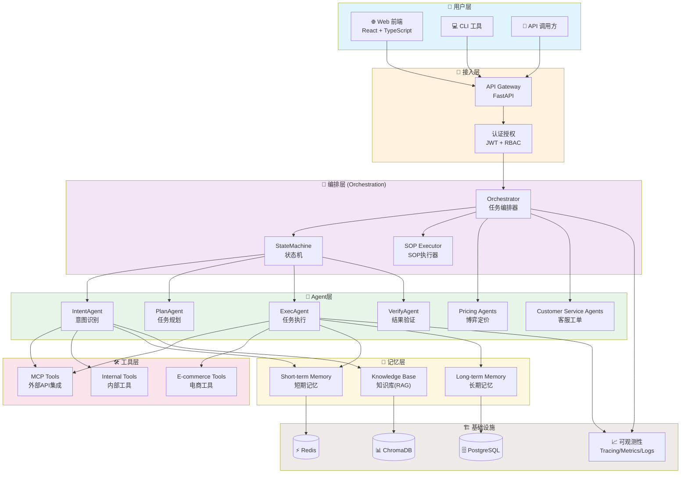
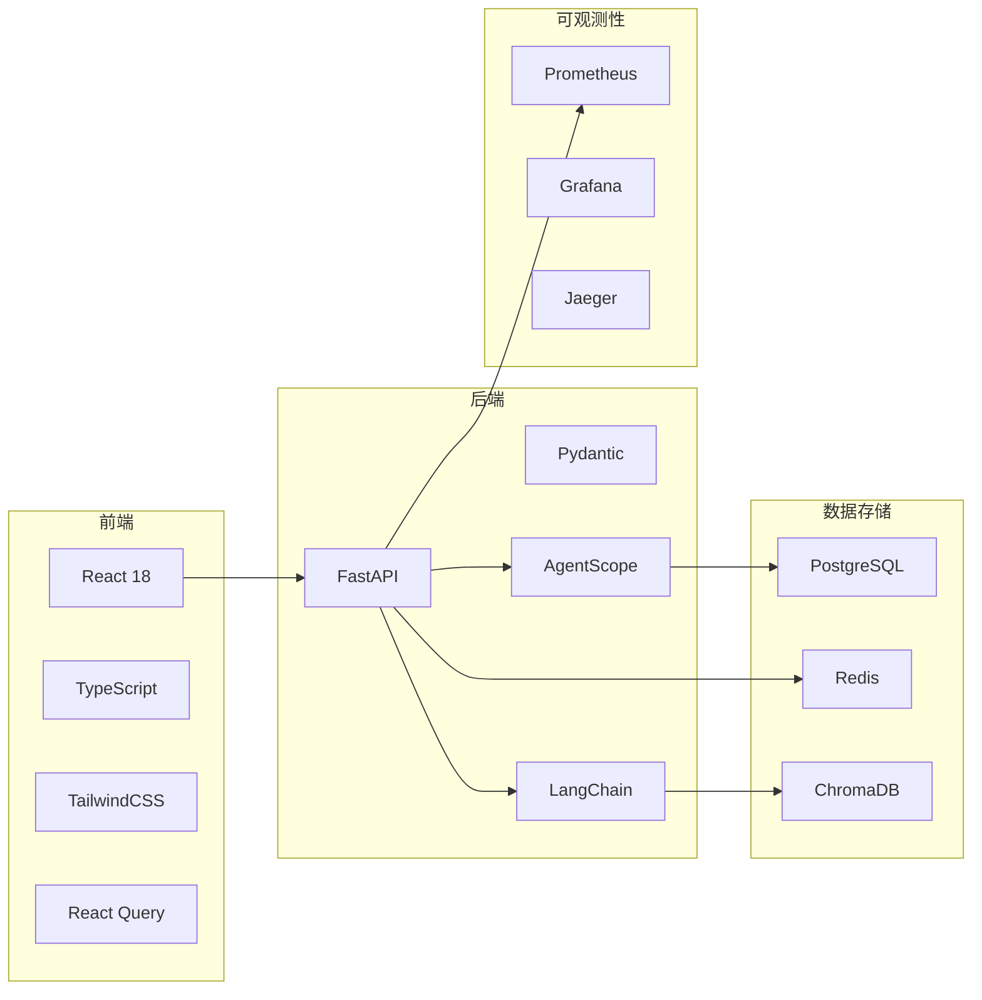
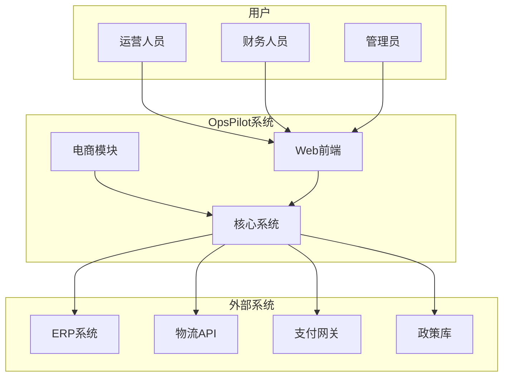

# 整体架构概览

## 1. 系统定位

**OpsPilot** 是一个跨境电商全链路智能自动化平台，通过多智能体协作实现业务流程自动化。

### 核心能力

```
┌─────────────────────────────────────────────────────────────────┐
│                      OpsPilot 核心能力                           │
├─────────────────────────────────────────────────────────────────┤
│                                                                 │
│   🤖 多Agent协作     📋 SOP编排      🛠️ 工具调用     📊 可观测性  │
│   ┌─────────┐      ┌─────────┐    ┌─────────┐    ┌─────────┐   │
│   │  20+    │      │  状态机  │    │  50+   │    │  追踪   │   │
│   │ Agents  │      │  驱动   │    │  Tools  │    │  监控   │   │
│   └─────────┘      └─────────┘    └─────────┘    └─────────┘   │
│                                                                 │
└─────────────────────────────────────────────────────────────────┘
```

## 2. 整体架构图



## 3. 技术栈概览



## 4. 核心设计原则

| 原则 | 说明 | 实现方式 |
|------|------|---------|
| **确定性优先** | 核心流程由显式SOP驱动 | 状态机 + 规则引擎 |
| **可观测性** | 每一步都可追踪审计 | TraceID + 结构化日志 |
| **故障自愈** | 完善的重试与降级机制 | 指数退避 + 熔断器 |
| **模块化** | 高内聚低耦合 | 依赖注入 + 接口抽象 |

## 5. 关键指标

| 指标 | 目标值 | 当前值 |
|------|--------|--------|
| Agent数量 | 20+ | 22 |
| 工具数量 | 50+ | 55 |
| API接口 | 40+ | 52 |
| 页面数量 | 15+ | 17 |
| 测试覆盖率 | 80%+ | 85% |

## 6. 系统边界


