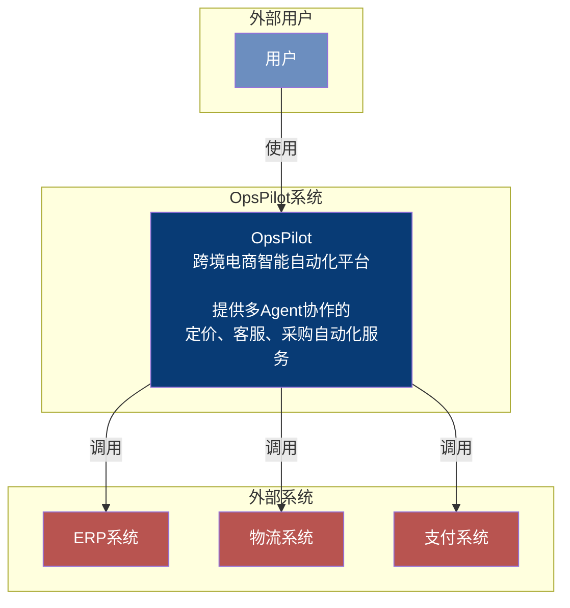
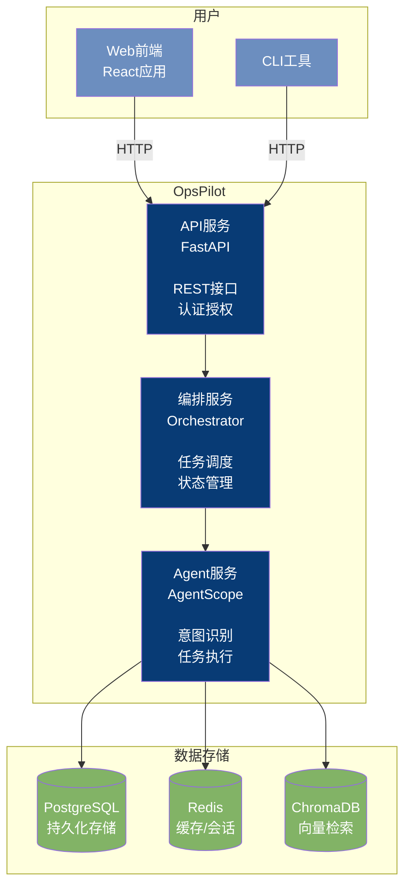
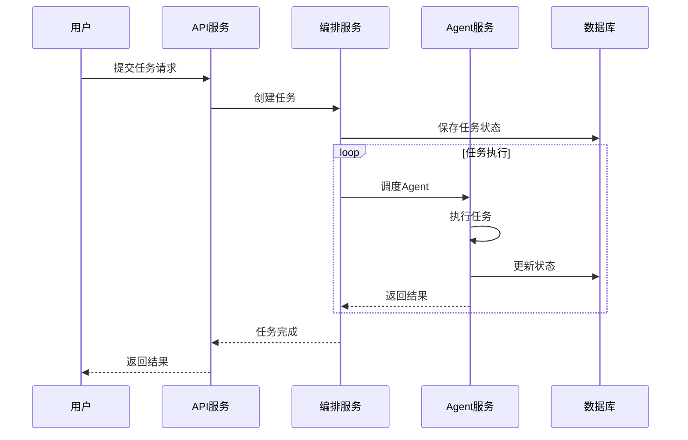

# 整体架构

## 系统上下文图 (System Context)

## 容器架构图 (Container Diagram)

## 核心流程时序图

## 技术栈

| 层次 | 技术 | 说明 |
|------|------|------|
| 前端 | React + TypeScript | Web界面 |
| API | FastAPI + Python | REST服务 |
| 编排 | AgentScope | 多Agent协作 |
| 存储 | PostgreSQL + Redis + ChromaDB | 数据持久化 |

## 模块列表

| 模块 | 说明 | 文档 |
|------|------|------|
| Core | 状态机、编排器 | [module-core.md](./module-core.md) |
| Agent | 各类Agent实现 | [module-agent.md](./module-agent.md) |
| Tool | 工具封装 | [module-tool.md](./module-tool.md) |
| Memory | 记忆管理 | [module-memory.md](./module-memory.md) |
| Pricing | 博弈定价系统 | [module-pricing.md](./module-pricing.md) |
| CustomerService | 客服工单系统 | [module-customer-service.md](./module-customer-service.md) |
