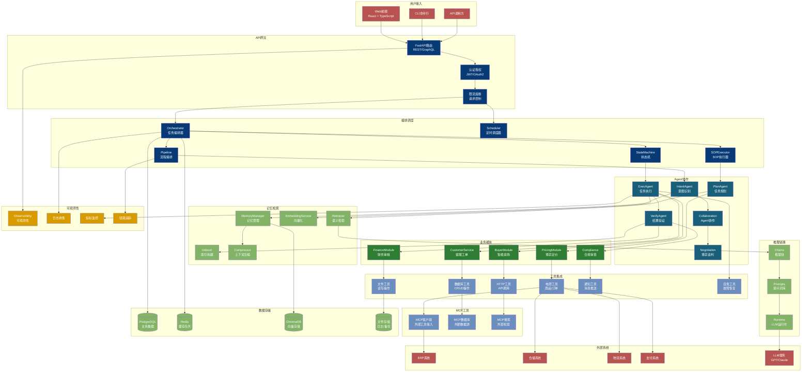
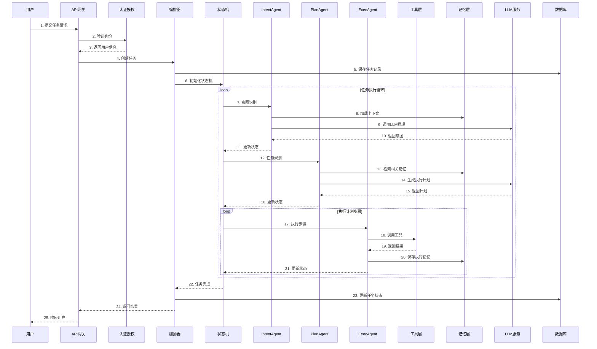

# 整体架构

## 系统架构图

## 核心流程时序图

## 模块清单

| 模块 | 路径 | 核心文件 | 说明 |
|------|------|---------|------|
| **Core** | opspilot/core | orchestrator, state_machine, sop_executor, context, events, llm_config | 核心编排与状态管理 |
| **Agents** | opspilot/agents | base, intent_agent, plan_agent, exec_agent, verify_agent, collaboration, negotiation | Agent协作与执行 |
| **Tools** | opspilot/tools | ecommerce, database, http_client, file_ops, notification, healing, mcp, retriever | 工具封装与集成 |
| **Memory** | opspilot/memory | memory_manager, embeddings, retriever, indexer, compressor | 记忆与检索系统 |
| **Pricing** | opspilot/pricing | pricing_orchestrator, pricing_agents, pricing_tools | 博弈定价系统 |
| **CustomerService** | opspilot/customer_service | ticket_router, ticket_agents, ticket_tools | 客服工单系统 |
| **API** | opspilot/api | routes, handlers, middleware | REST API服务 |
| **Auth** | opspilot/auth | jwt, oauth, permissions | 认证授权 |
| **Chains** | opspilot/chains | llm_chains, rag_chains | 推理链路 |
| **Runtime** | opspilot/runtime | llm_runtime, model_loader | LLM运行时 |
| **Scheduler** | opspilot/scheduler | cron, task_queue | 定时调度 |
| **Observability** | opspilot/observability | logging, metrics, tracing | 可观测性 |
| **Pipeline** | opspilot/pipeline | pipeline_executor, stages | 流程编排 |
| **Reliability** | opspilot/reliability | retry, circuit_breaker | 可靠性保障 |
| **MCP** | opspilot/mcp | mcp_client, mcp_tools | 外部工具接入 |
| **DB** | opspilot/db | models, migrations | 数据模型 |
| **Utils** | opspilot/utils | helpers, validators | 工具函数 |
| **Prompts** | opspilot/prompts | templates, few_shots | 提示词库 |

## 技术栈

| 层次 | 技术选型 | 说明 |
|------|---------|------|
| 前端 | React + TypeScript + Tailwind | Web界面 |
| API | FastAPI + Pydantic | REST服务 |
| 编排 | AgentScope + LangGraph | Agent协作 |
| LLM | GPT-4 / Claude / DeepSeek | 大语言模型 |
| 向量库 | ChromaDB + OpenAI Embeddings | 语义检索 |
| 数据库 | PostgreSQL + SQLAlchemy | 关系存储 |
| 缓存 | Redis | 会话/缓存 |
| 部署 | Docker + Kubernetes | 容器化部署 |
