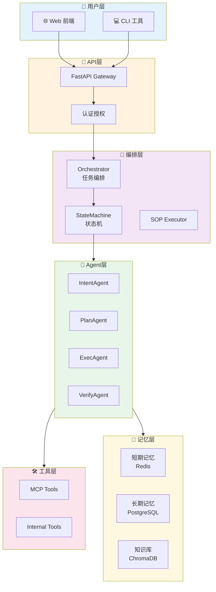
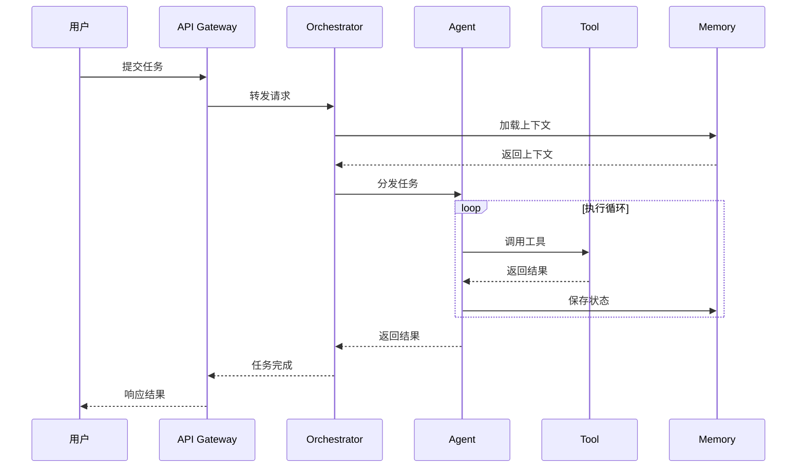

# 整体架构

## 系统架构图

## 核心流程时序图

## 技术栈

| 层次 | 技术 | 说明 |
|------|------|------|
| 前端 | React + TypeScript | Web界面 |
| 后端 | FastAPI + Python | API服务 |
| 编排 | AgentScope | 多Agent协作 |
| 执行 | LangChain | 工具调用 |
| 存储 | PostgreSQL + Redis + ChromaDB | 数据持久化 |

## 核心模块列表

| 模块 | 说明 | 详细文档 |
|------|------|---------|
| Core | 状态机、编排器、SOP执行 | [core模块](./module-core.md) |
| Agent | 各类Agent实现 | [agent模块](./module-agent.md) |
| Tool | 工具封装 | [tool模块](./module-tool.md) |
| Memory | 记忆管理 | [memory模块](./module-memory.md) |
| Pricing | 博弈定价系统 | [pricing模块](./module-pricing.md) |
| CustomerService | 客服工单系统 | [customer-service模块](./module-customer-service.md) |
