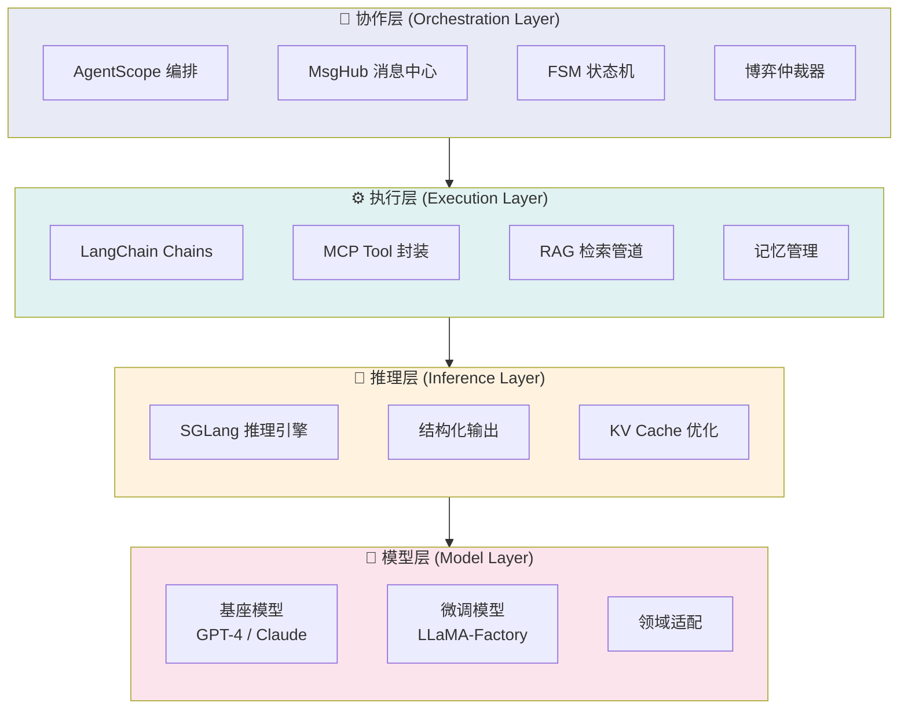
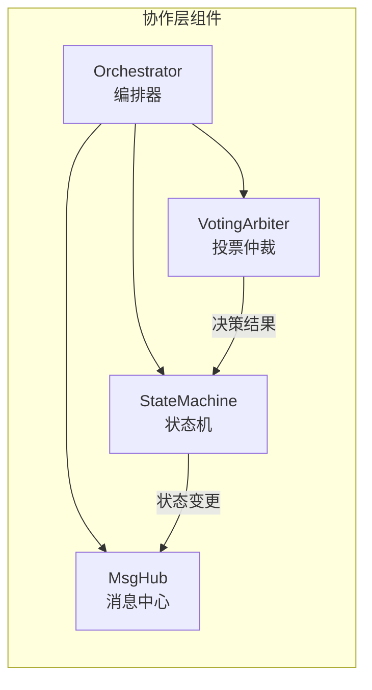
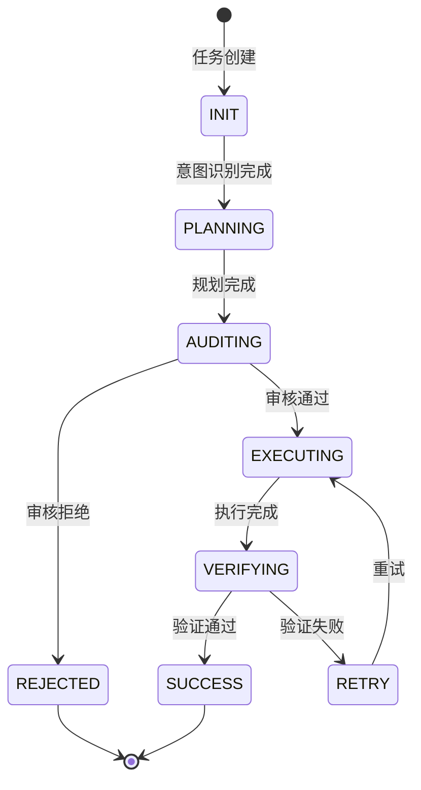
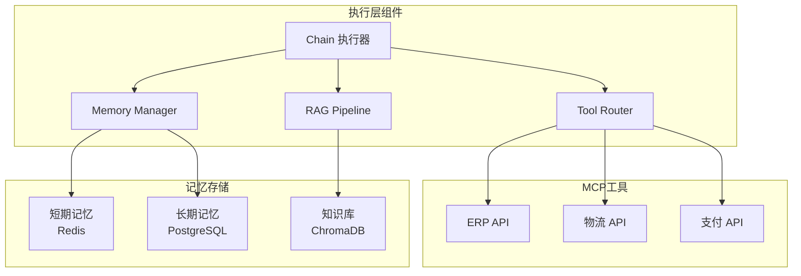
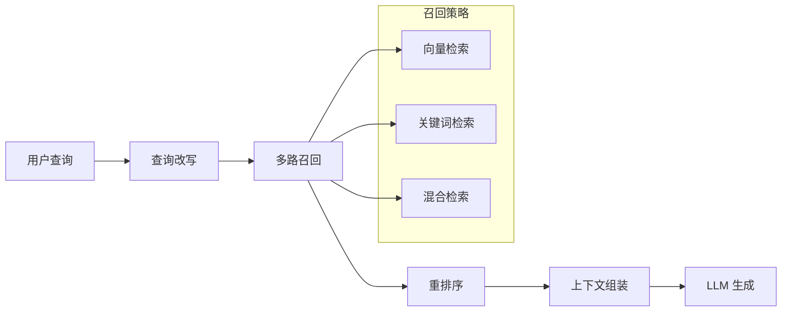
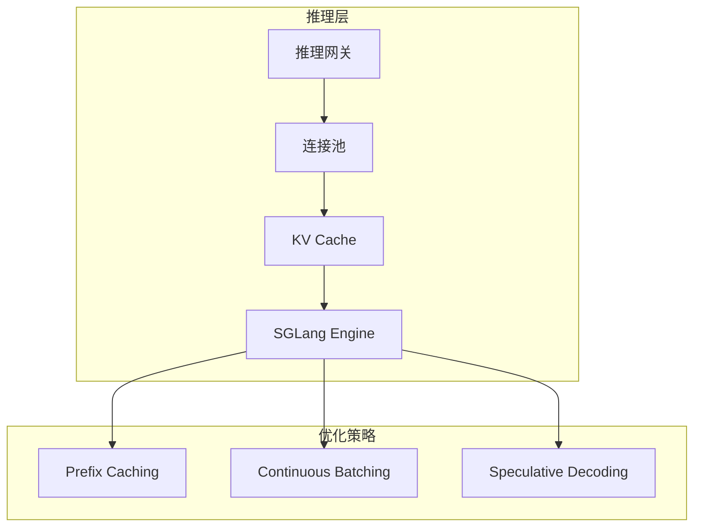
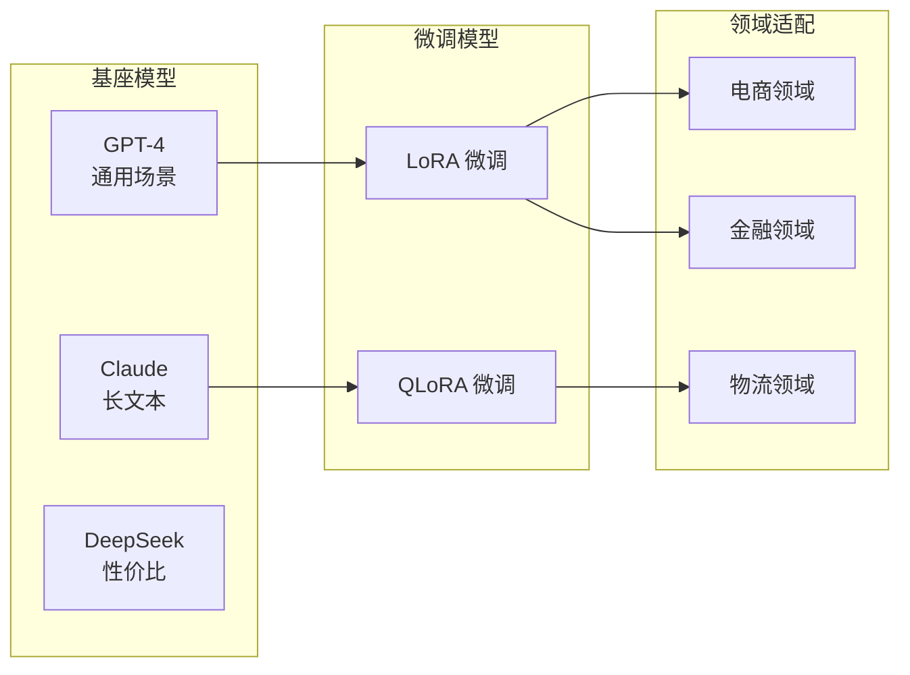
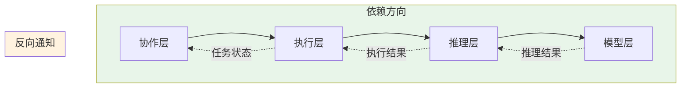

# 分层架构设计

## 1. 四层架构概览

OpsPilot 采用四层架构设计，自上而下分别为：**协作层 → 执行层 → 推理层 → 模型层**。



## 2. 协作层详解

### 职责
- 多智能体任务编排
- 消息路由与广播
- 状态流转控制
- 冲突仲裁与共识

### 核心组件



### 状态机流转



## 3. 执行层详解

### 职责
- 工具调用执行
- RAG 知识检索
- 记忆读写管理
- 确定性逻辑链

### 核心组件



### RAG 检索流程



## 4. 推理层详解

### 职责
- 高性能模型推理
- 结构化输出保证
- 并发请求优化

### 架构设计



### 性能指标

| 指标 | 目标 | 说明 |
|------|------|------|
| TTFT | < 1.5s | 首字延迟 |
| Throughput | > 100 req/s | 吞吐量 |
| P99 Latency | < 5s | 99分位延迟 |

## 5. 模型层详解

### 职责
- 提供基础推理能力
- 领域适配与微调
- 工具调用对齐

### 模型选型



## 6. 层间通信协议

### 请求协议

```json
{
  "trace_id": "uuid-v4",
  "layer": "orchestration",
  "action": "execute_task",
  "payload": {
    "task_type": "procurement",
    "params": {...}
  },
  "context": {
    "session_id": "sess-123",
    "user_id": "user-001"
  }
}
```

### 响应协议

```json
{
  "trace_id": "uuid-v4",
  "status": "success",
  "result": {...},
  "metadata": {
    "layer": "execution",
    "latency_ms": 234,
    "tokens_used": 150
  }
}
```

## 7. 层间依赖关系


