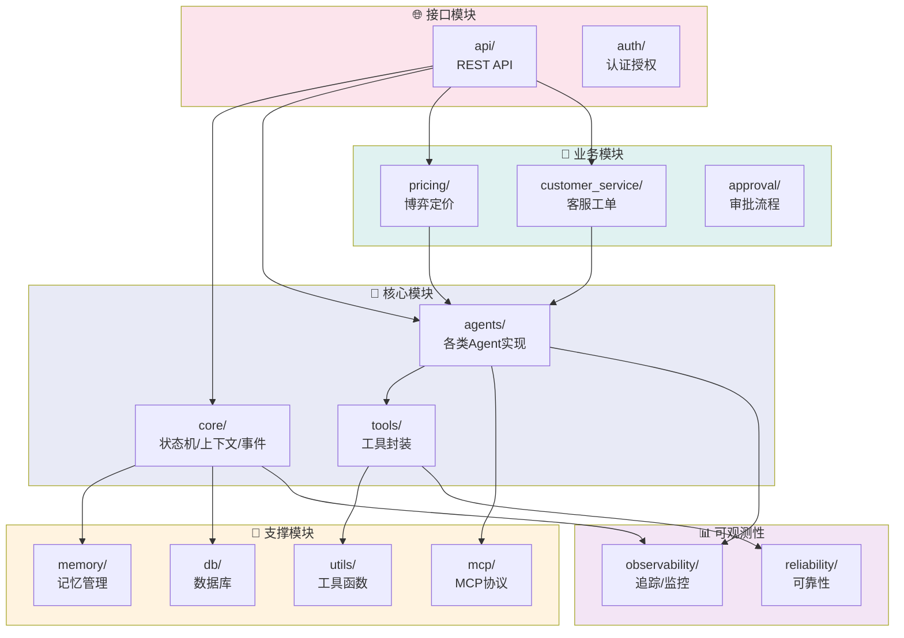
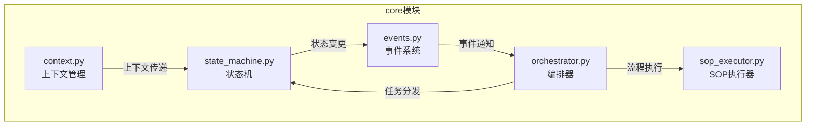
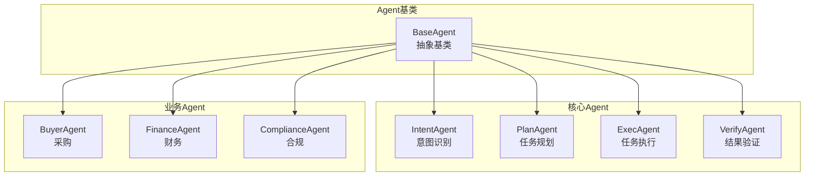
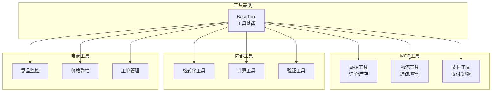
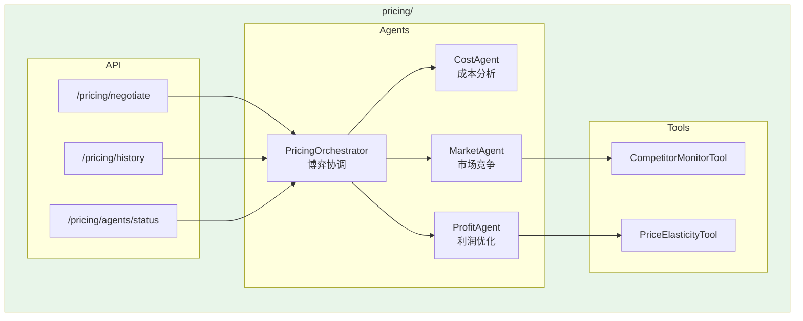
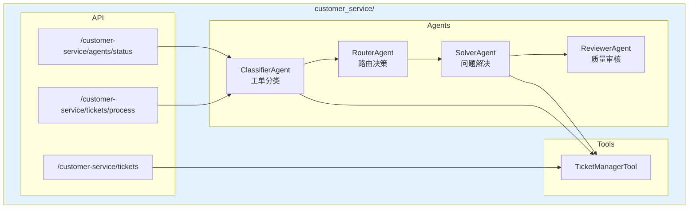
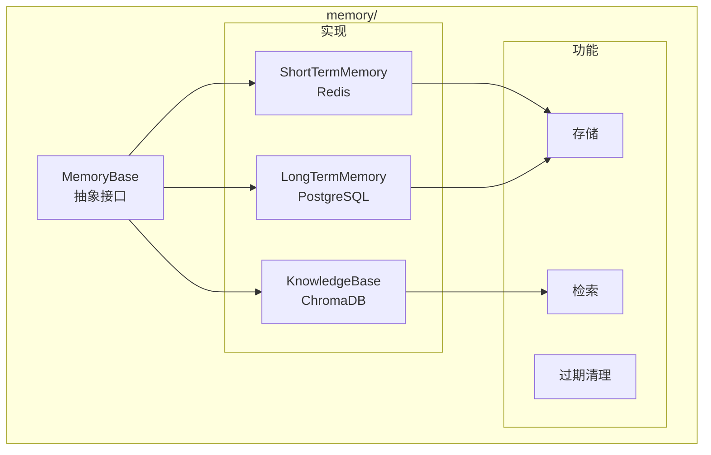
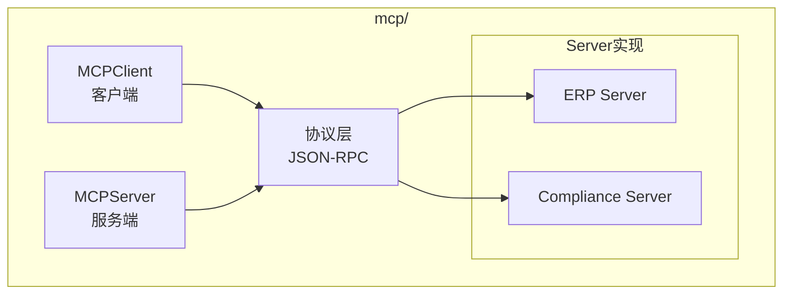

# 模块架构图

## 1. 模块总览



## 2. 核心模块详解

### 2.1 Core 模块



### 2.2 Agents 模块



### 2.3 Tools 模块



## 3. 业务模块详解

### 3.1 Pricing 模块（博弈定价）



### 3.2 Customer Service 模块（客服工单）



## 4. 支撑模块详解

### 4.1 Memory 模块



### 4.2 MCP 模块



## 5. 模块依赖矩阵

| 模块 | core | agents | tools | memory | mcp | api |
|------|------|--------|-------|--------|-----|-----|
| **core** | - | ✗ | ✗ | ✓ | ✗ | ✗ |
| **agents** | ✓ | - | ✓ | ✓ | ✓ | ✗ |
| **tools** | ✗ | ✗ | - | ✗ | ✓ | ✗ |
| **memory** | ✗ | ✗ | ✗ | - | ✗ | ✗ |
| **mcp** | ✗ | ✗ | ✗ | ✗ | - | ✗ |
| **api** | ✓ | ✓ | ✗ | ✓ | ✗ | - |
| **pricing** | ✓ | ✓ | ✓ | ✓ | ✗ | ✗ |
| **customer_service** | ✓ | ✓ | ✓ | ✓ | ✗ | ✗ |

> ✓ = 依赖，✗ = 不依赖

## 6. 模块目录结构

```
opspilot/
├── core/                    # 核心模块
│   ├── state_machine.py     # 状态机
│   ├── context.py           # 上下文管理
│   ├── events.py            # 事件系统
│   ├── orchestrator.py      # 编排器
│   └── sop_executor.py      # SOP执行器
│
├── agents/                  # Agent模块
│   ├── base.py              # 基类
│   ├── intent_agent.py      # 意图识别
│   ├── plan_agent.py        # 任务规划
│   ├── exec_agent.py        # 任务执行
│   └── verify_agent.py      # 结果验证
│
├── tools/                   # 工具模块
│   ├── base.py              # 基类
│   ├── internal.py          # 内部工具
│   └── ecommerce.py         # 电商工具
│
├── memory/                  # 记忆模块
│   ├── base.py              # 基类
│   ├── short_term.py        # 短期记忆
│   └── long_term.py         # 长期记忆
│
├── pricing/                 # 定价模块
│   ├── agents/              # 定价Agent
│   ├── tools/               # 定价工具
│   └── api.py               # 定价API
│
├── customer_service/        # 客服模块
│   ├── agents/              # 客服Agent
│   ├── tools/               # 工单工具
│   └── api.py               # 客服API
│
├── api/                     # API模块
│   ├── routes.py            # 路由
│   ├── schemas.py           # Schema
│   └── middleware.py        # 中间件
│
└── utils/                   # 工具函数
    ├── config.py            # 配置
    ├── logger.py            # 日志
    └── exceptions.py        # 异常
```
