# 数据流图

## 1. 整体数据流向

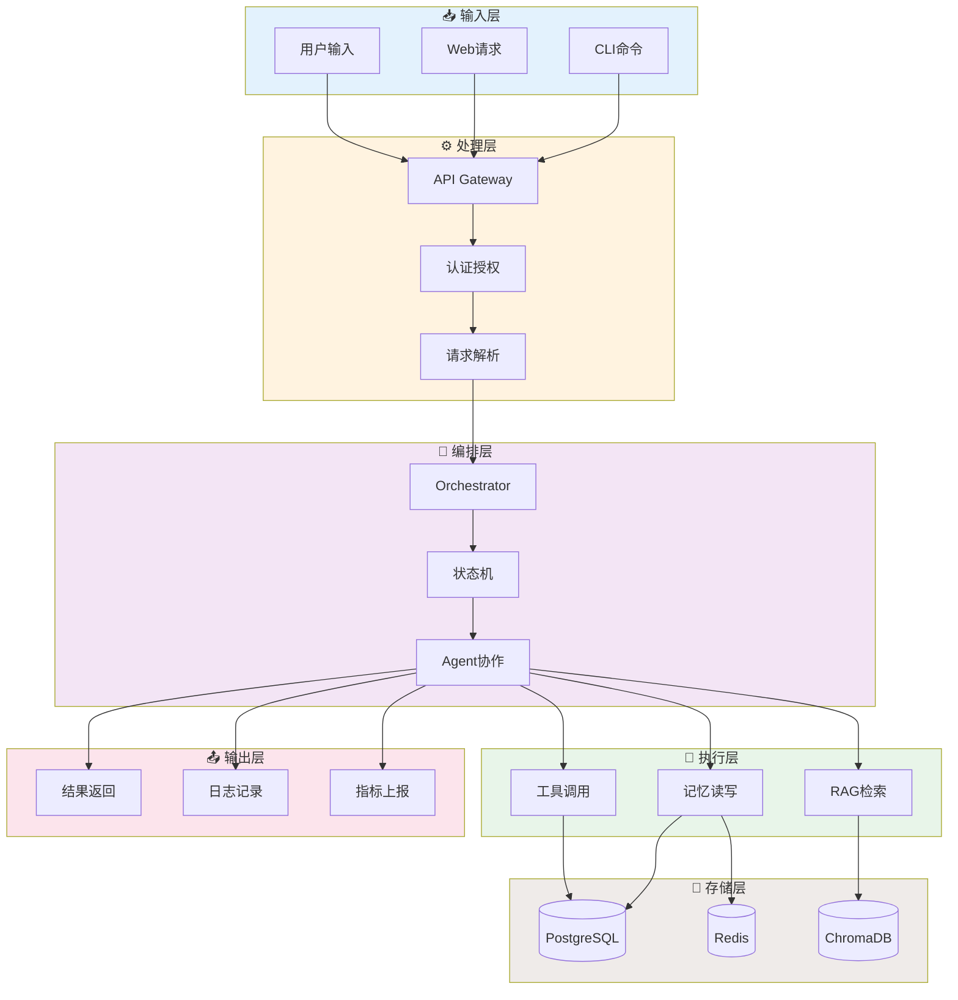

## 2. 请求处理数据流

### 2.1 同步请求流程

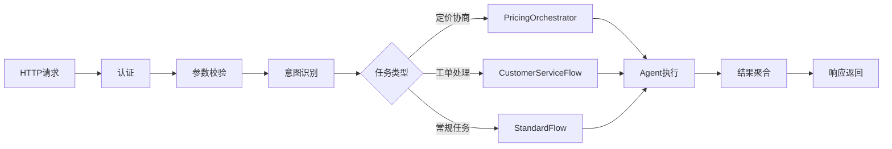

### 2.2 异步任务流程

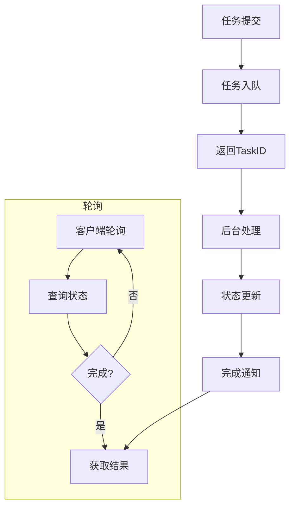

## 3. Agent 协作数据流

### 3.1 单Agent执行流

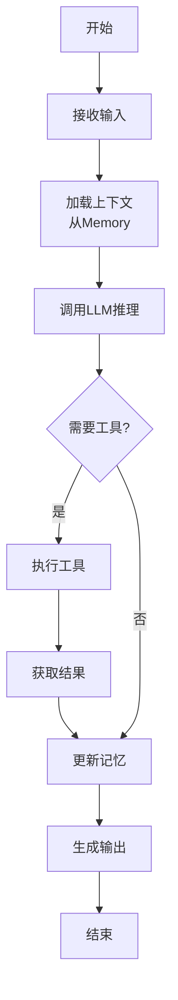

### 3.2 多Agent协作流

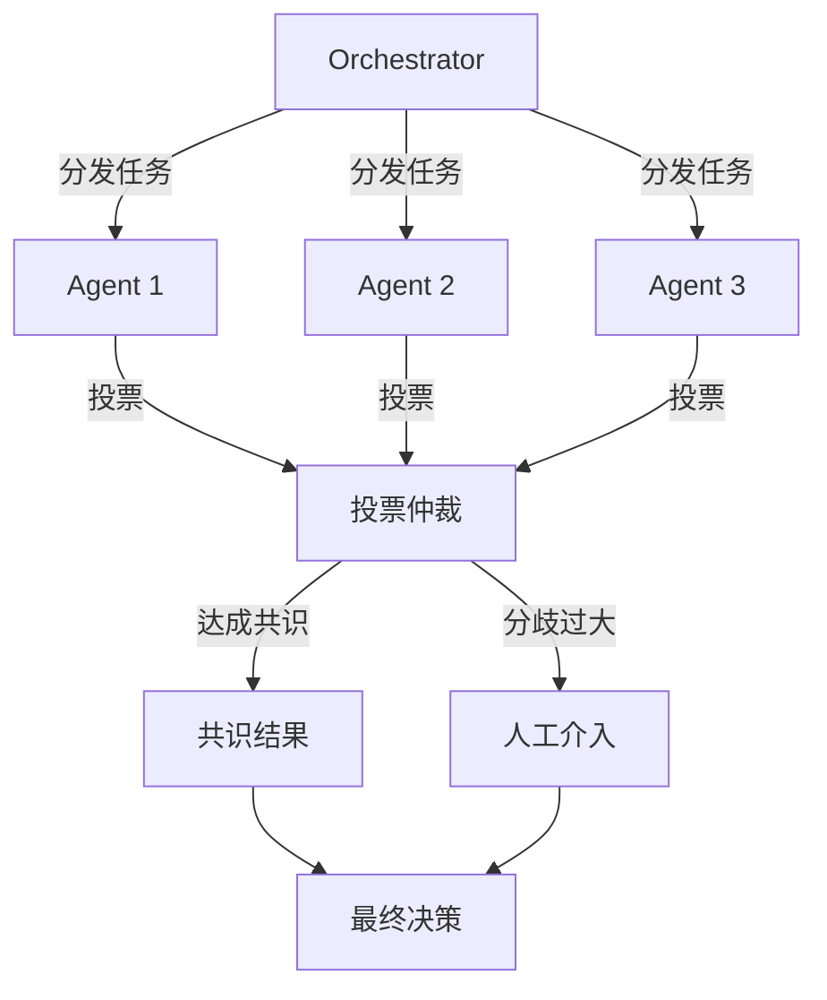

## 4. 工具调用数据流

### 4.1 MCP工具调用

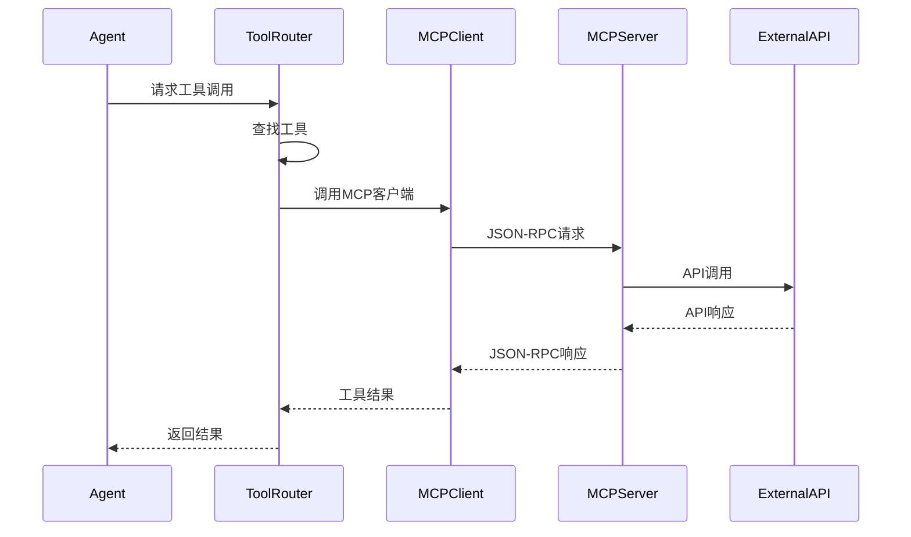

### 4.2 降级流程

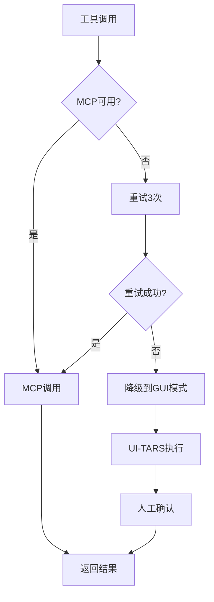

## 5. RAG 检索数据流

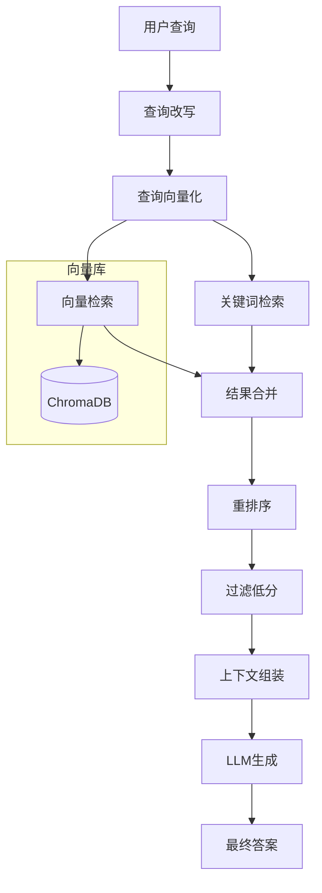

## 6. 记忆数据流

### 6.1 写入流程

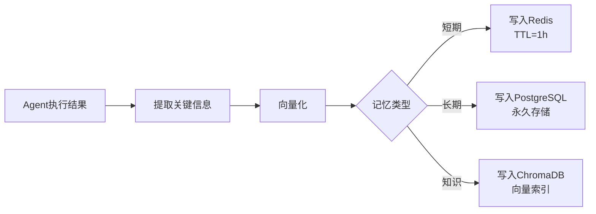

### 6.2 读取流程

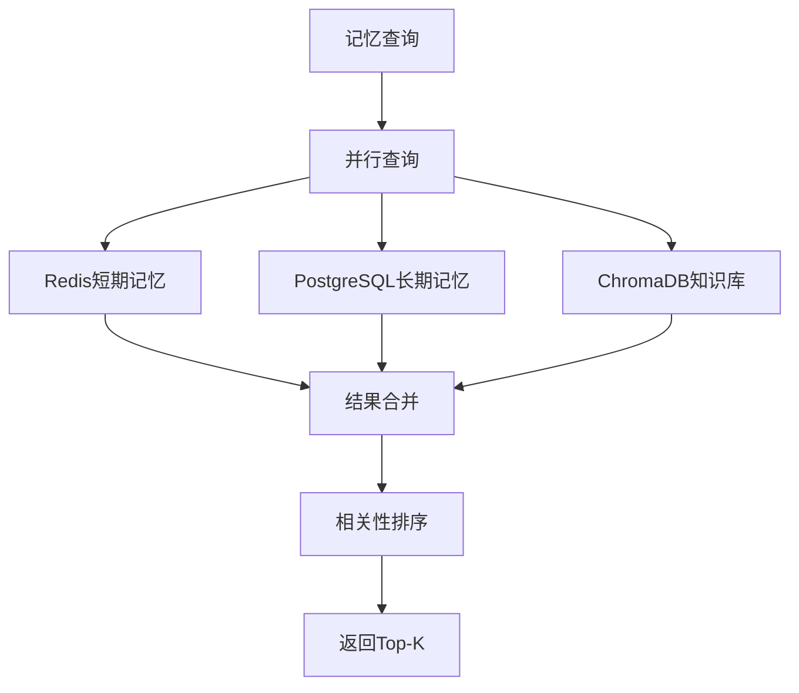

## 7. 数据流转示例

### 7.1 定价协商完整数据流

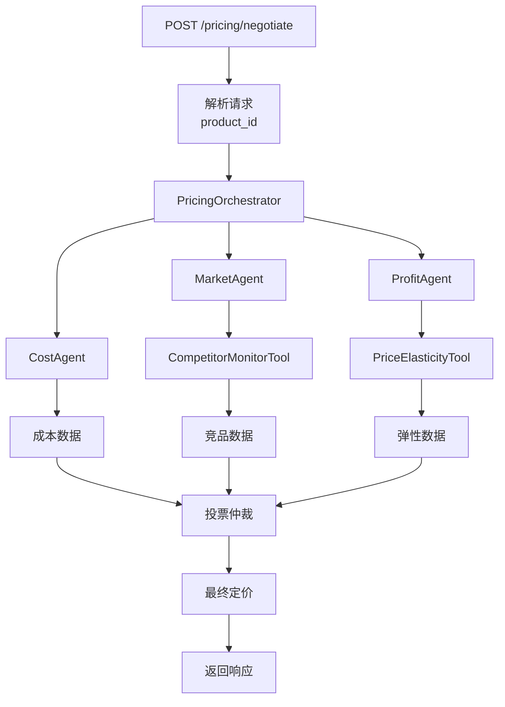

### 7.2 工单处理完整数据流

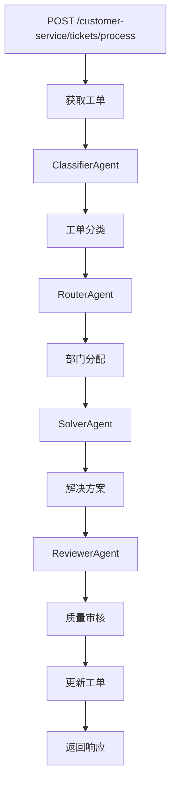

## 8. 数据格式规范

### 8.1 请求数据格式

```json
{
  "trace_id": "trace-uuid-v4",
  "timestamp": "2026-02-18T10:00:00Z",
  "source": "web|cli|api",
  "action": "execute_task",
  "payload": {
    "task_type": "string",
    "params": {}
  },
  "context": {
    "session_id": "string",
    "user_id": "string",
    "roles": ["string"]
  }
}
```

### 8.2 响应数据格式

```json
{
  "trace_id": "trace-uuid-v4",
  "status": "success|error|pending",
  "result": {},
  "metadata": {
    "processing_time_ms": 1234,
    "tokens_used": 500,
    "agents_involved": ["agent1", "agent2"],
    "tools_called": ["tool1", "tool2"]
  },
  "error": {
    "code": "ERROR_CODE",
    "message": "Error message",
    "retry_suggested": true
  }
}
```
