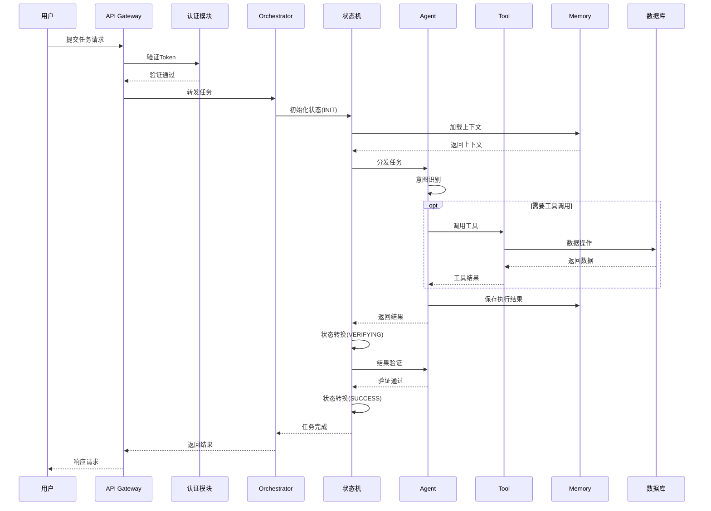
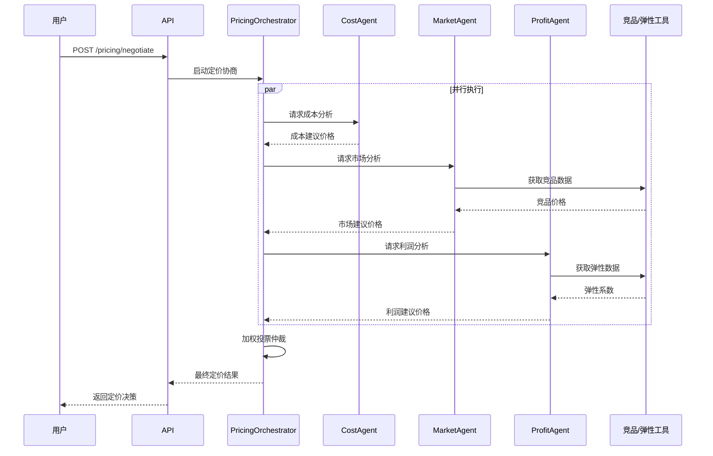
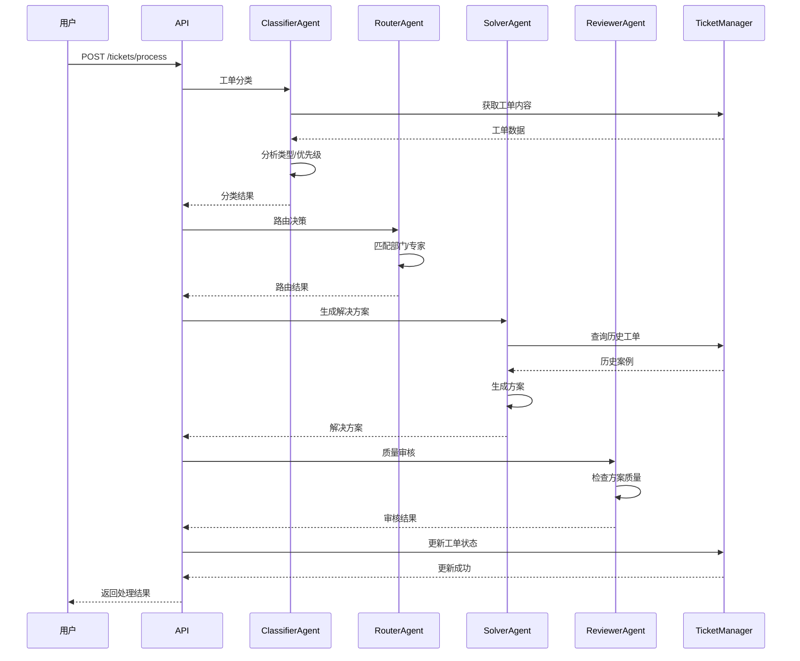
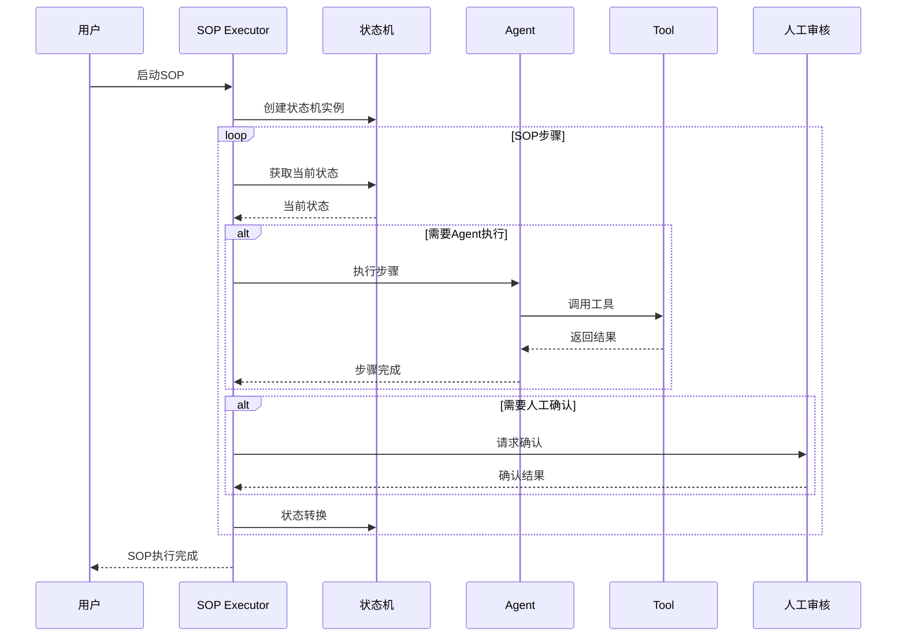
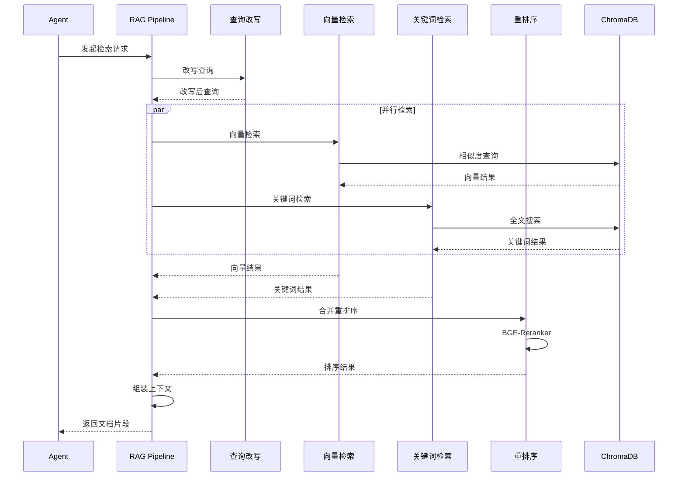
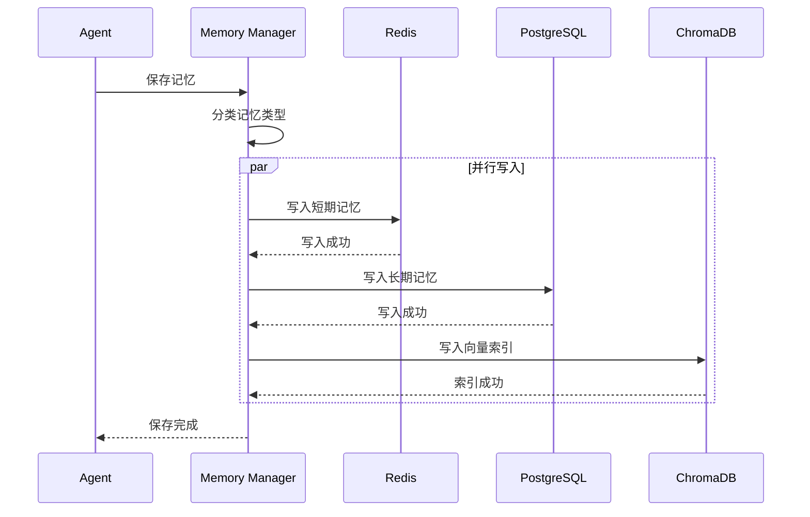
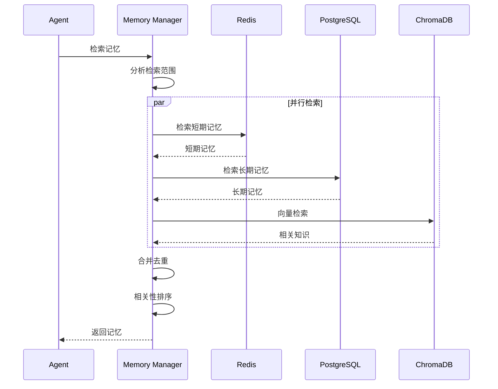
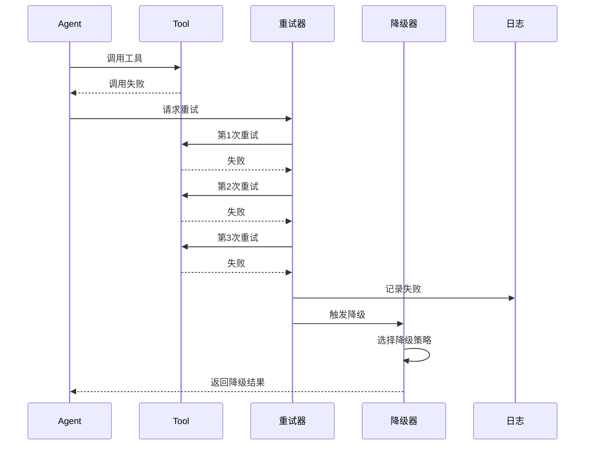
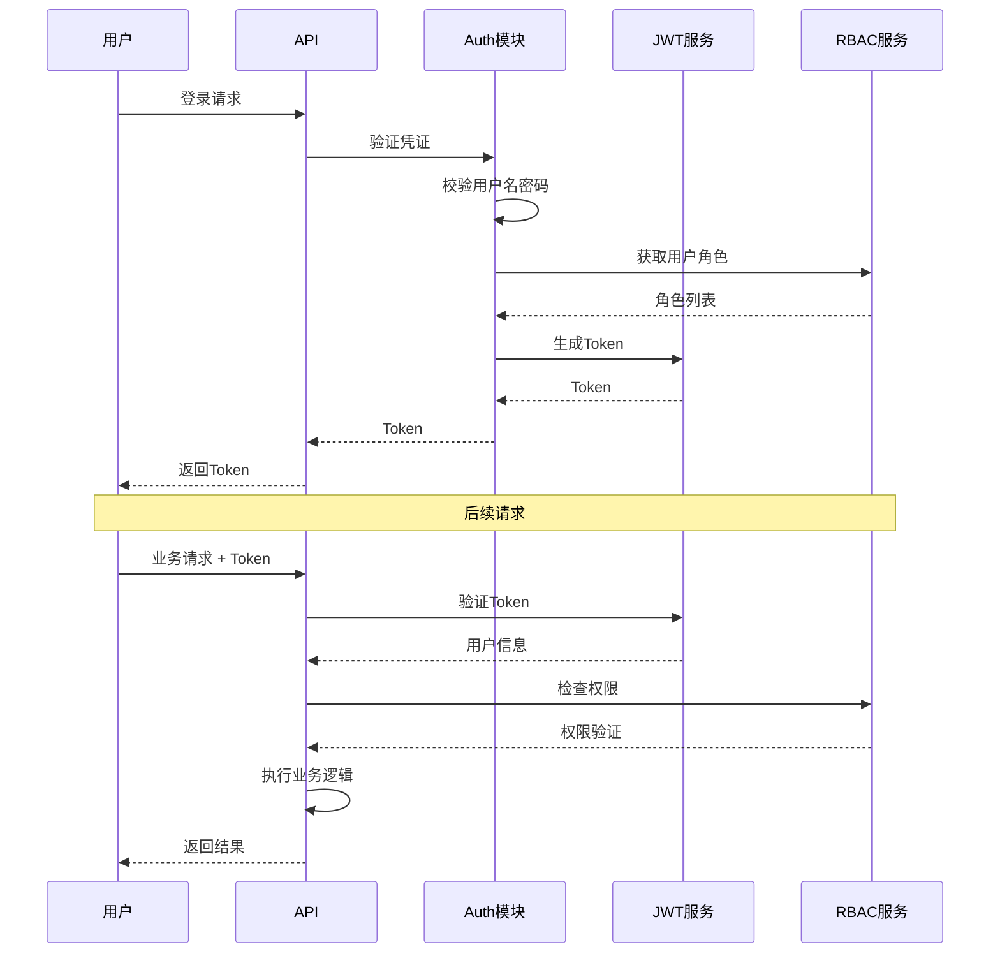

# 核心流程时序图

## 1. 任务执行完整时序

## 2. 多Agent协作时序

### 2.1 博弈定价流程

### 2.2 客服工单处理流程

## 3. SOP 执行时序

## 4. RAG 检索时序

## 5. 记忆管理时序

### 5.1 记忆写入

### 5.2 记忆检索

## 6. 错误处理时序

## 7. 认证授权时序

## 8. 关键时序指标

| 流程 | 正常耗时 | P99耗时 | 超时阈值 |
|------|---------|---------|---------|
| 任务执行 | 500ms | 3s | 30s |
| 博弈定价 | 2s | 5s | 60s |
| 工单处理 | 1.5s | 4s | 45s |
| RAG检索 | 200ms | 1s | 10s |
| 记忆写入 | 100ms | 500ms | 5s |
| 认证授权 | 50ms | 200ms | 3s |
