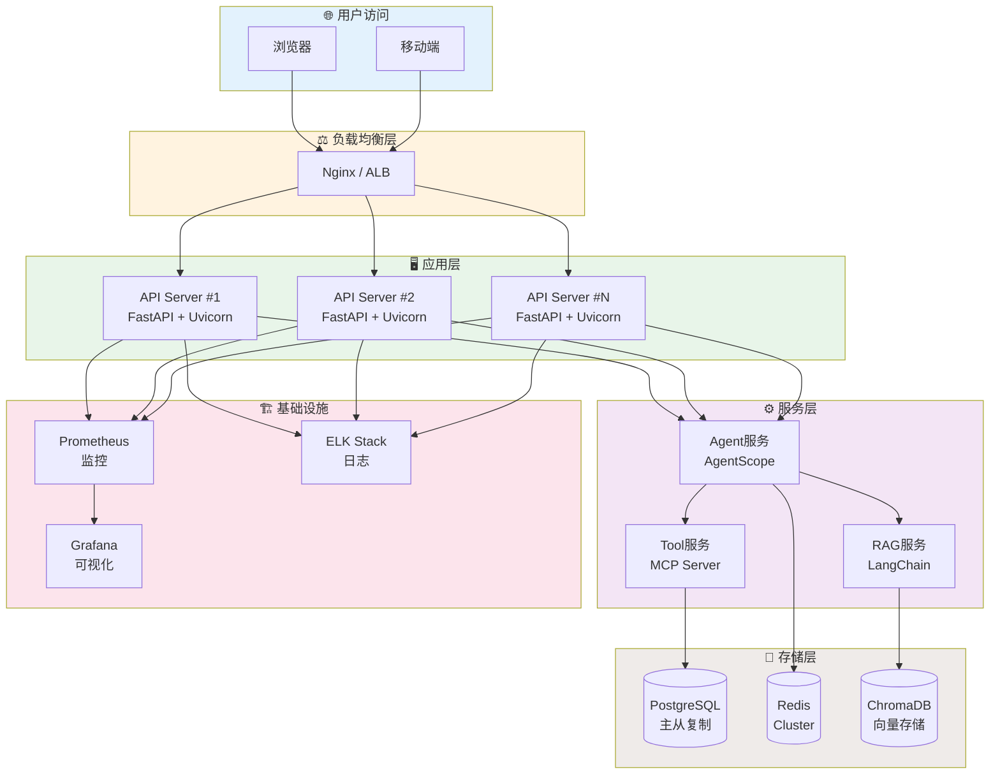
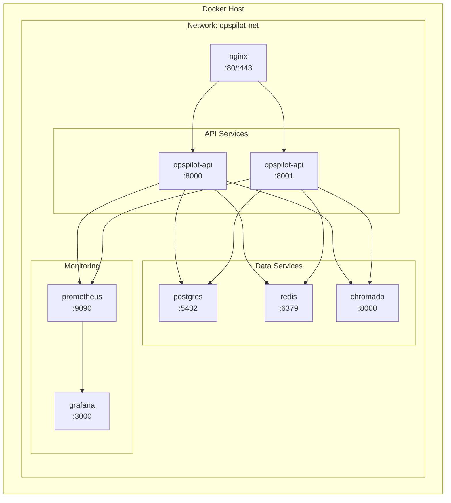
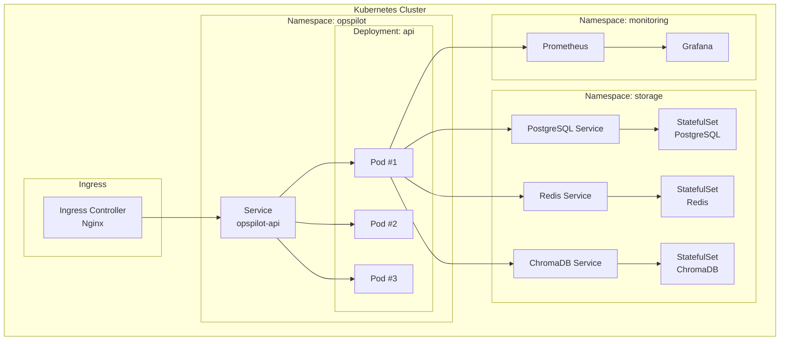
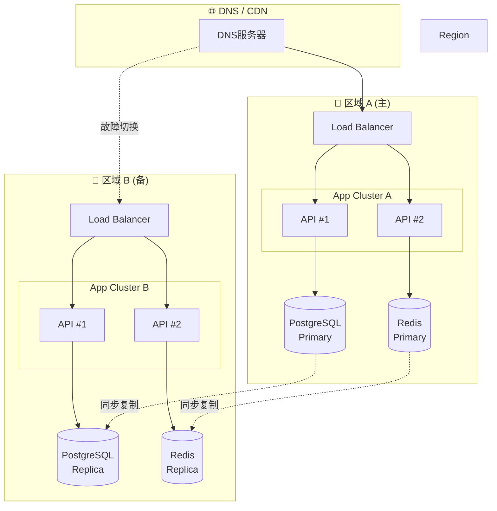
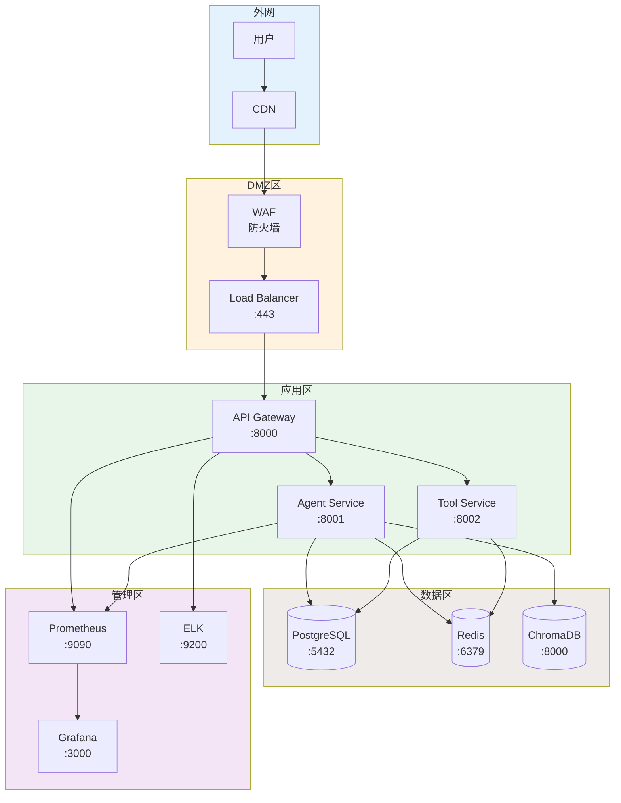
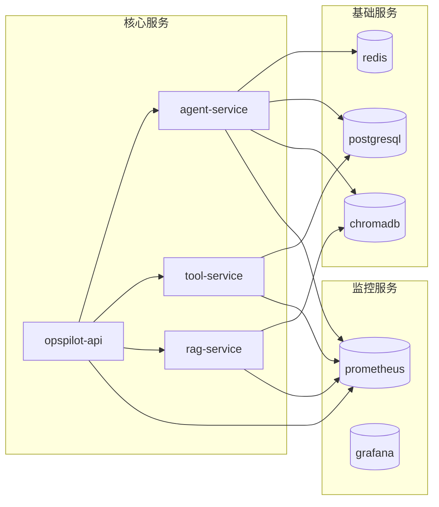

# 部署架构图

## 1. 整体部署架构



## 2. 容器化部署

### 2.1 Docker Compose 部署



### 2.2 Kubernetes 部署



## 3. 高可用部署



## 4. 网络架构



## 5. 服务依赖关系



## 6. 资源配置建议

### 6.1 最小部署配置

| 服务 | CPU | 内存 | 存储 | 副本数 |
|------|-----|------|------|--------|
| API Server | 2核 | 4GB | - | 2 |
| PostgreSQL | 2核 | 4GB | 50GB | 1 |
| Redis | 1核 | 2GB | - | 1 |
| ChromaDB | 2核 | 4GB | 20GB | 1 |

### 6.2 生产环境配置

| 服务 | CPU | 内存 | 存储 | 副本数 |
|------|-----|------|------|--------|
| API Server | 4核 | 8GB | - | 3+ |
| PostgreSQL | 4核 | 16GB | 200GB | 2 (主从) |
| Redis | 2核 | 8GB | - | 3 (Cluster) |
| ChromaDB | 4核 | 16GB | 100GB | 3 |
| Prometheus | 2核 | 4GB | 50GB | 1 |
| Grafana | 1核 | 2GB | 10GB | 1 |

## 7. 部署检查清单

### 7.1 部署前检查

- [ ] 环境变量配置完成
- [ ] 数据库连接配置正确
- [ ] SSL证书已配置
- [ ] 防火墙规则已设置
- [ ] 监控告警已配置

### 7.2 部署后验证

- [ ] 健康检查接口正常
- [ ] API文档可访问
- [ ] 数据库连接正常
- [ ] 缓存服务正常
- [ ] 监控面板正常

## 8. 运维命令速查

```bash
# 启动服务
docker-compose up -d

# 查看日志
docker-compose logs -f opspilot-api

# 扩容API服务
docker-compose up -d --scale opspilot-api=3

# 数据库备份
pg_dump -h localhost -U postgres opspilot > backup.sql

# Redis缓存清理
redis-cli FLUSHDB

# 查看服务状态
kubectl get pods -n opspilot

# 滚动更新
kubectl rollout restart deployment/opspilot-api -n opspilot
```
