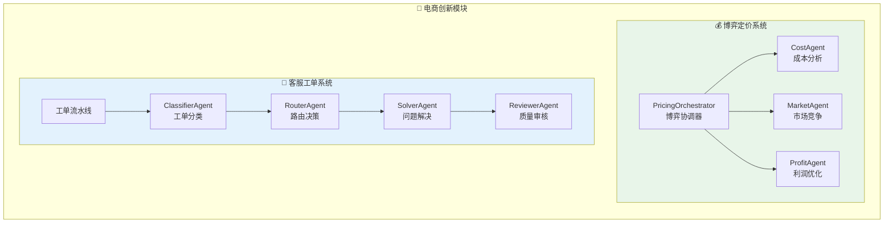
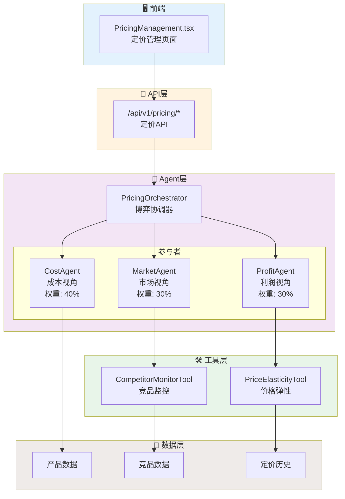
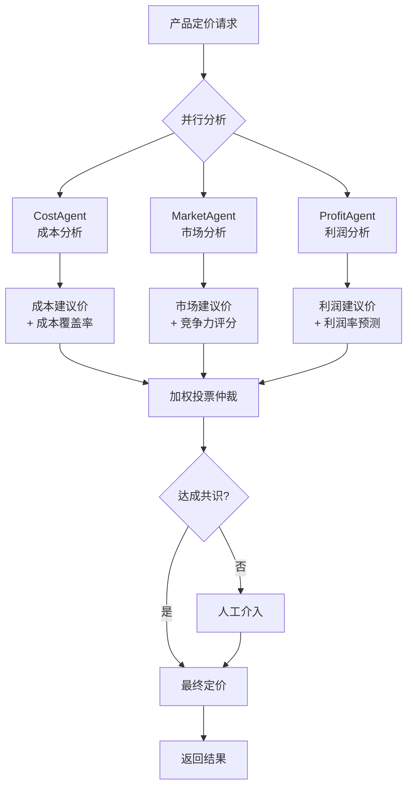
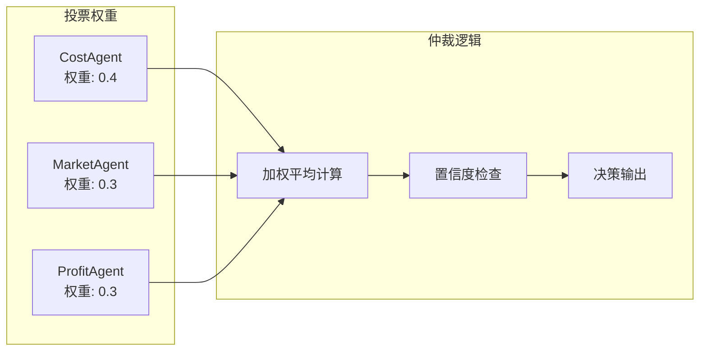
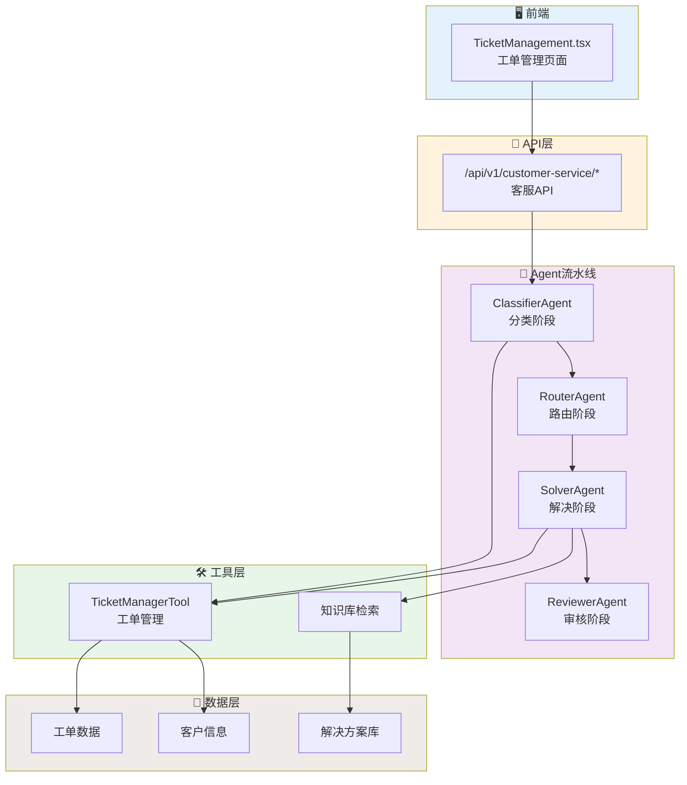
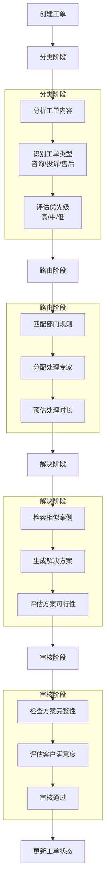
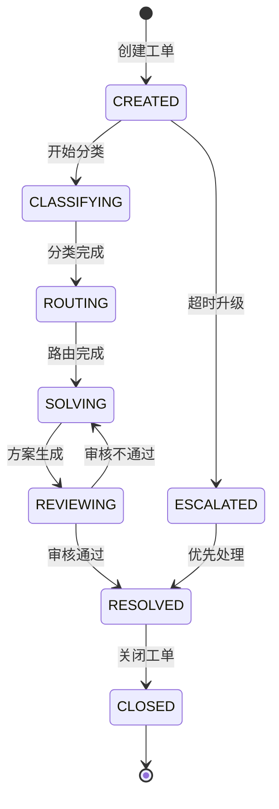
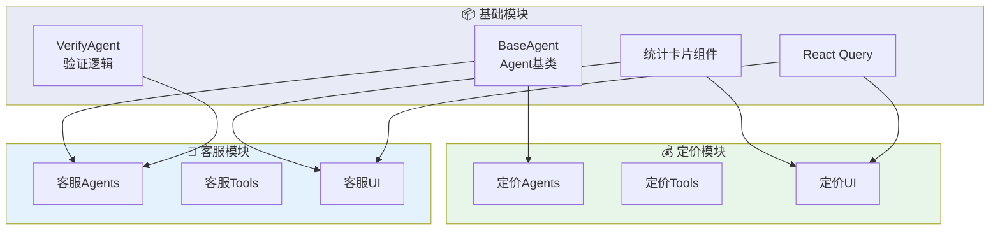

# 电商创新模块架构图

## 1. 电商模块总览



## 2. 博弈定价系统架构

### 2.1 整体架构



### 2.2 博弈流程



### 2.3 投票仲裁机制



**投票计算公式**：
```
最终价格 = CostPrice × 0.4 + MarketPrice × 0.3 + ProfitPrice × 0.3
置信度 = Σ(Weight × Confidence) / ΣWeight
```

## 3. 客服工单系统架构

### 3.1 整体架构



### 3.2 工单处理流程



### 3.3 工单状态流转



## 4. 模块复用关系



## 5. 数据统计

### 5.1 博弈定价系统

| 指标 | 数值 |
|------|------|
| Agent数量 | 4个 |
| 工具数量 | 2个 |
| API接口 | 3个 |
| 新增代码 | ~1050行 |
| 复用代码 | ~3500行 |
| 复用率 | 77% |

### 5.2 客服工单系统

| 指标 | 数值 |
|------|------|
| Agent数量 | 4个 |
| 工具数量 | 1个 |
| API接口 | 5个 |
| 新增代码 | ~700行 |
| 复用代码 | ~1500行 |
| 复用率 | 68% |

## 6. API 接口清单

### 6.1 定价API

| 方法 | 路径 | 说明 |
|------|------|------|
| POST | /api/v1/pricing/negotiate | 启动定价协商 |
| GET | /api/v1/pricing/history | 查询定价历史 |
| GET | /api/v1/pricing/agents/status | 获取Agent状态 |

### 6.2 客服API

| 方法 | 路径 | 说明 |
|------|------|------|
| POST | /api/v1/customer-service/tickets | 创建工单 |
| POST | /api/v1/customer-service/tickets/process | 处理工单 |
| GET | /api/v1/customer-service/tickets | 查询工单列表 |
| GET | /api/v1/customer-service/tickets/{id} | 查询工单详情 |
| GET | /api/v1/customer-service/agents/status | 获取Agent状态 |

## 7. 技术亮点

### 7.1 博弈定价

- **多Agent博弈**：成本、市场、利润三方视角
- **加权投票**：避免单一视角偏见
- **实时竞品监控**：动态调整定价策略
- **价格弹性分析**：预测价格变化影响

### 7.2 客服工单

- **流水线处理**：分类→路由→解决→审核
- **智能路由**：自动分配最优处理专家
- **案例检索**：复用历史解决方案
- **质量审核**：确保方案质量
