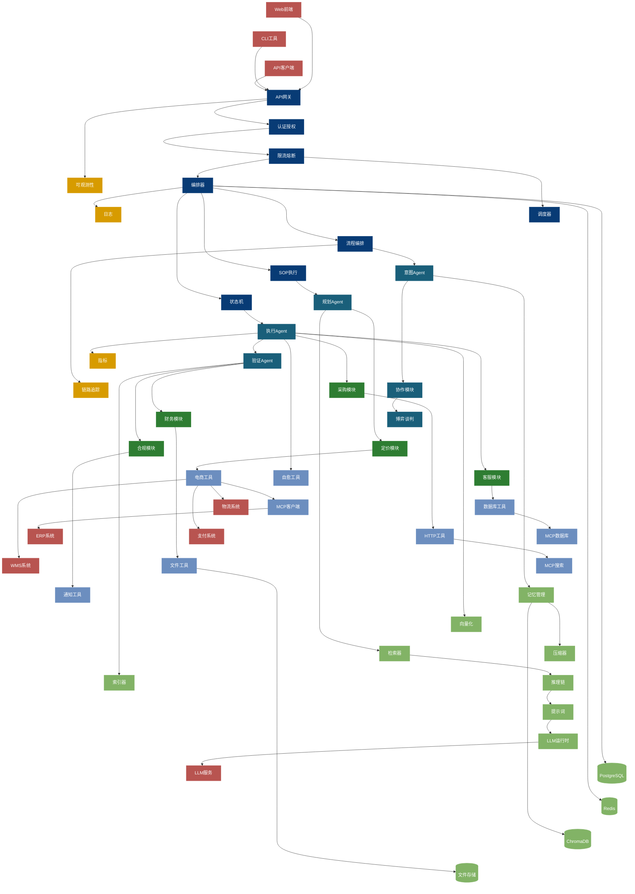

# 系统架构图

```mermaid
flowchart TB
    %% 定义样式
    classDef core fill:#083B75,color:#fff,stroke:#083B75
    classDef agent fill:#1a5f7a,color:#fff,stroke:#1a5f7a
    classDef business fill:#2e7d32,color:#fff,stroke:#2e7d32
    classDef tool fill:#6C8EBF,color:#fff,stroke:#6C8EBF
    classDef storage fill:#82B366,color:#fff,stroke:#82B366
    classDef external fill:#B85450,color:#fff,stroke:#B85450
    classDef observe fill:#D79B00,color:#fff,stroke:#D79B00
    
    %% 第一行：用户接入层
    WEB["Web前端"]:::external
    CLI["CLI工具"]:::external
    CLIENT["API客户端"]:::external
    API["API网关"]:::core
    AUTH["认证授权"]:::core
    RATE["限流熔断"]:::core
    ERP["ERP系统"]:::external
    WMS["WMS系统"]:::external
    
    %% 强制第一行对齐
    WEB ~~~ CLI ~~~ CLIENT ~~~ API ~~~ AUTH ~~~ RATE ~~~ ERP ~~~ WMS
    
    %% 第二行：编排调度层
    ORCH["编排器"]:::core
    SCHED["调度器"]:::core
    PIPELINE["流程编排"]:::core
    SOP["SOP执行"]:::core
    STATE["状态机"]:::core
    LOGISTICS["物流系统"]:::external
    PAYMENT["支付系统"]:::external
    LLM["LLM服务"]:::external
    
    ORCH ~~~ SCHED ~~~ PIPELINE ~~~ SOP ~~~ STATE ~~~ LOGISTICS ~~~ PAYMENT ~~~ LLM
    
    %% 第三行：Agent协作层
    INTENT["意图Agent"]:::agent
    PLAN["规划Agent"]:::agent
    EXEC["执行Agent"]:::agent
    VERIFY["验证Agent"]:::agent
    COLLAB["协作模块"]:::agent
    NEGOT["博弈谈判"]:::agent
    PRICING["定价模块"]:::business
    CSERVICE["客服模块"]:::business
    
    INTENT ~~~ PLAN ~~~ EXEC ~~~ VERIFY ~~~ COLLAB ~~~ NEGOT ~~~ PRICING ~~~ CSERVICE
    
    %% 第四行：业务模块层
    BUYER["采购模块"]:::business
    FINANCE["财务模块"]:::business
    COMPLY["合规模块"]:::business
    ECOM["电商工具"]:::tool
    DBTOOL["数据库工具"]:::tool
    HTTPTOOL["HTTP工具"]:::tool
    FILETOOL["文件工具"]:::tool
    NOTIFY["通知工具"]:::tool
    
    BUYER ~~~ FINANCE ~~~ COMPLY ~~~ ECOM ~~~ DBTOOL ~~~ HTTPTOOL ~~~ FILETOOL ~~~ NOTIFY
    
    %% 第五行：工具集成层
    HEALING["自愈工具"]:::tool
    MCP["MCP客户端"]:::tool
    MCPDB["MCP数据库"]:::tool
    MCPSEARCH["MCP搜索"]:::tool
    MEMORY["记忆管理"]:::storage
    EMBED["向量化"]:::storage
    RETRIEVE["检索器"]:::storage
    INDEX["索引器"]:::storage
    
    HEALING ~~~ MCP ~~~ MCPDB ~~~ MCPSEARCH ~~~ MEMORY ~~~ EMBED ~~~ RETRIEVE ~~~ INDEX
    
    %% 第六行：存储支撑层
    COMPRESS["压缩器"]:::storage
    CHAINS["推理链"]:::storage
    PROMPTS["提示词"]:::storage
    RUNTIME["LLM运行时"]:::storage
    PG[("PostgreSQL")]:::storage
    REDIS[("Redis")]:::storage
    CHROMA[("ChromaDB")]:::storage
    FILES[("文件存储")]:::storage
    
    COMPRESS ~~~ CHAINS ~~~ PROMPTS ~~~ RUNTIME ~~~ PG ~~~ REDIS ~~~ CHROMA ~~~ FILES
    
    %% 第七行：可观测层
    OBS["可观测性"]:::observe
    LOGS["日志"]:::observe
    METRICS["指标"]:::observe
    TRACES["链路追踪"]:::observe
    E1[" "]:::observe
    E2[" "]:::observe
    E3[" "]:::observe
    E4[" "]:::observe
    
    OBS ~~~ LOGS ~~~ METRICS ~~~ TRACES ~~~ E1 ~~~ E2 ~~~ E3 ~~~ E4
    
    %% 连接关系
    WEB --> API
    CLI --> API
    CLIENT --> API
    API --> AUTH
    AUTH --> RATE
    RATE --> ORCH
    RATE --> SCHED
    
    ORCH --> PIPELINE
    ORCH --> SOP
    ORCH --> STATE
    
    PIPELINE --> INTENT
    SOP --> PLAN
    STATE --> EXEC
    EXEC --> VERIFY
    INTENT --> COLLAB
    COLLAB --> NEGOT
    
    PLAN --> PRICING
    EXEC --> CSERVICE
    EXEC --> BUYER
    VERIFY --> FINANCE
    VERIFY --> COMPLY
    
    PRICING --> ECOM
    CSERVICE --> DBTOOL
    BUYER --> HTTPTOOL
    FINANCE --> FILETOOL
    COMPLY --> NOTIFY
    EXEC --> HEALING
    
    ECOM --> MCP
    HTTPTOOL --> MCPSEARCH
    DBTOOL --> MCPDB
    
    INTENT --> MEMORY
    PLAN --> RETRIEVE
    EXEC --> EMBED
    VERIFY --> INDEX
    MEMORY --> COMPRESS
    
    RETRIEVE --> CHAINS
    CHAINS --> PROMPTS
    PROMPTS --> RUNTIME
    
    ORCH --> PG
    ORCH --> REDIS
    MEMORY --> CHROMA
    FILETOOL --> FILES
    
    API --> OBS
    ORCH --> LOGS
    EXEC --> METRICS
    PIPELINE --> TRACES
    
    MCP --> ERP
    ECOM --> WMS
    ECOM --> LOGISTICS
    ECOM --> PAYMENT
    RUNTIME --> LLM
    
    %% 隐藏占位节点
    style E1 fill:none,stroke:none,color:none
    style E2 fill:none,stroke:none,color:none
    style E3 fill:none,stroke:none,color:none
    style E4 fill:none,stroke:none,color:none
```

## 图例

| 颜色 | 类型 |
|------|------|
| 深蓝 | 核心组件 |
| 青蓝 | Agent协作 |
| 绿色 | 业务模块 |
| 蓝灰 | 工具集成 |
| 浅绿 | 存储支撑 |
| 红棕 | 外部系统 |
| 橙色 | 可观测 |
