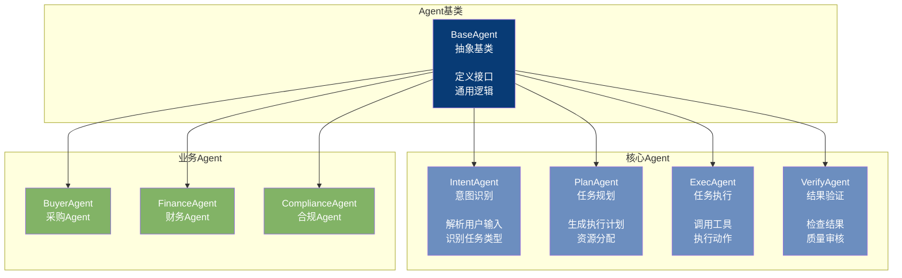
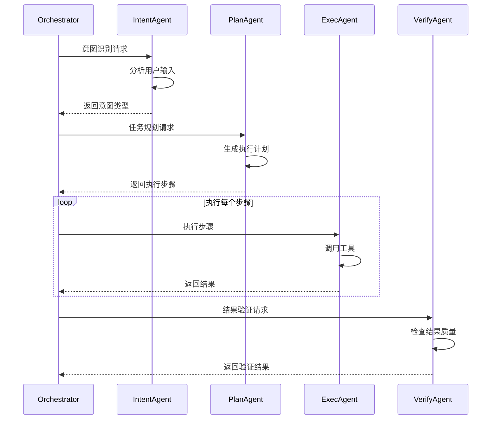

# Agent 模块架构

## 组件架构图

## Agent协作时序图

## Agent分类

| 类型 | Agent | 职责 |
|------|-------|------|
| 核心 | IntentAgent | 识别用户意图 |
| 核心 | PlanAgent | 生成执行计划 |
| 核心 | ExecAgent | 执行具体任务 |
| 核心 | VerifyAgent | 验证执行结果 |
| 业务 | BuyerAgent | 采购决策 |
| 业务 | FinanceAgent | 财务审核 |
| 业务 | ComplianceAgent | 合规检查 |
