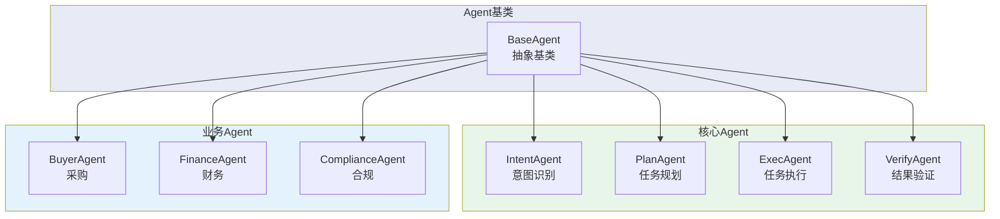
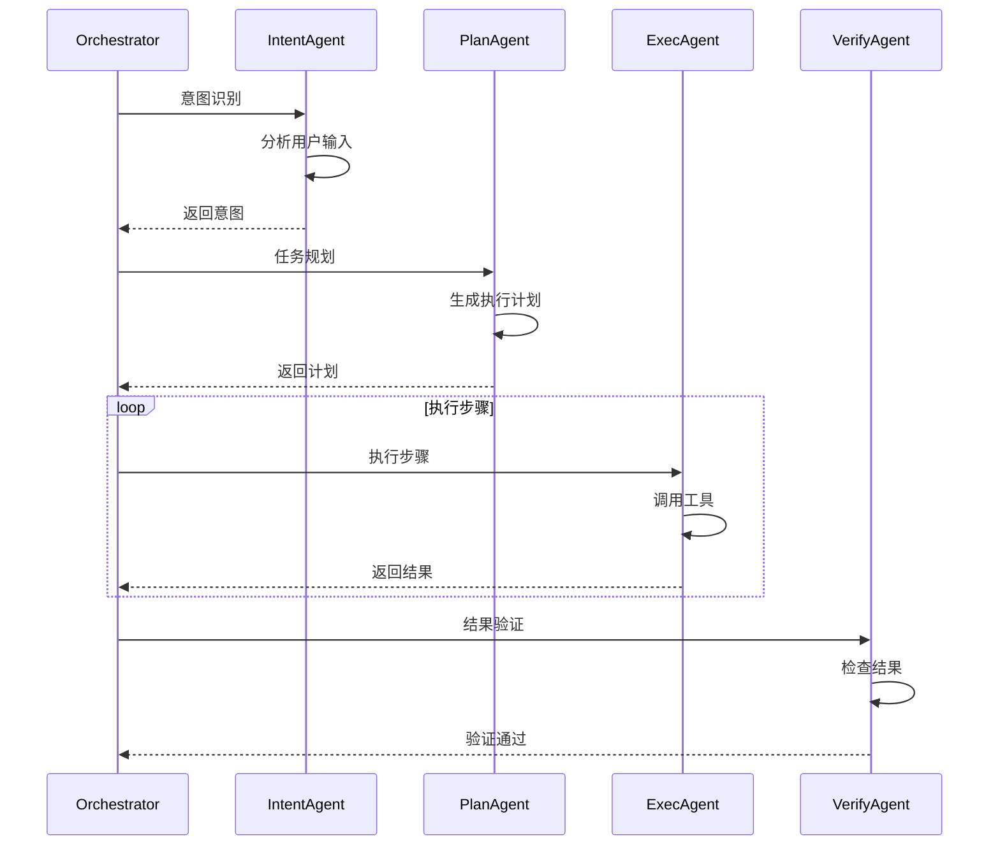

# Agent 模块架构

## 模块架构图

## Agent协作时序图

## Agent列表

| Agent | 文件 | 职责 |
|------|------|------|
| IntentAgent | intent_agent.py | 识别用户意图 |
| PlanAgent | plan_agent.py | 生成执行计划 |
| ExecAgent | exec_agent.py | 执行具体任务 |
| VerifyAgent | verify_agent.py | 验证执行结果 |
| BuyerAgent | buyer_agent.py | 采购决策 |
| FinanceAgent | finance_agent.py | 财务审核 |
| ComplianceAgent | compliance_agent.py | 合规检查 |
