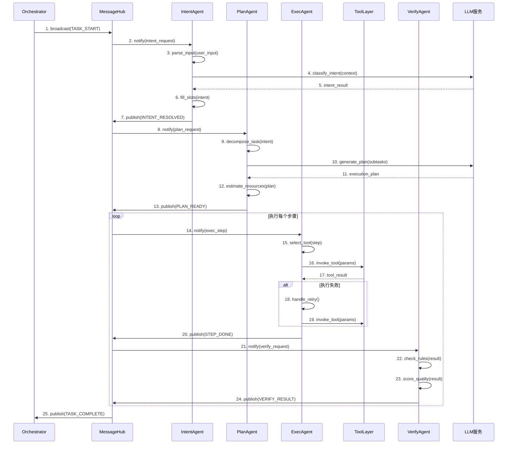

# Agent 模块架构

## 组件架构图

```mermaid
graph TB
    %% ==================== 第一行：基类 ====================
    subgraph L1[Base基类]
        direction LR
        BASE[BaseAgent<br/>抽象基类<br/>定义Agent接口]
        BASE_STATE[AgentState<br/>Agent状态<br/>IDLE/BUSY]
        BASE_CTX[AgentContext<br/>Agent上下文<br/>任务信息]
        BASE_MSG[MessageHub<br/>消息中心<br/>订阅发布]
    end

    %% ==================== 第二行：核心Agent ====================
    subgraph L2[核心Agent]
        direction LR
        INTENT[IntentAgent<br/>意图识别<br/>解析用户输入]
        PLAN[PlanAgent<br/>任务规划<br/>生成执行计划]
        EXEC[ExecAgent<br/>任务执行<br/>调用工具]
        VERIFY[VerifyAgent<br/>结果验证<br/>质量审核]
    end

    %% ==================== 第三行：Agent内部组件 ====================
    subgraph L3A[IntentAgent组件]
        direction LR
        INTENT_PARSER[InputParser<br/>输入解析器]
        INTENT_CLS[IntentClassifier<br/>意图分类器]
        INTENT_SLOT[SlotFiller<br/>槽位填充器]
    end

    subgraph L3B[PlanAgent组件]
        direction LR
        PLAN_DECOMP[TaskDecomposer<br/>任务分解器]
        PLAN_SCHED[PlanScheduler<br/>计划调度器]
        PLAN_RES[ResourceEstimator<br/>资源评估器]
    end

    %% ==================== 第四行：更多Agent组件 ====================
    subgraph L4A[ExecAgent组件]
        direction LR
        EXEC_TOOL[ToolSelector<br/>工具选择器]
        EXEC_INV[ToolInvoker<br/>工具调用器]
        EXEC_RETRY[RetryHandler<br/>重试处理器]
    end

    subgraph L4B[VerifyAgent组件]
        direction LR
        VERIFY_RULE[RuleChecker<br/>规则检查器]
        VERIFY_QUAL[QualityScorer<br/>质量评分器]
        VERIFY_FB[FeedbackGenerator<br/>反馈生成器]
    end

    %% ==================== 第五行：协作与适配 ====================
    subgraph L5A[Collaboration协作]
        direction LR
        COLLAB[Collaboration<br/>协作管理器]
        COLLAB_MSG[MsgHub<br/>消息枢纽]
        COLLAB_LEAD[LeaderElection<br/>领导者选举]
    end

    subgraph L5B[Negotiation博弈]
        direction LR
        NEGOT[Negotiation<br/>谈判管理器]
        NEGOT_STRAT[StrategyEngine<br/>策略引擎]
        NEGOT_BID[BidEngine<br/>出价引擎]
    end

    subgraph L5C[Adapter适配]
        direction LR
        ADAPT[AgentScopeAdapter<br/>框架适配]
        ADAPT_LLM[LLMAdapter<br/>LLM适配器]
    end

    %% ==================== 层间连接 ====================
    BASE --> BASE_STATE
    BASE --> BASE_CTX
    BASE --> BASE_MSG

    INTENT --> INTENT_PARSER
    INTENT --> INTENT_CLS
    INTENT --> INTENT_SLOT
    INTENT_CLS --> INTENT_PARSER

    PLAN --> PLAN_DECOMP
    PLAN --> PLAN_SCHED
    PLAN --> PLAN_RES
    PLAN_DECOMP --> PLAN_SCHED

    EXEC --> EXEC_TOOL
    EXEC --> EXEC_INV
    EXEC --> EXEC_RETRY
    EXEC_INV --> EXEC_RETRY

    VERIFY --> VERIFY_RULE
    VERIFY --> VERIFY_QUAL
    VERIFY --> VERIFY_FB
    VERIFY_RULE --> VERIFY_QUAL

    COLLAB --> COLLAB_MSG
    COLLAB --> COLLAB_LEAD

    NEGOT --> NEGOT_STRAT
    NEGOT --> NEGOT_BID
    NEGOT_STRAT --> NEGOT_BID

    ADAPT --> ADAPT_LLM

    BASE -.->|继承| INTENT
    BASE -.->|继承| PLAN
    BASE -.->|继承| EXEC
    BASE -.->|继承| VERIFY

    COLLAB_MSG --> BASE_MSG
    INTENT --> PLAN
    PLAN --> EXEC
    EXEC --> VERIFY
    EXEC --> COLLAB
    NEGOT --> COLLAB

    INTENT --> ADAPT_LLM
    PLAN --> ADAPT_LLM
    EXEC --> ADAPT

    %% ==================== 样式 ====================
    classDef base fill:#083B75,color:#fff
    classDef intent fill:#1a5f7a,color:#fff
    classDef plan fill:#2e7d32,color:#fff
    classDef exec fill:#1565c0,color:#fff
    classDef verify fill:#c62828,color:#fff
    classDef collab fill:#6a1b9a,color:#fff
    classDef adapt fill:#455a64,color:#fff

    class BASE,BASE_STATE,BASE_CTX,BASE_MSG base
    class INTENT,INTENT_PARSER,INTENT_CLS,INTENT_SLOT intent
    class PLAN,PLAN_DECOMP,PLAN_SCHED,PLAN_RES plan
    class EXEC,EXEC_TOOL,EXEC_INV,EXEC_RETRY exec
    class VERIFY,VERIFY_RULE,VERIFY_QUAL,VERIFY_FB verify
    class COLLAB,COLLAB_MSG,COLLAB_LEAD,NEGOT,NEGOT_STRAT,NEGOT_BID collab
    class ADAPT,ADAPT_LLM adapt
```



## Agent协作时序图



## 文件清单

| 文件 | 类/函数 | 职责 |
|------|--------|------|
| base.py | BaseAgent | Agent抽象基类 |
| base.py | AgentState | Agent状态枚举 |
| base.py | AgentContext | Agent上下文 |
| intent_agent.py | IntentAgent | 意图识别Agent |
| intent_agent.py | IntentClassifier | 意图分类器 |
| intent_agent.py | SlotFiller | 槽位填充器 |
| plan_agent.py | PlanAgent | 任务规划Agent |
| plan_agent.py | TaskDecomposer | 任务分解器 |
| plan_agent.py | PlanScheduler | 计划调度器 |
| exec_agent.py | ExecAgent | 任务执行Agent |
| exec_agent.py | ToolSelector | 工具选择器 |
| exec_agent.py | RetryHandler | 重试处理器 |
| verify_agent.py | VerifyAgent | 结果验证Agent |
| verify_agent.py | QualityScorer | 质量评分器 |
| collaboration.py | Collaboration | 协作管理器 |
| collaboration.py | LeaderElection | 领导者选举 |
| negotiation.py | Negotiation | 博弈谈判管理器 |
| negotiation.py | StrategyEngine | 策略引擎 |
| msg_hub.py | MessageHub | 消息中心 |
| actor.py | Actor | Agent角色定义 |
| agentscope_adapter.py | AgentScopeAdapter | AgentScope框架适配 |

## Agent生命周期

```
INIT → IDLE → BUSY → SUCCESS/FAILED → IDLE
                  ↓
                ERROR → RETRY → BUSY
```

## 消息类型

| 消息类型 | 发送者 | 接收者 | 说明 |
|---------|-------|-------|------|
| TASK_START | Orchestrator | All Agents | 任务开始通知 |
| INTENT_RESOLVED | IntentAgent | PlanAgent | 意图识别完成 |
| PLAN_READY | PlanAgent | ExecAgent | 执行计划就绪 |
| STEP_DONE | ExecAgent | VerifyAgent | 步骤执行完成 |
| VERIFY_RESULT | VerifyAgent | Orchestrator | 验证结果返回 |
| TASK_COMPLETE | VerifyAgent | All Agents | 任务完成通知 |
| ERROR | Any Agent | Error Handler | 错误通知 |
