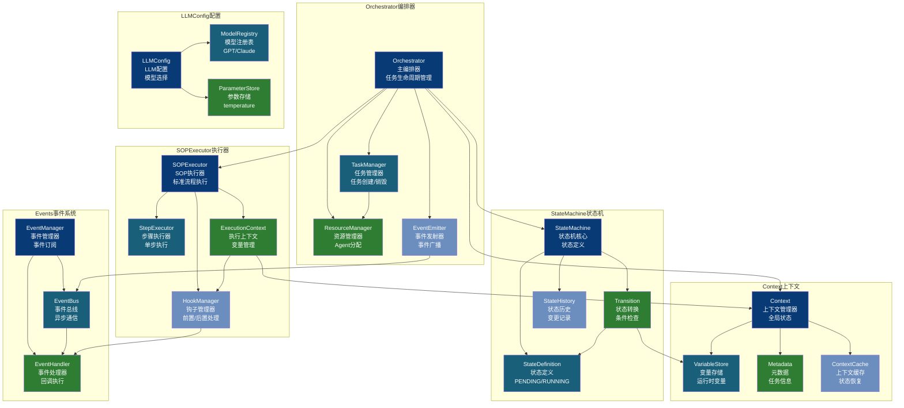
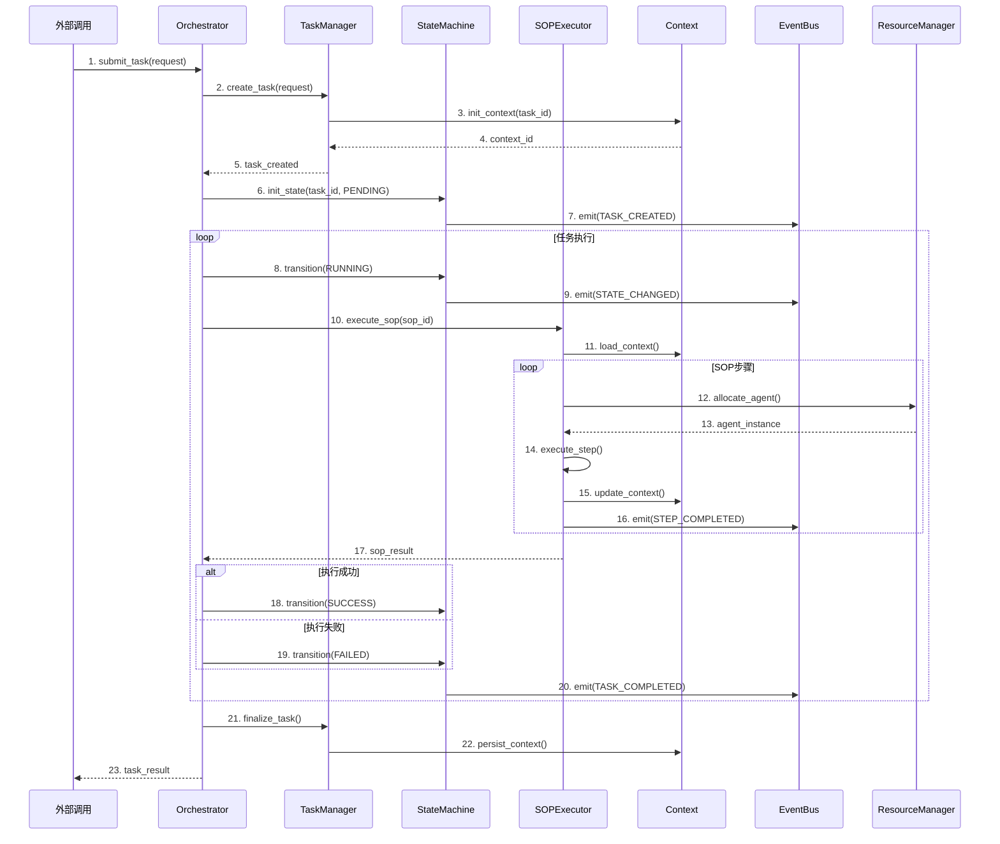

# Core 模块架构

## 组件架构图



## 核心流程时序图



## 文件清单

| 文件 | 类/函数 | 职责 |
|------|--------|------|
| orchestrator.py | Orchestrator | 主编排器，协调各组件 |
| orchestrator.py | TaskManager | 任务生命周期管理 |
| orchestrator.py | ResourceManager | Agent和工具资源管理 |
| state_machine.py | StateMachine | 状态机核心实现 |
| state_machine.py | StateDefinition | 状态定义枚举 |
| state_machine.py | Transition | 状态转换逻辑 |
| sop_executor.py | SOPExecutor | SOP流程执行器 |
| sop_executor.py | StepExecutor | 单步骤执行器 |
| sop_executor.py | ExecutionContext | 执行上下文管理 |
| context.py | Context | 全局上下文管理器 |
| context.py | VariableStore | 运行时变量存储 |
| events.py | EventEmitter | 事件发射器 |
| events.py | EventBus | 异步事件总线 |
| events.py | EventHandler | 事件处理器基类 |
| llm_config.py | LLMConfig | LLM配置管理 |
| llm_config.py | ModelRegistry | 模型注册表 |

## 状态机状态流转

```
PENDING → RUNNING → SUCCESS
    ↓         ↓
  FAILED    FAILED
    ↓         ↓
 RETRY → RUNNING → ...
```

## 事件类型

| 事件 | 触发时机 | 携带数据 |
|------|---------|---------|
| TASK_CREATED | 任务创建 | task_id, request |
| STATE_CHANGED | 状态变更 | task_id, old_state, new_state |
| STEP_STARTED | 步骤开始 | task_id, step_id |
| STEP_COMPLETED | 步骤完成 | task_id, step_id, result |
| TASK_COMPLETED | 任务完成 | task_id, final_state, result |
| ERROR_OCCURRED | 错误发生 | task_id, error, stack_trace |
