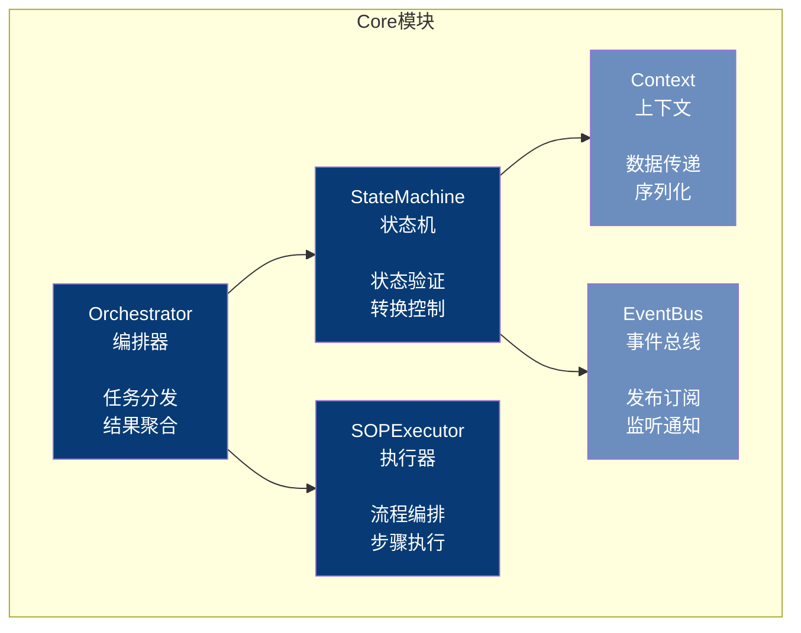
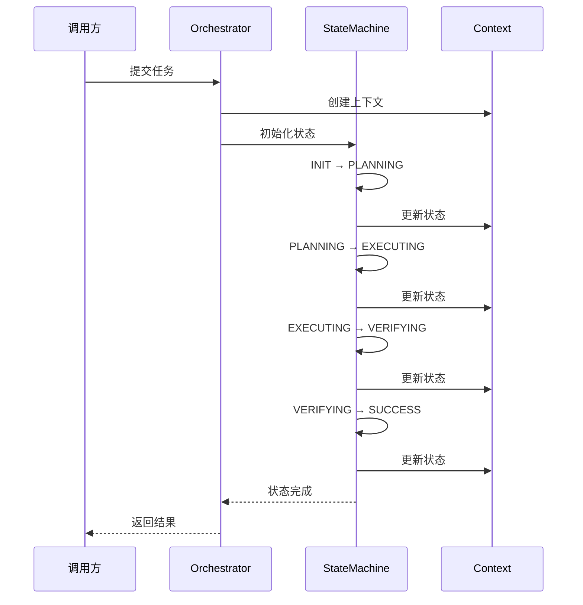

# Core 模块架构

## 组件架构图

## 状态流转时序图

## 状态定义

| 状态 | 说明 | 允许的下一状态 |
|------|------|---------------|
| INIT | 初始化 | PLANNING |
| PLANNING | 规划中 | AUDITING |
| AUDITING | 审核中 | EXECUTING, REJECTED |
| EXECUTING | 执行中 | VERIFYING |
| VERIFYING | 验证中 | SUCCESS, RETRY |
| SUCCESS | 成功 | - |
| RETRY | 重试 | EXECUTING |
| REJECTED | 拒绝 | - |

## 核心组件

| 组件 | 文件 | 职责 |
|------|------|------|
| Orchestrator | orchestrator.py | 任务编排、Agent调度 |
| StateMachine | state_machine.py | 状态流转控制 |
| Context | context.py | 上下文管理 |
| EventBus | events.py | 事件发布订阅 |
| SOPExecutor | sop_executor.py | SOP流程执行 |
