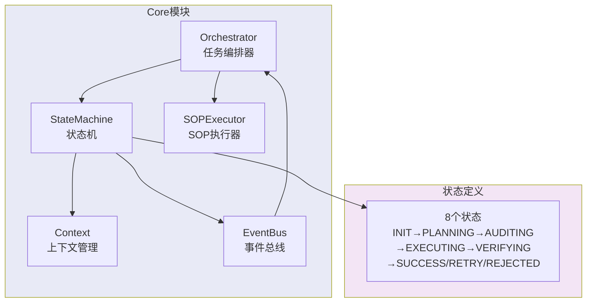
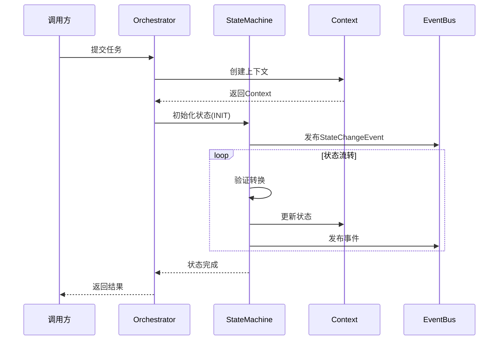

# Core 模块架构

## 模块架构图

## 核心流程时序图

## 核心组件

| 组件 | 文件 | 职责 |
|------|------|------|
| Orchestrator | orchestrator.py | 任务编排、Agent调度 |
| StateMachine | state_machine.py | 状态流转控制 |
| Context | context.py | 上下文管理 |
| EventBus | events.py | 事件发布订阅 |
| SOPExecutor | sop_executor.py | SOP流程执行 |
