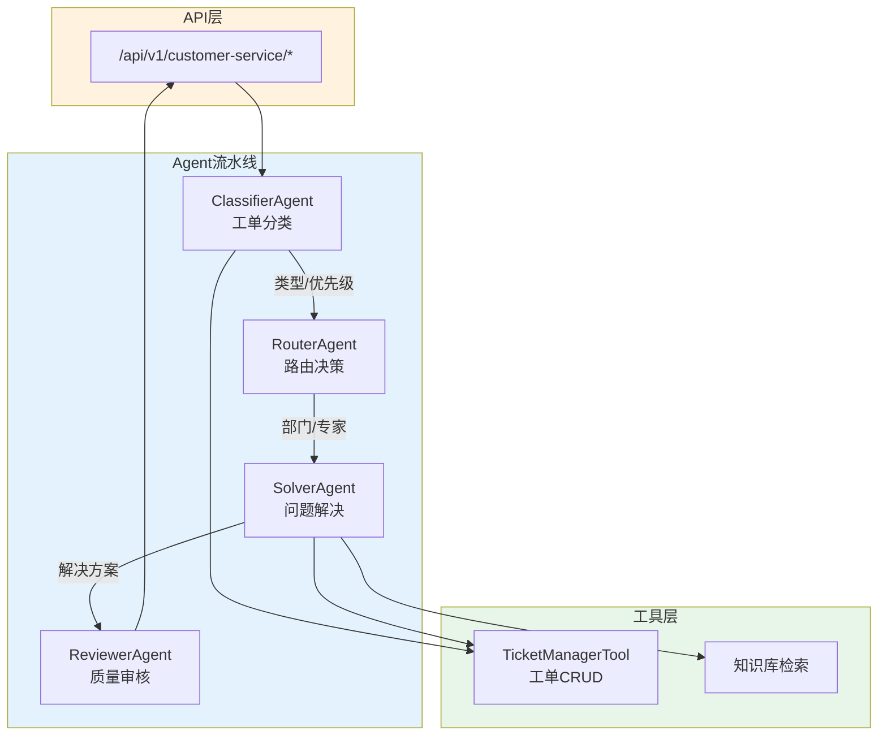
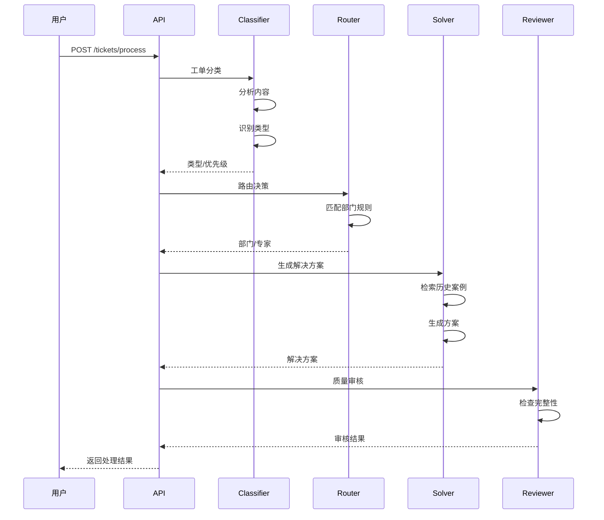

# Customer Service 模块架构（客服工单系统）

## 模块架构图

## 工单处理时序图

## 核心组件

| 组件 | 职责 | 输入 | 输出 |
|------|------|------|------|
| ClassifierAgent | 工单分类 | 工单内容 | 类型、优先级 |
| RouterAgent | 路由决策 | 分类结果 | 部门、专家 |
| SolverAgent | 问题解决 | 路由结果 | 解决方案 |
| ReviewerAgent | 质量审核 | 解决方案 | 审核结果 |

## API接口

| 方法 | 路径 | 说明 |
|------|------|------|
| POST | /customer-service/tickets | 创建工单 |
| POST | /customer-service/tickets/process | 处理工单 |
| GET | /customer-service/tickets | 查询工单列表 |
| GET | /customer-service/tickets/{id} | 查询工单详情 |
| GET | /customer-service/agents/status | 获取Agent状态 |
