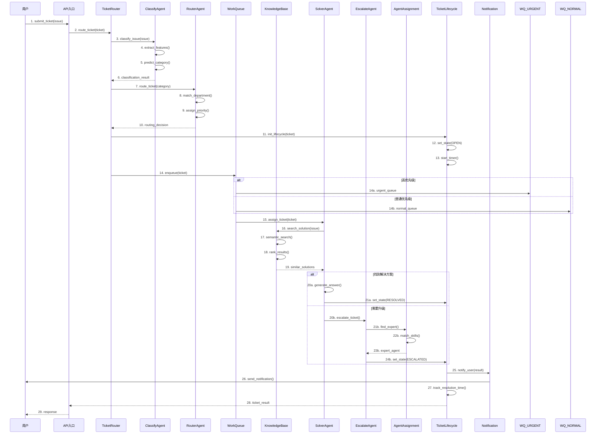
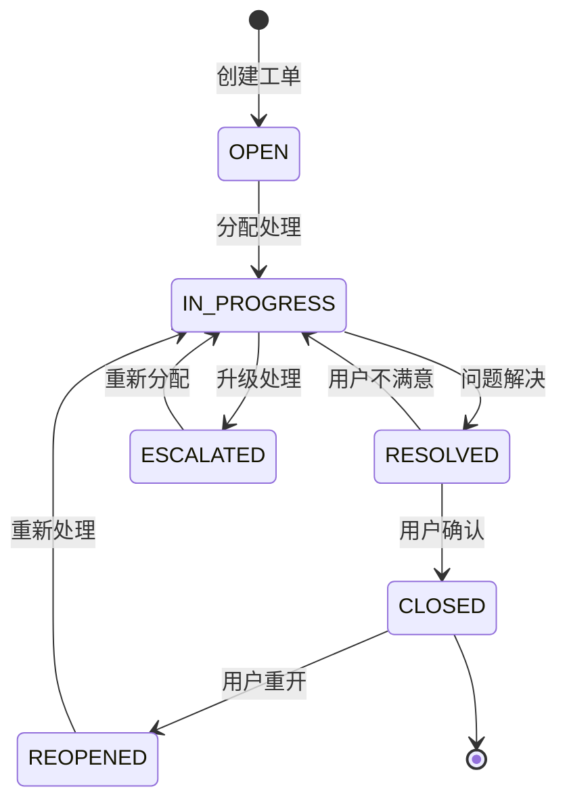

# CustomerService 模块架构（客服工单系统）

## 组件架构图

```mermaid
graph TB
    subgraph TicketRouter工单路由
        TR[TicketRouter<br/>工单路由器<br/><br/>智能分发<br/>优先级排序]
        TR_CLASS[Classifier<br/>分类器<br/><br/>问题分类<br/>意图识别]
        TR_ROUTE[RoutingEngine<br/>路由引擎<br/><br/>规则匹配<br/>队列分配]
        TR_PRIO[PriorityEngine<br/>优先级引擎<br/><br/>紧急度评估<br/>SLA计算]
    end

    subgraph TicketAgents工单Agent
        TA_CLASSIFY[ClassifyAgent<br/>分类Agent<br/><br/>问题类型识别<br/>标签分配]
        TA_ROUTER[RouterAgent<br/>路由Agent<br/><br/>部门分配<br/>人员匹配]
        TA_SOLVE[SolverAgent<br/>解决Agent<br/><br/>问题解答<br/>方案生成]
        TA_ESCALATE[EscalateAgent<br/>升级Agent<br/><br/>复杂问题升级<br/>专家调度]
        TA_FOLLOW[FollowUpAgent<br/>跟进Agent<br/><br/>状态追踪<br/>满意度调查]
    end

    subgraph KnowledgeBase知识库
        KB[KnowledgeBase<br/>知识库<br/><br/>问题库/方案库<br/>FAQ管理]
        KB_INDEX[KnowledgeIndexer<br/>知识索引器<br/><br/>向量化<br/>分类索引]
        KB_SEARCH[KnowledgeSearcher<br/>知识检索器<br/><br/>语义匹配<br/>相似问题]
        KB_UPDATE[KnowledgeUpdater<br/>知识更新器<br/><br/>方案沉淀<br/>知识迭代]
    end

    subgraph WorkQueue工作队列
        WQ[WorkQueueManager<br/>队列管理器<br/><br/>任务队列<br/>负载均衡]
        WQ_URGENT[UrgentQueue<br/>紧急队列<br/><br/>高优先级<br/>即时处理]
        WQ_NORMAL[NormalQueue<br/>普通队列<br/><br/>标准优先级<br/>常规处理]
        WQ_DELAY[DelayedQueue<br/>延迟队列<br/><br/>低优先级<br/>批量处理]
    end

    subgraph TicketLifecycle工单生命周期
        TL[TicketLifecycle<br/>生命周期管理<br/><br/>状态流转<br/>时效控制]
        TL_STATE[StateManager<br/>状态管理器<br/><br/>状态机<br/>转换规则]
        TL_TIME[TimeTracker<br/>时效追踪器<br/><br/>响应时间<br/>解决时间]
        TL_SLA[SLAMonitor<br/>SLA监控器<br/><br/>时效预警<br/>超时告警]
    end

    subgraph AgentAssignment客服分配
        AA[AgentAssignment<br/>客服分配器<br/><br/>技能匹配<br/>负载均衡]
        AA_SKILL[SkillMatcher<br/>技能匹配器<br/><br/>问题-技能映射<br/>专家定位]
        AA_LOAD[LoadBalancer<br/>负载均衡器<br/><br/>工作量统计<br/>分配优化]
        AA_SCHED[Scheduler<br/>调度器<br/><br/>排班管理<br/>交接处理]
    end

    subgraph ResolutionEngine解决引擎
        RE[ResolutionEngine<br/>解决引擎<br/><br/>方案生成<br/>知识应用]
        RE_DIAG[DiagnosticEngine<br/>诊断引擎<br/><br/>问题诊断<br/>根因分析]
        RE_SOLUTION[SolutionGenerator<br/>方案生成器<br/><br/>方案推荐<br/>步骤生成]
        RE_VERIFY[ResolutionVerifier<br/>解决验证器<br/><br/>效果验证<br/>满意度评估]
    end

    subgraph Notification通知系统
        NOTIF[NotificationManager<br/>通知管理器<br/><br/>多渠道通知<br/>模板管理]
        NOTIF_EMAIL[EmailNotifier<br/>邮件通知<br/><br/>工单通知<br/>状态更新]
        NOTIF_SMS[SMSNotifier<br/>短信通知<br/><br/>紧急提醒<br/>验证码]
        NOTIF_PUSH[PushNotifier<br/>推送通知<br/><br/>APP推送<br/>桌面通知]
    end

    subgraph Analytics分析统计
        ANALY[AnalyticsEngine<br/>分析引擎<br/><br/>数据统计<br/>报表生成]
        ANALY_METRIC[MetricsCollector<br/>指标收集器<br/><br/>KPI统计<br/>趋势分析]
        ANALY_REPORT[ReportGenerator<br/>报告生成器<br/><br/>日报/周报<br/>绩效报表]
        ANALY_INSIGHT[InsightEngine<br/>洞察引擎<br/><br/>问题热点<br/>优化建议]
    end

    %% TicketRouter内部连接
    TR --> TR_CLASS
    TR --> TR_ROUTE
    TR --> TR_PRIO
    TR_CLASS --> TR_ROUTE

    %% TicketAgents内部连接
    TA_CLASSIFY --> TA_ROUTER
    TA_ROUTER --> TA_SOLVE
    TA_SOLVE --> TA_ESCALATE
    TA_ESCALATE --> TA_FOLLOW

    %% KnowledgeBase内部连接
    KB --> KB_INDEX
    KB --> KB_SEARCH
    KB --> KB_UPDATE

    %% WorkQueue内部连接
    WQ --> WQ_URGENT
    WQ --> WQ_NORMAL
    WQ --> WQ_DELAY

    %% TicketLifecycle内部连接
    TL --> TL_STATE
    TL --> TL_TIME
    TL --> TL_SLA

    %% AgentAssignment内部连接
    AA --> AA_SKILL
    AA --> AA_LOAD
    AA --> AA_SCHED

    %% ResolutionEngine内部连接
    RE --> RE_DIAG
    RE --> RE_SOLUTION
    RE --> RE_VERIFY

    %% Notification内部连接
    NOTIF --> NOTIF_EMAIL
    NOTIF --> NOTIF_SMS
    NOTIF --> NOTIF_PUSH

    %% Analytics内部连接
    ANALY --> ANALY_METRIC
    ANALY --> ANALY_REPORT
    ANALY --> ANALY_INSIGHT

    %% 模块间连接
    TR_CLASS --> TA_CLASSIFY
    TR_ROUTE --> TA_ROUTER
    TR_PRIO --> WQ_URGENT
    TR_PRIO --> WQ_NORMAL
    TA_SOLVE --> KB_SEARCH
    KB_SEARCH --> RE_SOLUTION
    RE_SOLUTION --> TA_SOLVE
    TA_ESCALATE --> AA_SKILL
    AA_LOAD --> WQ
    WQ --> TL_STATE
    TL_SLA --> NOTIF
    TL_STATE --> TA_FOLLOW
    TA_FOLLOW --> ANALY_METRIC
    RE_VERIFY --> KB_UPDATE

    %% 样式
    classDef router fill:#083B75,color:#fff
    classDef agent fill:#1a5f7a,color:#fff
    classDef knowledge fill:#2e7d32,color:#fff
    classDef queue fill:#1565c0,color:#fff
    classDef lifecycle fill:#6a1b9a,color:#fff
    classDef assign fill:#c62828,color:#fff
    classDef resolution fill:#f57c00,color:#fff
    classDef notify fill:#00838f,color:#fff
    classDef analytics fill:#455a64,color:#fff

    class TR,TR_CLASS,TR_ROUTE,TR_PRIO router
    class TA_CLASSIFY,TA_ROUTER,TA_SOLVE,TA_ESCALATE,TA_FOLLOW agent
    class KB,KB_INDEX,KB_SEARCH,KB_UPDATE knowledge
    class WQ,WQ_URGENT,WQ_NORMAL,WQ_DELAY queue
    class TL,TL_STATE,TL_TIME,TL_SLA lifecycle
    class AA,AA_SKILL,AA_LOAD,AA_SCHED assign
    class RE,RE_DIAG,RE_SOLUTION,RE_VERIFY resolution
    class NOTIF,NOTIF_EMAIL,NOTIF_SMS,NOTIF_PUSH notify
    class ANALY,ANALY_METRIC,ANALY_REPORT,ANALY_INSIGHT analytics
```

## 工单处理时序图

## 文件清单

| 文件 | 类/函数 | 职责 |
|------|--------|------|
| ticket_router.py | TicketRouter | 工单路由主控制器 |
| ticket_router.py | Classifier | 问题分类器 |
| ticket_router.py | RoutingEngine | 路由引擎 |
| ticket_router.py | PriorityEngine | 优先级评估引擎 |
| ticket_agents.py | ClassifyAgent | 分类Agent |
| ticket_agents.py | RouterAgent | 路由Agent |
| ticket_agents.py | SolverAgent | 解决Agent |
| ticket_agents.py | EscalateAgent | 升级Agent |
| ticket_agents.py | FollowUpAgent | 跟进Agent |
| knowledge_tools.py | KnowledgeBase | 知识库管理 |
| knowledge_tools.py | KnowledgeIndexer | 知识索引器 |
| knowledge_tools.py | KnowledgeSearcher | 知识检索器 |
| resolution.py | ResolutionEngine | 解决方案引擎 |
| resolution.py | DiagnosticEngine | 问题诊断引擎 |
| resolution.py | SolutionGenerator | 方案生成器 |

## 工单状态流转

## SLA时效规则

| 优先级 | 响应时间 | 解决时间 | 升级阈值 |
|--------|---------|---------|---------|
| 紧急(P1) | 15分钟 | 4小时 | 30分钟 |
| 高(P2) | 1小时 | 8小时 | 2小时 |
| 中(P3) | 4小时 | 24小时 | 8小时 |
| 低(P4) | 24小时 | 72小时 | 48小时 |

## 路由规则

| 问题类型 | 路由目标 | 处理Agent |
|---------|---------|----------|
| 订单问题 | 订单组 | OrderSolverAgent |
| 退款问题 | 财务组 | RefundSolverAgent |
| 技术问题 | 技术组 | TechSolverAgent |
| 投诉建议 | 客服主管 | ComplainAgent |
| 产品咨询 | 售前组 | SalesAgent |
