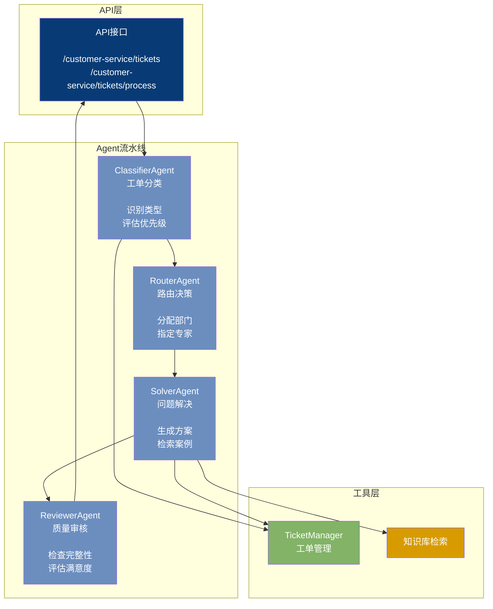
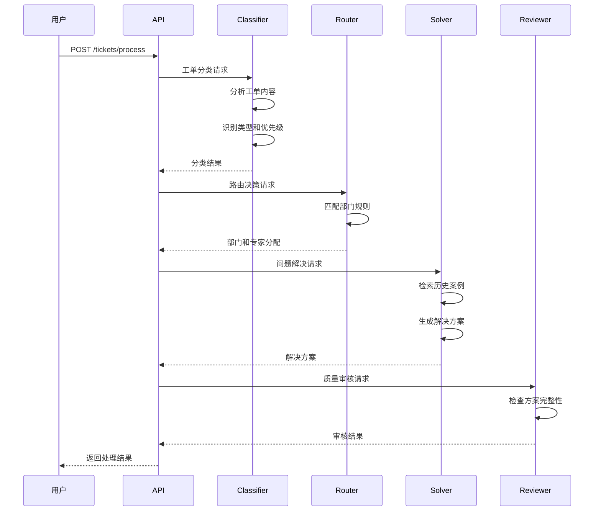

# Customer Service 模块架构（客服工单系统）

## 组件架构图

## 工单处理时序图

## 处理流程

| 阶段 | Agent | 输入 | 输出 |
|------|-------|------|------|
| 分类 | Classifier | 工单内容 | 类型、优先级 |
| 路由 | Router | 分类结果 | 部门、专家 |
| 解决 | Solver | 路由结果 | 解决方案 |
| 审核 | Reviewer | 解决方案 | 审核结果 |
