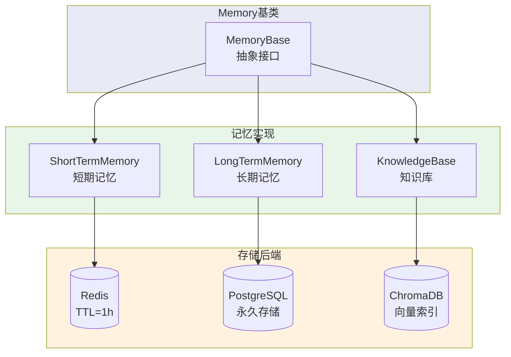
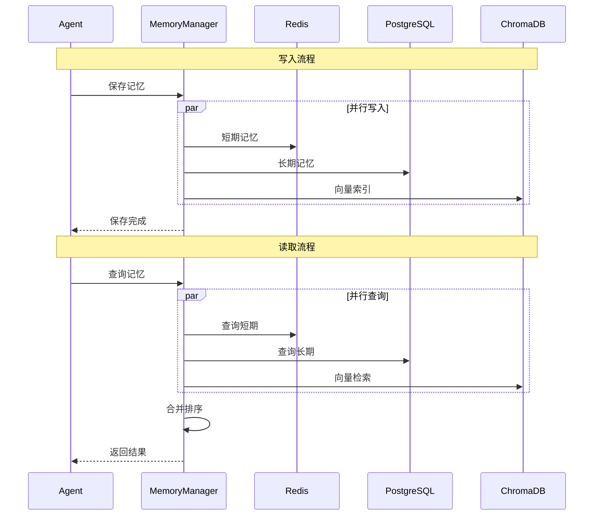

# Memory 模块架构

## 模块架构图

```mermaid
graph TB
    subgraph Memory基类
        BASE["MemoryBase<br/>抽象接口"]
    end
    
    subgraph 记忆实现
        SHORT["ShortTermMemory<br/>短期记忆"]
        LONG["LongTermMemory<br/>长期记忆"]
        KB["KnowledgeBase<br/>知识库"]
    end
    
    subgraph 存储后端
        REDIS[("Redis<br/>TTL=1h")]
        PG[("PostgreSQL<br/>永久存储")]
        CHROMA[("ChromaDB<br/>向量索引")]
    end
    
    BASE --> SHORT
    BASE --> LONG
    BASE --> KB
    
    SHORT --> REDIS
    LONG --> PG
    KB --> CHROMA

    style Memory基类 fill:#e8eaf6
    style 记忆实现 fill:#e8f5e9
    style 存储后端 fill:#fff3e0
```

## 记忆读写时序图

```mermaid
sequenceDiagram
    participant Agent as Agent
    participant Mem as MemoryManager
    participant Short as Redis
    participant Long as PostgreSQL
    participant KB as ChromaDB

    Note over Agent,KB: 写入流程
    Agent->>Mem: 保存记忆
    par 并行写入
        Mem->>Short: 短期记忆
        Mem->>Long: 长期记忆
        Mem->>KB: 向量索引
    end
    Mem-->>Agent: 保存完成
    
    Note over Agent,KB: 读取流程
    Agent->>Mem: 查询记忆
    par 并行查询
        Mem->>Short: 查询短期
        Mem->>Long: 查询长期
        Mem->>KB: 向量检索
    end
    Mem->>Mem: 合并排序
    Mem-->>Agent: 返回结果
```

## 记忆类型

| 类型 | 存储 | TTL | 用途 |
|------|------|-----|------|
| 短期记忆 | Redis | 1小时 | 会话上下文 |
| 长期记忆 | PostgreSQL | 永久 | 历史记录 |
| 知识库 | ChromaDB | 永久 | RAG检索 |
