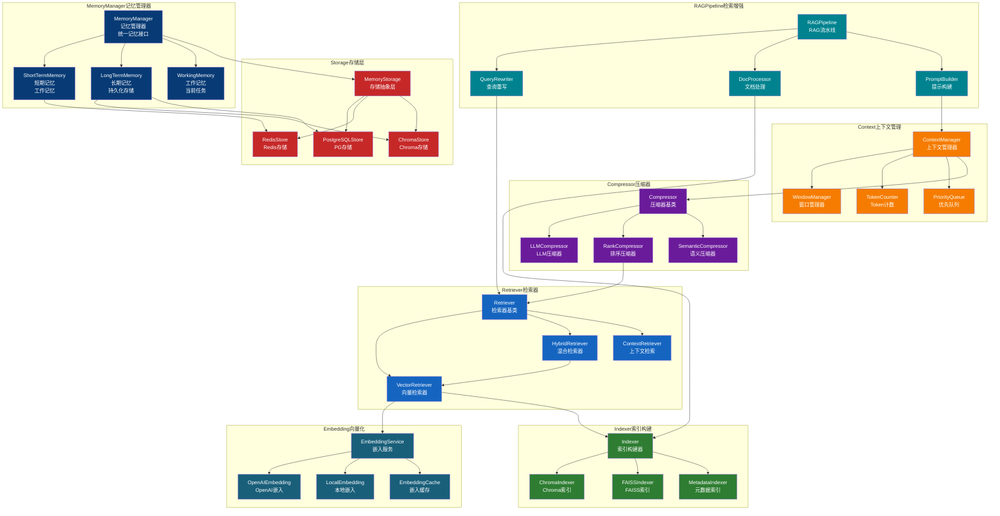
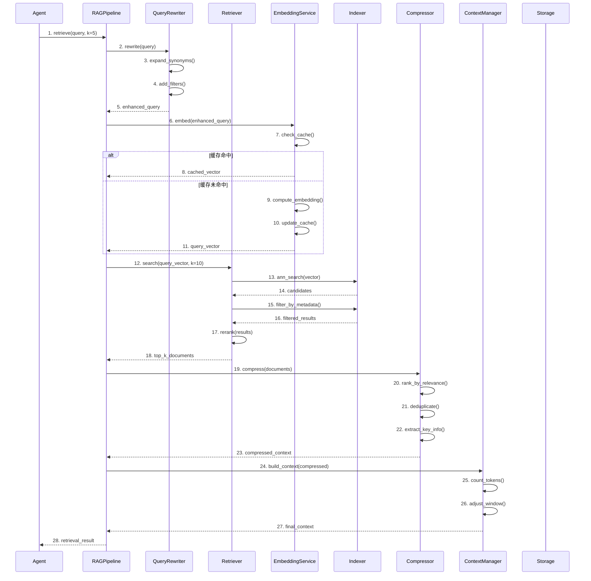

# Memory 模块架构

## 组件架构图



## RAG检索时序图



## 文件清单

| 文件 | 类/函数 | 职责 |
|------|--------|------|
| memory_manager.py | MemoryManager | 记忆管理器主类 |
| memory_manager.py | ShortTermMemory | 短期记忆管理 |
| memory_manager.py | LongTermMemory | 长期记忆管理 |
| memory_manager.py | WorkingMemory | 工作记忆管理 |
| embeddings.py | EmbeddingService | 嵌入服务基类 |
| embeddings.py | OpenAIEmbedding | OpenAI嵌入实现 |
| embeddings.py | LocalEmbedding | 本地嵌入实现 |
| embeddings.py | EmbeddingCache | 嵌入结果缓存 |
| indexer.py | Indexer | 索引构建器基类 |
| indexer.py | ChromaIndexer | ChromaDB索引器 |
| indexer.py | FAISSIndexer | FAISS索引器 |
| retriever.py | Retriever | 检索器基类 |
| retriever.py | VectorRetriever | 向量检索器 |
| retriever.py | HybridRetriever | 混合检索器 |
| retriever.py | ContextRetriever | 上下文检索器 |
| compressor.py | Compressor | 压缩器基类 |
| compressor.py | LLMCompressor | LLM摘要压缩 |
| compressor.py | RankCompressor | 排序压缩 |
| compressor.py | SemanticCompressor | 语义去重压缩 |
| context_manager.py | ContextManager | 上下文管理器 |
| context_manager.py | WindowManager | 窗口管理器 |
| context_manager.py | TokenCounter | Token计数器 |

## 记忆类型

| 类型 | 存储 | 生命周期 | 用途 |
|------|------|---------|------|
| 短期记忆 | Redis | 会话级别 | 当前对话上下文 |
| 长期记忆 | ChromaDB | 持久化 | 知识库、历史经验 |
| 工作记忆 | Redis | 任务级别 | 任务执行状态 |
| 情景记忆 | PostgreSQL | 持久化 | 事件历史记录 |

## RAG检索流程

```
Query → QueryRewrite → Embedding → ANN Search → Filter → Rerank → Compress → Context
```

## Token管理策略

| 策略 | 说明 |
|------|------|
| 滑动窗口 | 保持最近N轮对话 |
| 优先级队列 | 保留高重要性记忆 |
| 语义去重 | 合并相似内容 |
| 摘要压缩 | 历史对话摘要 |
