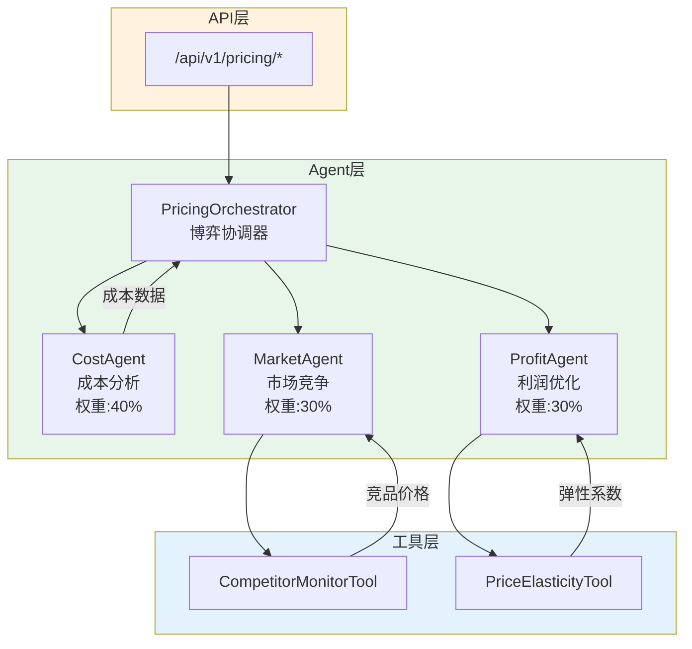
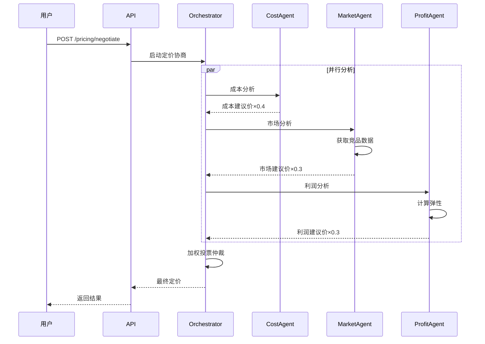

# Pricing 模块架构（博弈定价系统）

## 模块架构图

## 博弈定价时序图

## 核心组件

| 组件 | 职责 | 权重 |
|------|------|------|
| PricingOrchestrator | 博弈协调、投票仲裁 | - |
| CostAgent | 成本分析、确保毛利 | 40% |
| MarketAgent | 竞品分析、市场定位 | 30% |
| ProfitAgent | 利润优化、弹性分析 | 30% |

## API接口

| 方法 | 路径 | 说明 |
|------|------|------|
| POST | /pricing/negotiate | 启动定价协商 |
| GET | /pricing/history | 查询定价历史 |
| GET | /pricing/agents/status | 获取Agent状态 |
