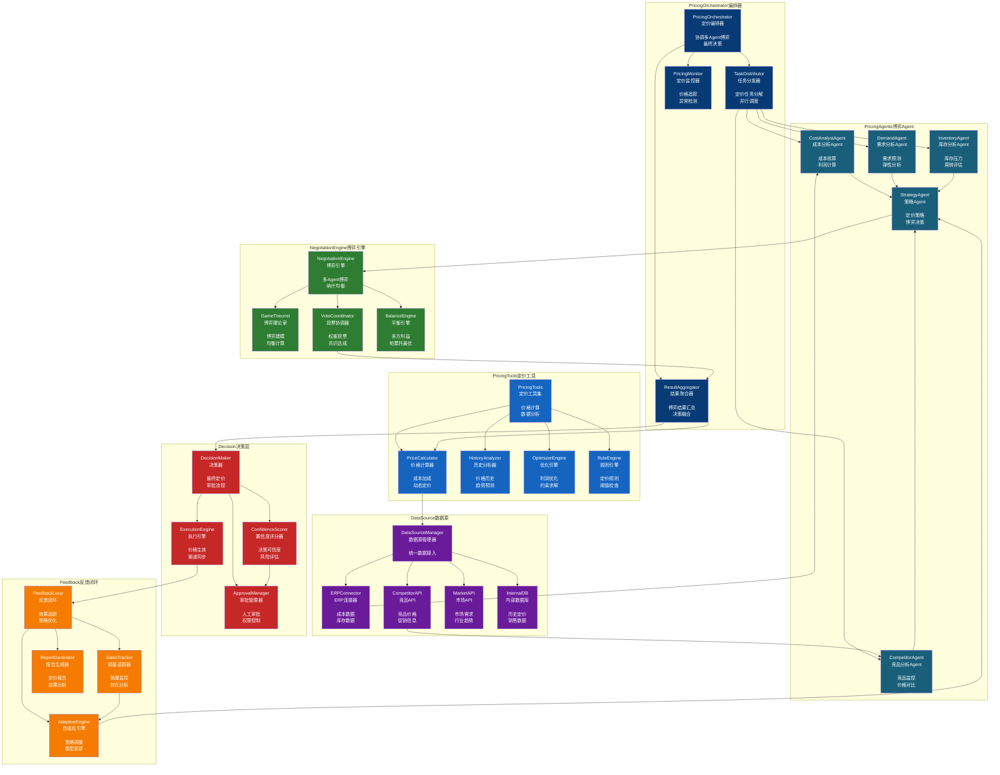
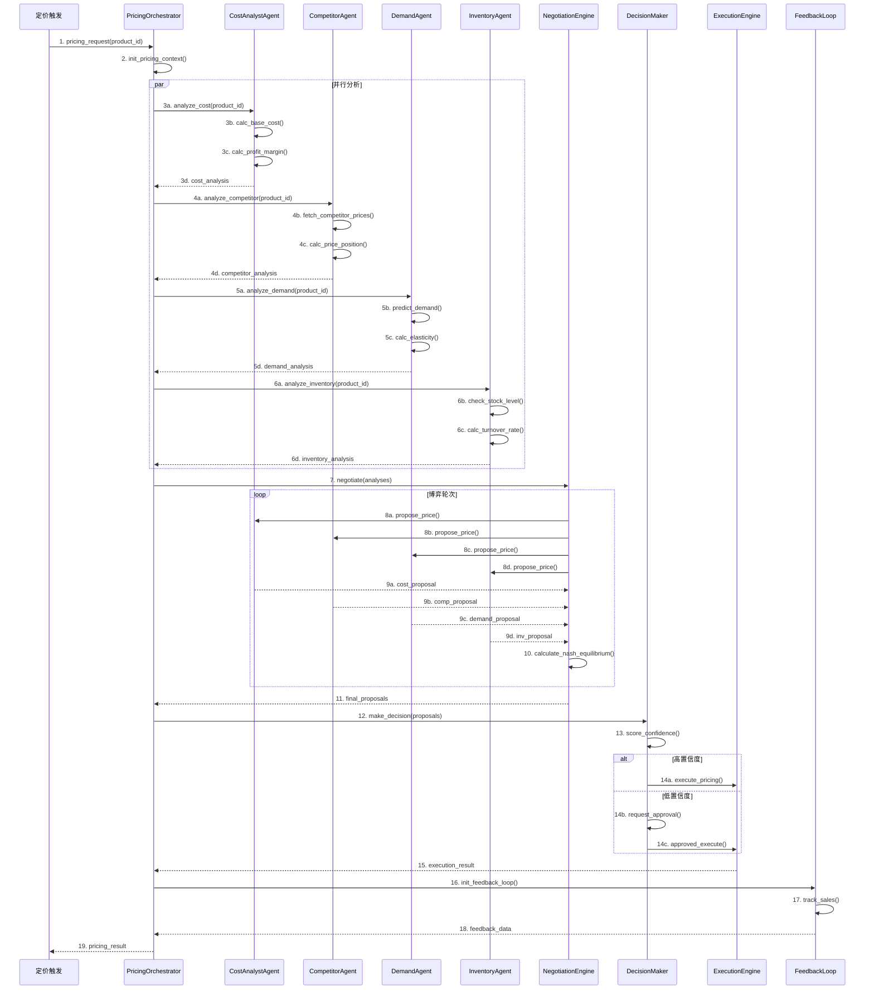

# Pricing 模块架构（博弈定价系统）

## 组件架构图



## 博弈定价时序图



## 文件清单

| 文件 | 类/函数 | 职责 |
|------|--------|------|
| pricing_orchestrator.py | PricingOrchestrator | 定价编排主控制器 |
| pricing_orchestrator.py | TaskDistributor | 任务分发器 |
| pricing_orchestrator.py | ResultAggregator | 结果聚合器 |
| pricing_agents.py | CostAnalystAgent | 成本分析Agent |
| pricing_agents.py | CompetitorAgent | 竞品分析Agent |
| pricing_agents.py | DemandAgent | 需求分析Agent |
| pricing_agents.py | InventoryAgent | 库存分析Agent |
| pricing_agents.py | StrategyAgent | 策略Agent |
| negotiation.py | NegotiationEngine | 博弈引擎 |
| negotiation.py | GameTheorist | 博弈理论计算 |
| negotiation.py | VoteCoordinator | 投票协调 |
| pricing_tools.py | PriceCalculator | 价格计算器 |
| pricing_tools.py | HistoryAnalyzer | 历史分析器 |
| pricing_tools.py | OptimizerEngine | 优化引擎 |
| pricing_tools.py | RuleEngine | 规则引擎 |

## Agent博弈策略

| Agent | 目标函数 | 权重 | 约束条件 |
|-------|---------|------|---------|
| CostAnalyst | 利润最大化 | 0.3 | 成本覆盖 |
| Competitor | 市场份额 | 0.25 | 竞品价格区间 |
| Demand | 销量最大化 | 0.25 | 需求弹性 |
| Inventory | 库存周转 | 0.2 | 库存水位 |

## 博弈均衡算法

```
1. 各Agent独立计算最优价格提案
2. NegotiationEngine收集所有提案
3. 计算加权平均作为初始均衡点
4. 迭代调整直至收敛（纳什均衡）
5. 验证帕累托最优性
6. 输出最终定价建议
```

## 定价触发条件

| 触发类型 | 条件 | 频率 |
|---------|------|------|
| 定时定价 | 周期性执行 | 每日/每周 |
| 事件定价 | 库存/竞品变化 | 实时 |
| 请求定价 | API调用 | 按需 |
| 异常定价 | 价格异常检测 | 实时 |
