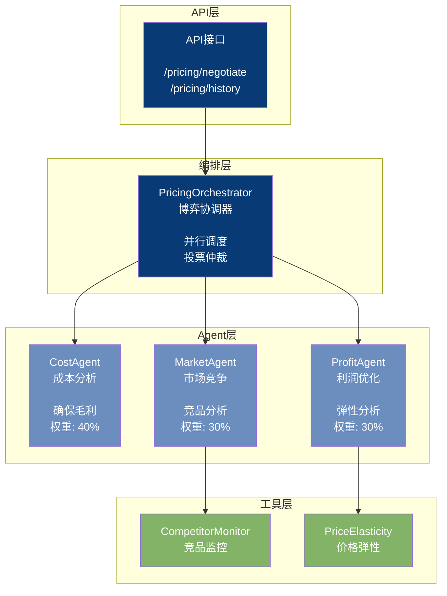
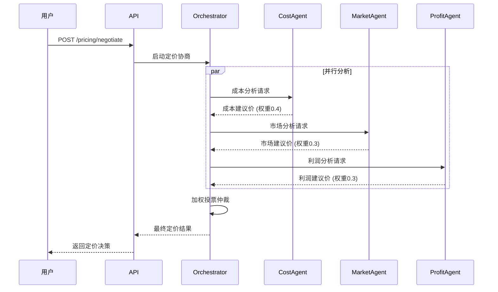

# Pricing 模块架构（博弈定价系统）

## 组件架构图



## 博弈定价时序图



## 博弈机制

| Agent | 视角 | 权重 | 关注点 |
|-------|------|------|--------|
| CostAgent | 成本 | 40% | 确保覆盖成本+毛利 |
| MarketAgent | 市场 | 30% | 竞品定价、市场定位 |
| ProfitAgent | 利润 | 30% | 价格弹性、利润最大化 |

## 最终定价公式

```
最终价格 = CostPrice × 0.4 + MarketPrice × 0.3 + ProfitPrice × 0.3
```
