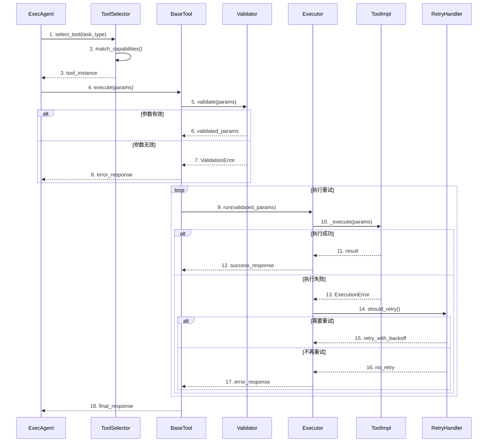

# Tool 模块架构

## 组件架构图

```mermaid
graph TB
    subgraph Base基类
        BASE[BaseTool<br/>工具基类<br/><br/>定义工具接口<br/>参数验证]
        BASE_SCHEMA[ToolSchema<br/>工具模式<br/><br/>输入输出定义<br/>JSON Schema]
        BASE_VALID[Validator<br/>参数验证器<br/><br/>类型检查<br/>范围验证]
        BASE_EXEC[Executor<br/>执行器<br/><br/>同步/异步执行<br/>超时控制]
    end

    subgraph Ecommerce电商工具
        ECOM[EcommerceTool<br/>电商工具集<br/><br/>商品/订单/库存]
        ECOM_PROD[ProductTool<br/>商品工具<br/><br/>商品查询<br/>价格管理]
        ECOM_ORDER[OrderTool<br/>订单工具<br/><br/>订单创建<br/>状态查询]
        ECOM_INV[InventoryTool<br/>库存工具<br/><br/>库存查询<br/>调拨管理]
        ECOM_PRICE[PriceTool<br/>定价工具<br/><br/>价格计算<br/>折扣管理]
    end

    subgraph Database数据库工具
        DB[DatabaseTool<br/>数据库工具集<br/><br/>CRUD操作]
        DB_QUERY[QueryTool<br/>查询工具<br/><br/>SELECT查询<br/>条件构建]
        DB_MUTATE[MutateTool<br/>变更工具<br/><br/>INSERT/UPDATE<br/>DELETE]
        DB_TRANS[TransactionTool<br/>事务工具<br/><br/>事务管理<br/>批量操作]
        DB_MIG[MigrationTool<br/>迁移工具<br/><br/>Schema变更<br/>数据迁移]
    end

    subgraph HTTP网络工具
        HTTP[HttpClientTool<br/>HTTP工具集<br/><br/>API调用]
        HTTP_GET[GETTool<br/>GET请求<br/><br/>查询接口<br/>分页处理]
        HTTP_POST[POSTTool<br/>POST请求<br/><br/>数据提交<br/>文件上传]
        HTTP_AUTH[AuthManager<br/>认证管理器<br/><br/>Token管理<br/>签名计算]
        HTTP_RETRY[RetryPolicy<br/>重试策略<br/><br/>失败重试<br/>熔断保护]
    end

    subgraph File文件工具
        FILE[FileOpsTool<br/>文件工具集<br/><br/>文件读写]
        FILE_READ[FileReader<br/>文件读取器<br/><br/>文本/JSON<br/>编码处理]
        FILE_WRITE[FileWriter<br/>文件写入器<br/><br/>创建/追加<br/>原子写入]
        FILE_GLOB[FileGlobber<br/>文件搜索器<br/><br/>模式匹配<br/>递归搜索]
        FILE_COMP[FileCompressor<br/>文件压缩器<br/><br/>ZIP/TAR<br/>解压缩]
    end

    subgraph Notification通知工具
        NOTIFY[NotificationTool<br/>通知工具集<br/><br/>消息推送]
        NOTIFY_EMAIL[EmailNotifier<br/>邮件通知<br/><br/>SMTP发送<br/>模板渲染]
        NOTIFY_SMS[SMSNotifier<br/>短信通知<br/><br/>短信网关<br/>状态查询]
        NOTIFY_WEB[WebhookNotifier<br/>Webhook通知<br/><br/>HTTP回调<br/>重试机制]
        NOTIFY_PUSH[PushNotifier<br/>推送通知<br/><br/>移动推送<br/>订阅管理]
    end

    subgraph Healing自愈工具
        HEAL[HealingTool<br/>自愈工具集<br/><br/>故障恢复]
        HEAL_DIAG[DiagnosticTool<br/>诊断工具<br/><br/>健康检查<br/>问题定位]
        HEAL_FIX[FixTool<br/>修复工具<br/><br/>自动修复<br/>配置恢复]
        HEAL_ROLL[RollbackTool<br/>回滚工具<br/><br/>版本回退<br/>状态恢复]
    end

    subgraph MCP外部工具
        MCP[MCPTool<br/>MCP工具集<br/><br/>外部工具接入]
        MCP_CLIENT[MCPClient<br/>MCP客户端<br/><br/>协议通信<br/>工具发现]
        MCP_DB[MCPDatabase<br/>MCP数据库<br/><br/>外部数据源<br/>统一查询]
        MCP_SEARCH[MCPSearch<br/>MCP搜索<br/><br/>外部检索<br/>结果聚合]
    end

    subgraph Retrieval检索工具
        RETR[RetrieverTool<br/>检索工具集<br/><br/>语义检索]
        RETR_VEC[VectorRetriever<br/>向量检索器<br/><br/>相似度搜索<br/>ANN索引]
        RETR_HYB[HybridRetriever<br/>混合检索器<br/><br/>关键词+向量<br/>重排序]
        RETR_CTX[ContextManager<br/>上下文管理器<br/><br/>窗口控制<br/>去重过滤]
    end

    subgraph Embedding向量工具
        EMBED[EmbeddingTool<br/>向量化工具<br/><br/>文本嵌入]
        EMBED_OPEN[OpenAIEmbedding<br/>OpenAI嵌入<br/><br/>text-embedding<br/>批量处理]
        EMBED_LOCAL[LocalEmbedding<br/>本地嵌入<br/><br/>SentenceTransform<br/>离线推理]
    end

    subgraph Langchain集成
        LC[LangchainTools<br/>Langchain工具<br/><br/>框架集成]
        LC_WRAP[ToolWrapper<br/>工具包装器<br/><br/>格式转换<br/>接口适配]
    end

    %% Base内部连接
    BASE --> BASE_SCHEMA
    BASE --> BASE_VALID
    BASE --> BASE_EXEC

    %% Ecommerce内部连接
    ECOM --> ECOM_PROD
    ECOM --> ECOM_ORDER
    ECOM --> ECOM_INV
    ECOM --> ECOM_PRICE

    %% Database内部连接
    DB --> DB_QUERY
    DB --> DB_MUTATE
    DB --> DB_TRANS
    DB --> DB_MIG

    %% HTTP内部连接
    HTTP --> HTTP_GET
    HTTP --> HTTP_POST
    HTTP --> HTTP_AUTH
    HTTP --> HTTP_RETRY

    %% File内部连接
    FILE --> FILE_READ
    FILE --> FILE_WRITE
    FILE --> FILE_GLOB
    FILE --> FILE_COMP

    %% Notification内部连接
    NOTIFY --> NOTIFY_EMAIL
    NOTIFY --> NOTIFY_SMS
    NOTIFY --> NOTIFY_WEB
    NOTIFY --> NOTIFY_PUSH

    %% Healing内部连接
    HEAL --> HEAL_DIAG
    HEAL --> HEAL_FIX
    HEAL --> HEAL_ROLL

    %% MCP内部连接
    MCP --> MCP_CLIENT
    MCP --> MCP_DB
    MCP --> MCP_SEARCH

    %% Retrieval内部连接
    RETR --> RETR_VEC
    RETR --> RETR_HYB
    RETR --> RETR_CTX

    %% Embedding内部连接
    EMBED --> EMBED_OPEN
    EMBED --> EMBED_LOCAL

    %% Langchain内部连接
    LC --> LC_WRAP

    %% 继承关系
    BASE -.->|继承| ECOM
    BASE -.->|继承| DB
    BASE -.->|继承| HTTP
    BASE -.->|继承| FILE
    BASE -.->|继承| NOTIFY
    BASE -.->|继承| HEAL
    BASE -.->|继承| MCP
    BASE -.->|继承| RETR
    BASE -.->|继承| EMBED
    BASE -.->|继承| LC

    %% 工具间协作
    RETR_VEC --> EMBED
    HTTP_AUTH --> HTTP_RETRY
    HEAL_DIAG --> HEAL_FIX

    %% 样式
    classDef base fill:#083B75,color:#fff
    classDef ecommerce fill:#1a5f7a,color:#fff
    classDef database fill:#2e7d32,color:#fff
    classDef http fill:#1565c0,color:#fff
    classDef file fill:#6a1b9a,color:#fff
    classDef notify fill:#c62828,color:#fff
    classDef healing fill:#f57c00,color:#fff
    classDef mcp fill:#455a64,color:#fff
    classDef retrieval fill:#00838f,color:#fff

    class BASE,BASE_SCHEMA,BASE_VALID,BASE_EXEC base
    class ECOM,ECOM_PROD,ECOM_ORDER,ECOM_INV,ECOM_PRICE ecommerce
    class DB,DB_QUERY,DB_MUTATE,DB_TRANS,DB_MIG database
    class HTTP,HTTP_GET,HTTP_POST,HTTP_AUTH,HTTP_RETRY http
    class FILE,FILE_READ,FILE_WRITE,FILE_GLOB,FILE_COMP file
    class NOTIFY,NOTIFY_EMAIL,NOTIFY_SMS,NOTIFY_WEB,NOTIFY_PUSH notify
    class HEAL,HEAL_DIAG,HEAL_FIX,HEAL_ROLL healing
    class MCP,MCP_CLIENT,MCP_DB,MCP_SEARCH mcp
    class RETR,RETR_VEC,RETR_HYB,RETR_CTX,EMBED,EMBED_OPEN,EMBED_LOCAL retrieval
    class LC,LC_WRAP base
```

## 工具调用时序图

## 文件清单

| 文件 | 类/函数 | 职责 |
|------|--------|------|
| base.py | BaseTool | 工具抽象基类 |
| base.py | ToolSchema | 工具Schema定义 |
| base.py | Validator | 参数验证器 |
| ecommerce.py | ProductTool | 商品操作工具 |
| ecommerce.py | OrderTool | 订单操作工具 |
| ecommerce.py | InventoryTool | 库存操作工具 |
| ecommerce.py | PriceTool | 定价操作工具 |
| database.py | QueryTool | 数据库查询工具 |
| database.py | MutateTool | 数据库变更工具 |
| database.py | TransactionTool | 事务管理工具 |
| http_client.py | HttpClientTool | HTTP请求工具 |
| http_client.py | AuthManager | 认证管理器 |
| file_ops.py | FileReader | 文件读取工具 |
| file_ops.py | FileWriter | 文件写入工具 |
| notification.py | EmailNotifier | 邮件通知工具 |
| notification.py | WebhookNotifier | Webhook通知工具 |
| healing.py | DiagnosticTool | 诊断工具 |
| healing.py | FixTool | 修复工具 |
| mcp.py | MCPClient | MCP客户端 |
| mcp.py | MCPTool | MCP工具包装 |
| mcp_db.py | MCPDatabase | MCP数据库工具 |
| retriever.py | VectorRetriever | 向量检索工具 |
| retriever.py | HybridRetriever | 混合检索工具 |
| embeddings.py | OpenAIEmbedding | OpenAI嵌入工具 |
| indexer.py | Indexer | 索引构建工具 |
| compressor.py | ContextCompressor | 上下文压缩工具 |
| context_manager.py | ToolContextManager | 工具上下文管理 |
| langchain_tools.py | LangchainToolWrapper | Langchain工具包装 |
| internal.py | InternalTool | 内部工具集 |
| devops.py | DevopsTool | 运维工具集 |

## 工具分类

| 分类 | 工具 | 输入 | 输出 |
|------|------|------|------|
| 电商 | ProductTool | product_id | product_info |
| 电商 | OrderTool | order_params | order_id |
| 数据库 | QueryTool | sql, params | rows |
| 数据库 | MutateTool | sql, params | affected_rows |
| HTTP | GETTool | url, headers | response |
| HTTP | POSTTool | url, data, headers | response |
| 文件 | FileReader | file_path | content |
| 文件 | FileWriter | file_path, content | success |
| 通知 | EmailNotifier | to, subject, body | message_id |
| 检索 | VectorRetriever | query, k | documents |
| 向量 | EmbeddingTool | text | vector |
