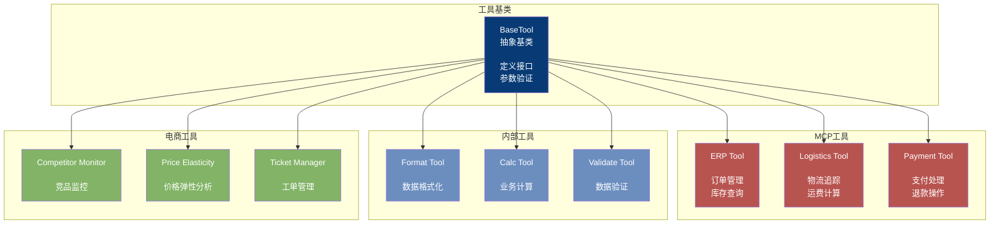
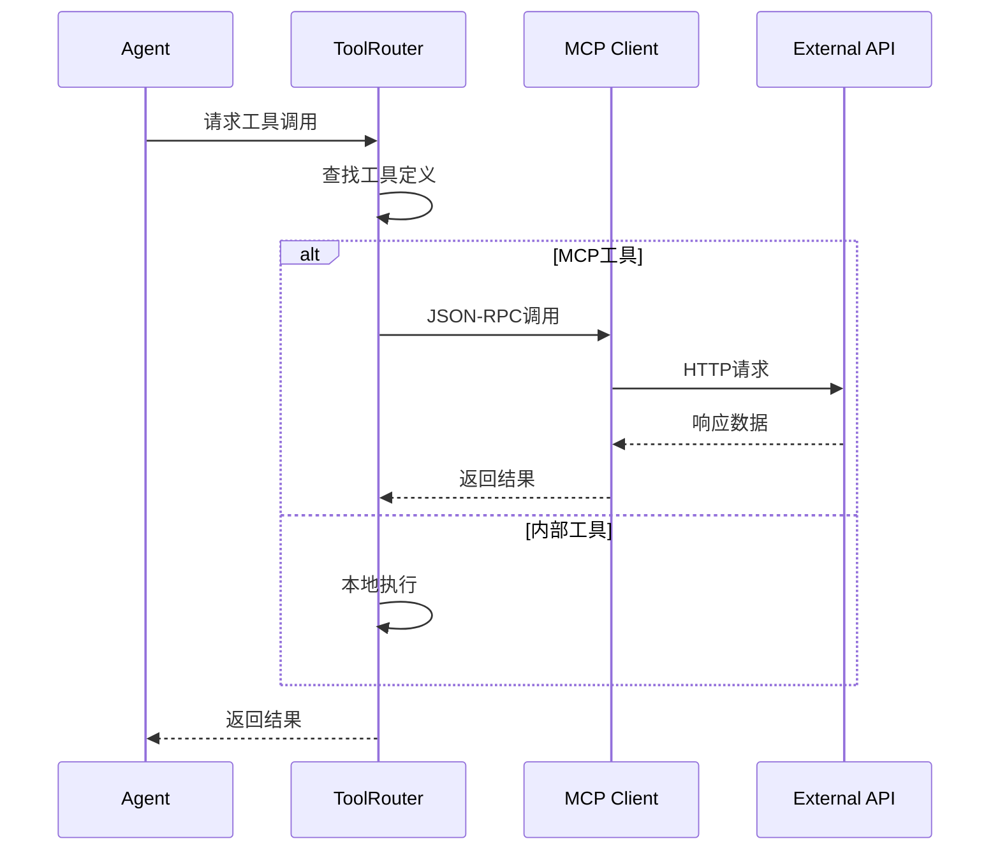

# Tool 模块架构

## 组件架构图

## 工具调用时序图

## 工具分类

| 类别 | 工具 | 功能 |
|------|------|------|
| MCP | ERP Tool | 订单管理、库存查询 |
| MCP | Logistics Tool | 物流追踪、运费计算 |
| MCP | Payment Tool | 支付、退款 |
| 内部 | Format Tool | 数据格式化 |
| 内部 | Calc Tool | 业务计算 |
| 内部 | Validate Tool | 数据验证 |
| 电商 | Competitor Monitor | 竞品价格监控 |
| 电商 | Price Elasticity | 价格弹性分析 |
| 电商 | Ticket Manager | 工单CRUD操作 |
