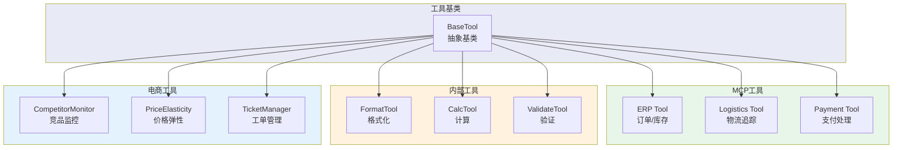
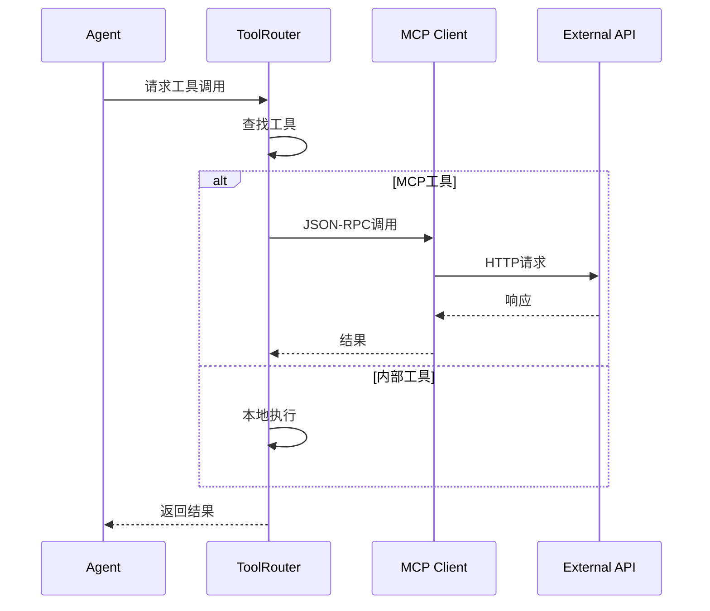

# Tool 模块架构

## 模块架构图

## 工具调用时序图

## 工具分类

| 类别 | 工具 | 说明 |
|------|------|------|
| MCP | ERP Tool | 订单管理、库存查询 |
| MCP | Logistics Tool | 物流追踪、运费计算 |
| MCP | Payment Tool | 支付、退款 |
| 内部 | FormatTool | 数据格式化 |
| 内部 | CalcTool | 业务计算 |
| 内部 | ValidateTool | 数据验证 |
| 电商 | CompetitorMonitor | 竞品价格监控 |
| 电商 | PriceElasticity | 价格弹性分析 |
| 电商 | TicketManager | 工单CRUD |
