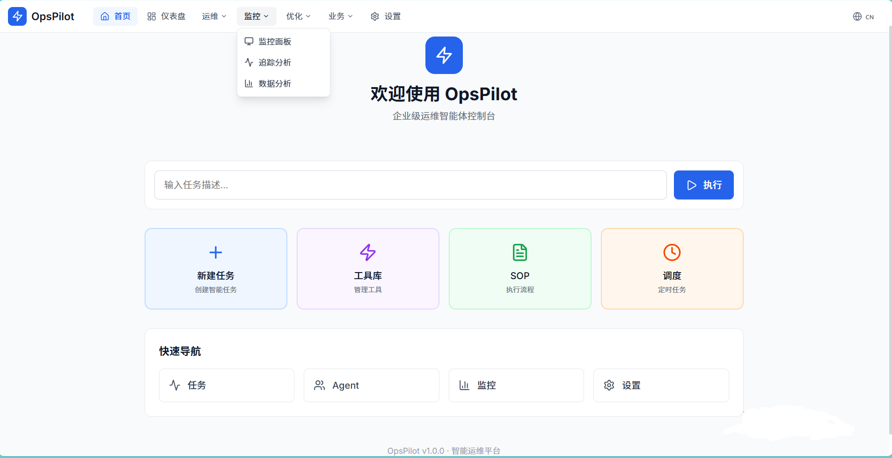
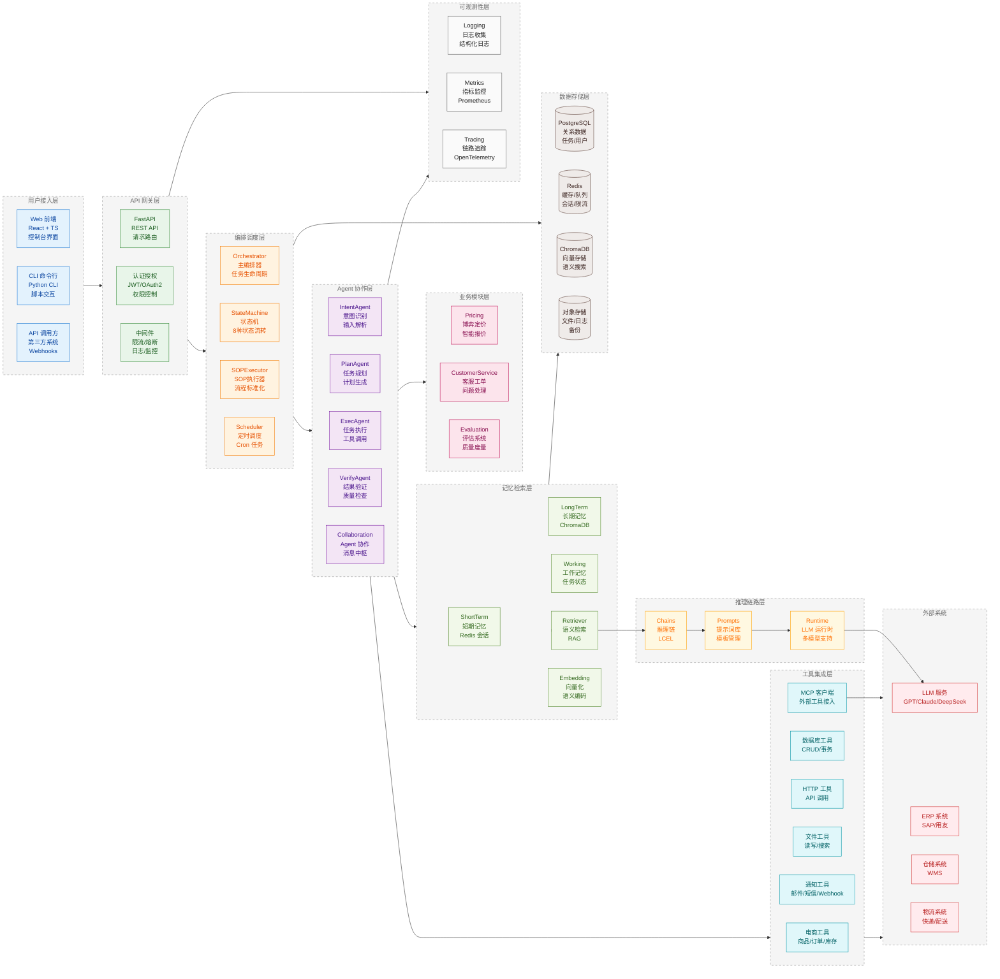
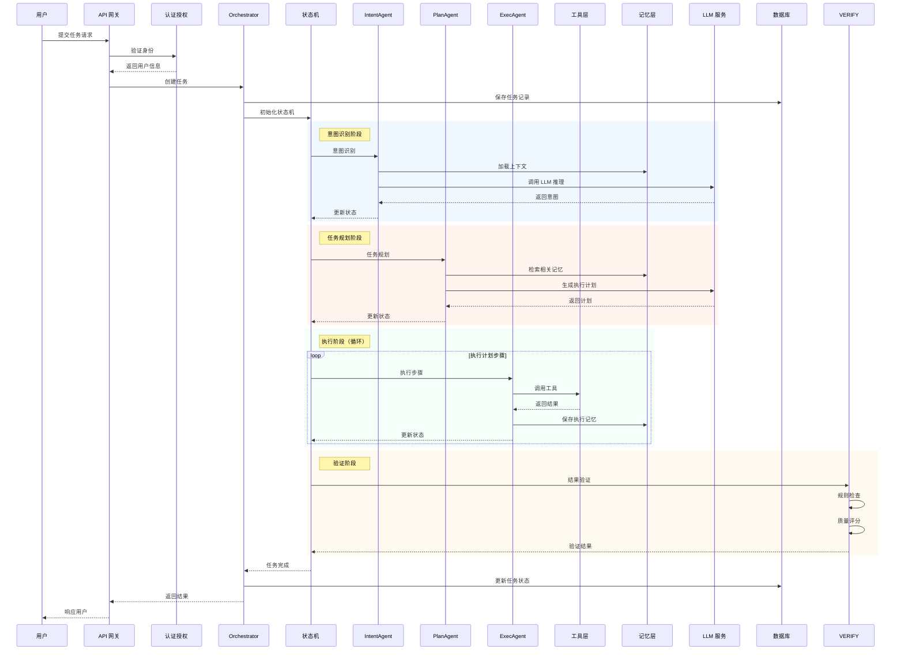

<h1 align="center">OpsPilot</h1>

<p align="center">
  <strong>企业级 AI 运维自动化平台</strong>
</p>

<p align="center">
  连接大语言模型与企业系统，实现运维自动化
</p>

<p align="center">
  <a href="#核心特性">核心特性</a> •
  <a href="#架构设计">架构设计</a> •
  <a href="#快速开始">快速开始</a> •
  <a href="#文档">文档</a> •
  <a href="#贡献">贡献</a>
</p>

<p align="center">
  
  
  
  
  
  
  
</p>

---

### 主页预览



新任务 | 工具中心 | SOP 管理 | 定时调度 | Agent 管理 | 监控分析 | 系统设置

更多功能（如博弈定价、客服工单等）详见 [功能模块](docs/architecture)

---

## 核心特性

| 特性 | 说明 |
|------|------|
| **多 Agent 协作** | Intent → Plan → Exec → Verify 闭环执行流程，多 Agent 消息中枢，博弈校验 |
| **状态机驱动** | 8 种任务状态自动流转，支持重试与回退机制 |
| **SOP 标准化** | 标准操作流程模板化执行，定时任务调度 |
| **记忆系统** | 短期/长期/工作记忆三级架构，RAG 语义检索 |
| **MCP 集成** | Model Context Protocol 标准化工具接口，动态扩展外部工具 |
| **故障自愈** | 6 种自动降级策略，工具沙箱隔离执行 |

---

## 架构设计

### 整体架构



### 核心流程



---

## 快速开始

### 环境要求

| 依赖 | 版本 |
|------|------|
| Python | 3.10+ |
| Node.js | 20+ |
| PostgreSQL | 15+ |
| Redis | 7+ |

### 安装步骤

```bash
# 1. 克隆项目
git clone https://github.com/Aiting-for-you/OpsPilot.git
cd OpsPilot

# 2. 安装后端依赖
pip install -e .

# 3. 初始化数据库
python scripts/init_data.py

# 4. 启动后端服务
uvicorn opspilot.api:app --reload --port 8000

# 5. 安装前端依赖
cd frontend && npm install

# 6. 启动前端开发服务器
npm run dev
```

### 服务地址

- 前端界面：http://localhost:5173
- API 文档：http://localhost:8000/docs

---

## 文档

- [架构设计](docs/architecture/01_overall.md) — 完整架构文档与设计理念
- [核心模块](docs/architecture/module-core.md) — 核心模块详解
- [Agent 模块](docs/architecture/module-agent.md) — 多 Agent 协作机制
- [记忆系统](docs/architecture/module-memory.md) — 记忆系统设计
- [工具模块](docs/architecture/module-tool.md) — 工具集成与 MCP

---

## 贡献

欢迎提交 Issue 和 Pull Request！如有 Bug 反馈、功能建议或合作意向，欢迎通过邮箱联系：cyx0414@outlook.com

---

## 许可证

Apache License 2.0 - 详见 [LICENSE](LICENSE) 文件