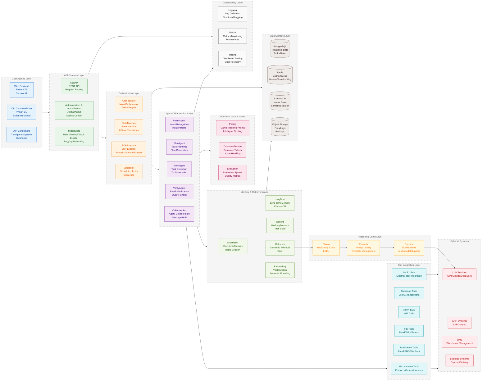
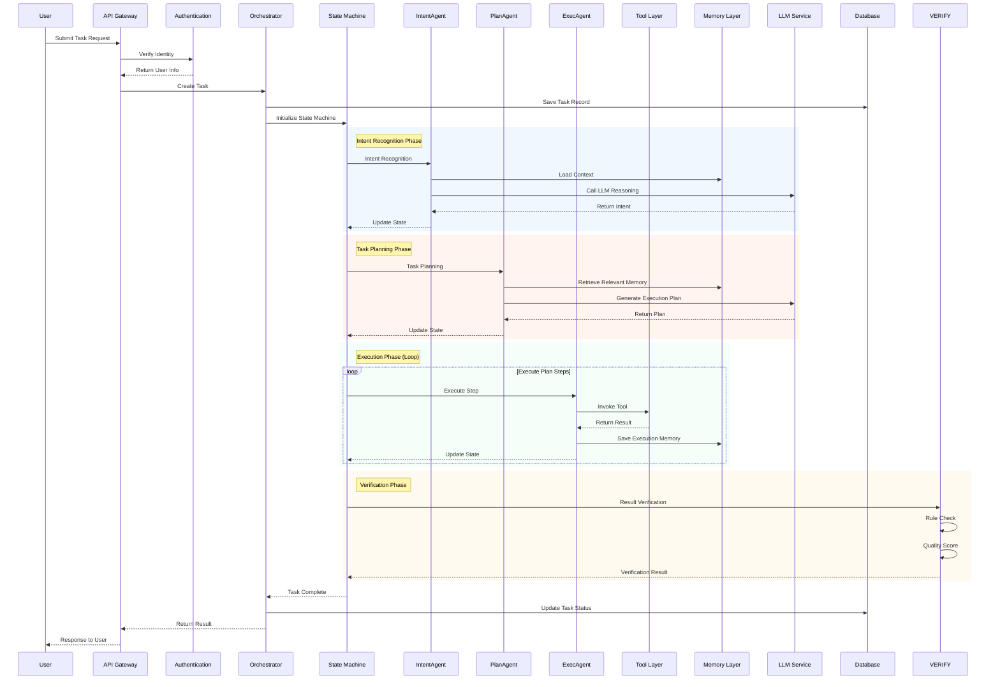

<!-- Language Toggle Button -->
<div align="right">
  <a href="README.md">🇨🇳 中文</a> | <a href="README_en.md">🇺🇸 English</a>
</div>

<h1 align="center">OpsPilot</h1>

<p align="center">
  <strong>Enterprise AI Operations Automation Platform</strong>
</p>

<p align="center">
  Connect Large Language Models with enterprise systems to achieve operations automation
</p>

<p align="center">
  <a href="#core-features">Core Features</a> •
  <a href="#architecture">Architecture</a> •
  <a href="#quick-start">Quick Start</a> •
  <a href="#documentation">Documentation</a> •
  <a href="#contributing">Contributing</a>
</p>

<p align="center">
  
  
  
  
  
  
  
</p>

---

### Home Page Preview


New Task | Tool Center | SOP Management | Scheduled Tasks | Agent Management | Monitoring & Analytics | System Settings

For more features (such as Game-theoretic Pricing, Customer Service Tickets, etc.), see [Feature Modules](docs/architecture)

---

## Core Features

| Feature | Description |
|---------|-------------|
| **Multi-Agent Collaboration** | Intent → Plan → Exec → Verify closed-loop execution, multi-agent message hub, game-theoretic validation |
| **State Machine Driven** | 8 task states with automatic transitions, retry and rollback mechanisms |
| **SOP Standardization** | Standard Operating Procedure templated execution, scheduled task scheduling |
| **Memory System** | Short-term / Long-term / Working memory three-tier architecture, RAG semantic retrieval |
| **MCP Integration** | Model Context Protocol standardized tool interface, dynamic external tool extension |
| **Fault Self-Healing** | 6 automatic degradation strategies, tool sandbox isolated execution |

---

## Architecture

### Overall Architecture



### Core Flow



---

## Quick Start

### Environment Requirements

| Dependency | Version |
|------------|---------|
| Python | 3.10+ |
| Node.js | 20+ |
| PostgreSQL | 15+ |
| Redis | 7+ |

### Installation Steps

```bash
# 1. Clone the project
git clone https://github.com/Aiting-for-you/OpsPilot.git
cd OpsPilot

# 2. Install backend dependencies
pip install -e .

# 3. Initialize database
python scripts/init_data.py

# 4. Start backend service
uvicorn opspilot.api:app --reload --port 8000

# 5. Install frontend dependencies
cd frontend && npm install

# 6. Start frontend development server
npm run dev
```

### Service Addresses

- Frontend UI: http://localhost:5173
- API Documentation: http://localhost:8000/docs

---

## Documentation

- [Architecture Design](docs/architecture/01_overall.md) — Complete architecture documentation and design concepts
- [Core Modules](docs/architecture/module-core.md) — Detailed core module explanations
- [Agent Module](docs/architecture/module-agent.md) — Multi-agent collaboration mechanism
- [Memory System](docs/architecture/module-memory.md) — Memory system design
- [Tool Module](docs/architecture/module-tool.md) — Tool integration and MCP

---

## Contributing

Contributions via Issues and Pull Requests are welcome! For bug feedback, feature suggestions, or partnership inquiries, please contact via email: cyx0414@outlook.com

---

## License

Apache License 2.0 - See [LICENSE](LICENSE) file for details
