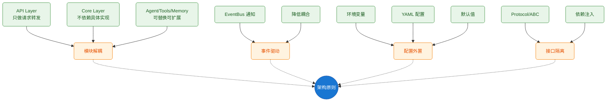
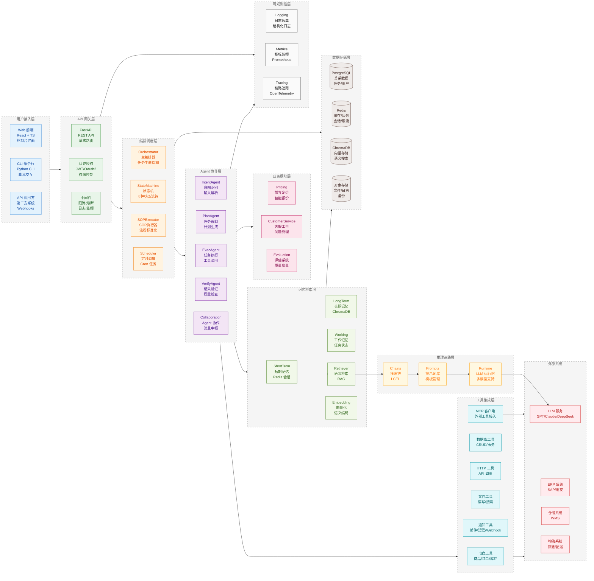
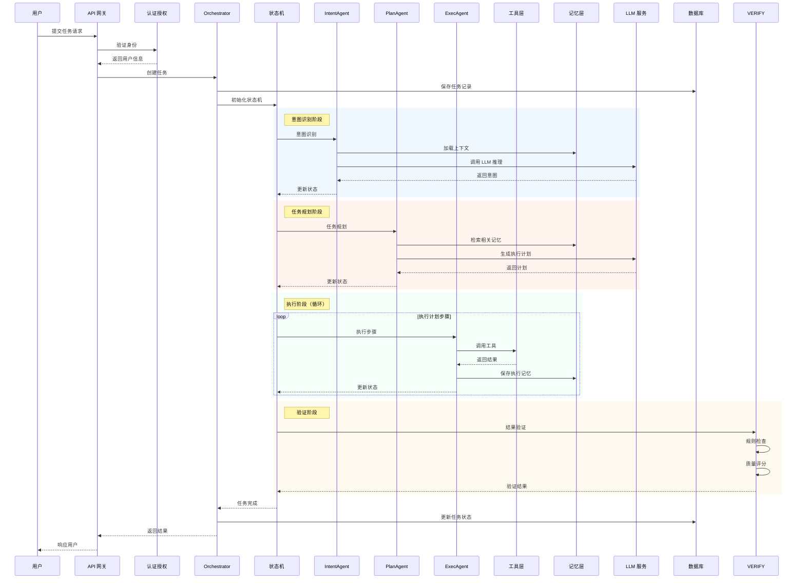
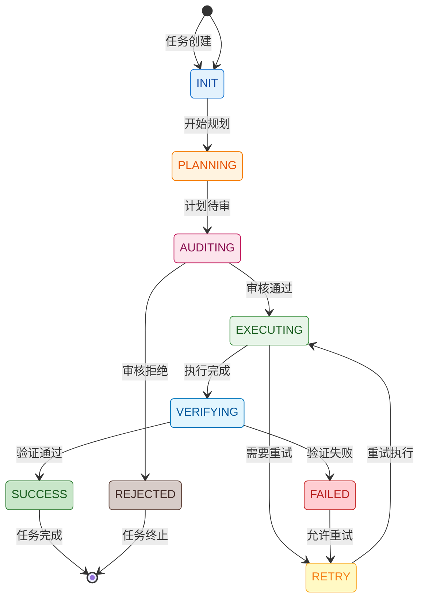
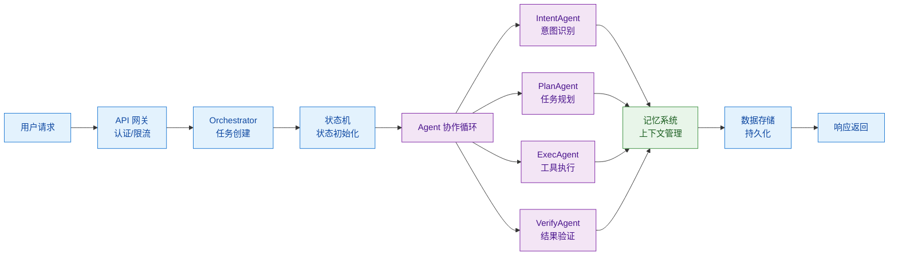
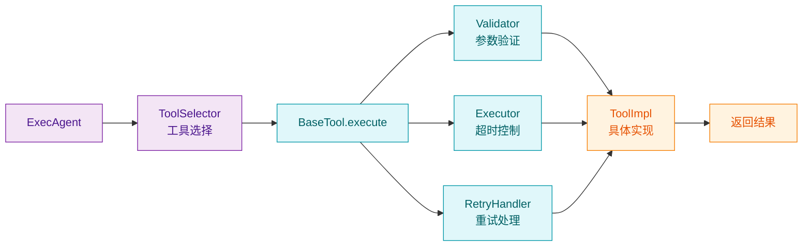
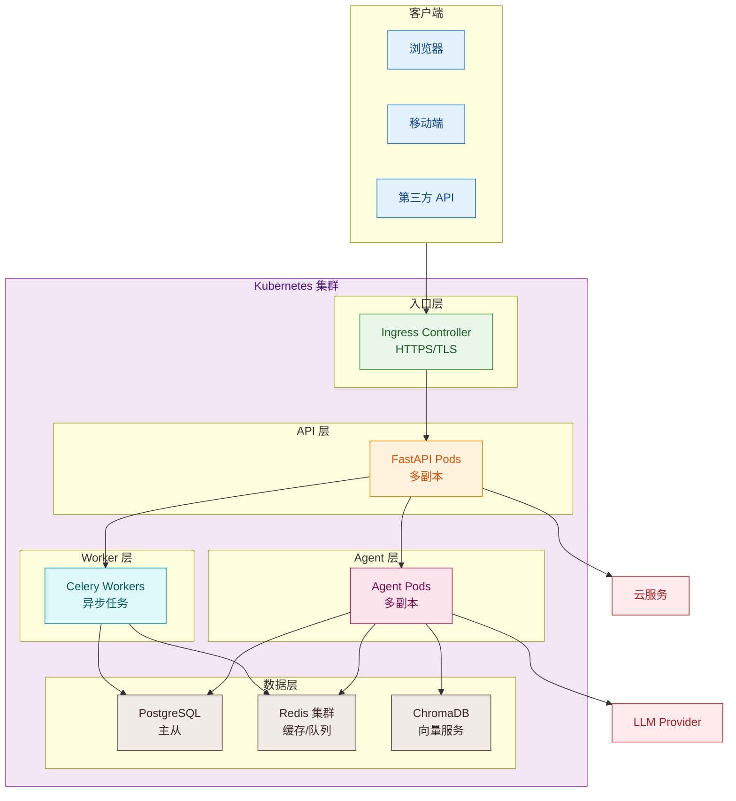
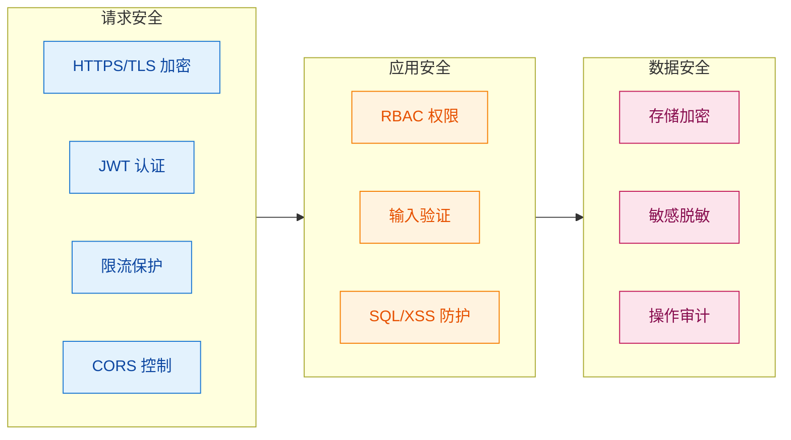

# OpsPilot 整体架构

## 1. 架构概述

### 1.1 系统定位

OpsPilot 是一个 **AI 驱动的智能运维与业务自动化平台**，通过多 Agent 协作实现复杂任务的智能编排、执行与验证。系统融合了大语言模型（LLM）、Agent 协作框架、记忆系统和外部工具集成，为企业提供从任务规划到执行完成的全流程自动化能力。

### 1.2 核心特性

| 特性 | 说明 |
|------|------|
| **多 Agent 协作** | Intent → Plan → Exec → Verify 闭环执行流程 |
| **状态机驱动** | 8 种任务状态自动流转，支持重试与回退 |
| **SOP 标准化** | 支持标准操作流程模板化执行 |
| **记忆系统** | 短期/长期/工作记忆三级架构 |
| **工具生态** | 电商、数据库、HTTP、文件、通知等 50+ 工具 |
| **MCP 集成** | Model Context Protocol 标准化外部工具接入 |
| **博弈定价** | 多 Agent 博弈协商的智能定价系统 |
| **客服工单** | 智能分类、路由、解决全流程自动化 |

### 1.3 架构原则

---

## 2. 系统架构图

### 2.1 整体架构（分层视图）

### 2.2 核心流程时序图

---

## 3. 模块清单

| 模块 | 路径 | 核心组件 | 职责 |
|------|------|---------|------|
| **Core** | `opspilot/core` | Orchestrator, StateMachine, SOPExecutor, Context, Events | 任务编排、状态管理、事件驱动 |
| **Agents** | `opspilot/agents` | IntentAgent, PlanAgent, ExecAgent, VerifyAgent, Collaboration | Agent 协作、消息中枢、博弈协商 |
| **Tools** | `opspilot/tools` | BaseTool, Ecommerce, Database, HttpClient, FileOps, Notification, MCP | 工具封装、工具选择、工具调用 |
| **Memory** | `opspilot/memory` | ShortTerm, LongTerm, Working, Retriever, Embedding, Compressor | 记忆管理、语义检索、上下文压缩 |
| **Pricing** | `opspilot/pricing` | PricingOrchestrator, NegotiationEngine, CostAgent, MarketAgent | 博弈定价、多 Agent 协商、智能报价 |
| **CustomerService** | `opspilot/customer_service` | TicketRouter, ClassifierAgent, SolverAgent, KnowledgeBase | 工单路由、智能分类、问题解决 |
| **API** | `opspilot/api` | Routes, Handlers, Middleware, Schemas | REST API 服务、数据校验 |
| **Auth** | `opspilot/auth` | JWT, OAuth2, RBAC | 认证授权、权限管理 |
| **Chains** | `opspilot/chains` | LLMChains, RAGChains, Prompts | 推理链路、提示词管理 |
| **Runtime** | `opspilot/runtime` | LLMRuntime, Streaming, A2A, Tracing | LLM 运行时、流式输出、链路追踪 |
| **Scheduler** | `opspilot/scheduler` | TaskScheduler, CronParser | 定时任务、调度管理 |
| **Observability** | `opspilot/observability` | Logging, Metrics, Tracing | 日志、指标、链路追踪 |
| **Pipeline** | `opspilot/pipeline` | Sequential, Parallel, Conditional, Loop | 流程编排、条件分支、循环执行 |
| **Reliability** | `opspilot/reliability` | Retry, CircuitBreaker, LLMReliability | 重试机制、熔断器、LLM 可靠性 |
| **MCP** | `opspilot/mcp` | MCPClient, MCPServer, ExternalManager | MCP 协议实现、外部工具接入 |
| **DB** | `opspilot/db` | Models, CRUD, Connection, Cache | 数据模型、数据库操作、连接池 |
| **Evaluation** | `opspilot/evaluation` | Metrics, Evaluator, Benchmark | 评估指标、质量度量、性能基准 |

---

## 4. 技术栈

| 层次 | 技术选型 | 说明 |
|------|---------|------|
| **前端** | React 19 + TypeScript + Tailwind CSS | 现代 Web 界面 |
| **API** | FastAPI + Pydantic v2 | 高性能 REST 服务 |
| **Agent 框架** | AgentScope + LangGraph | 多 Agent 协作编排 |
| **LLM** | OpenAI GPT-4 / Anthropic Claude / DeepSeek | 大语言模型支持 |
| **向量库** | ChromaDB + OpenAI Embeddings | 语义检索 |
| **数据库** | PostgreSQL + SQLAlchemy 2.0 | 关系型数据存储 |
| **缓存** | Redis | 会话、缓存、限流、队列 |
| **部署** | Docker + Kubernetes | 容器化编排 |
| **可观测** | OpenTelemetry + Prometheus + Grafana | 监控告警 |

---

## 5. 状态机

### 5.1 任务状态定义

### 5.2 状态说明

| 状态 | 说明 | 可转换状态 |
|------|------|-----------|
| INIT | 初始状态 | PLANNING |
| PLANNING | 规划中 | AUDITING, REJECTED |
| AUDITING | 待审核 | EXECUTING, REJECTED |
| EXECUTING | 执行中 | VERIFYING, RETRY |
| VERIFYING | 验证中 | SUCCESS, FAILED |
| SUCCESS | 成功 | - |
| FAILED | 失败 | RETRY |
| RETRY | 重试中 | EXECUTING |
| REJECTED | 已拒绝 | - |

---

## 6. 数据流

### 6.1 请求处理流程

### 6.2 工具调用流程

---

## 7. 部署架构

---

## 8. 安全架构

---

## 9. 可观测性

| 类型 | 工具 | 指标 |
|------|------|------|
| **日志** | 结构化 JSON 日志 | trace_id 追踪 |
| **指标** | Prometheus | 请求延迟、错误率、队列长度 |
| **链路** | OpenTelemetry | 请求流程、Agent 协作、工具调用 |
| **告警** | Alertmanager | 任务失败、延迟过高、资源不足 |