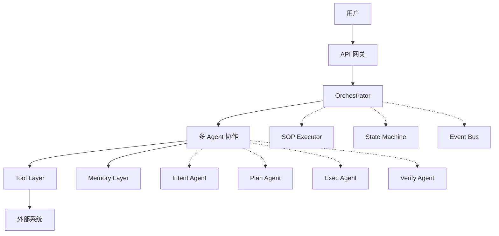
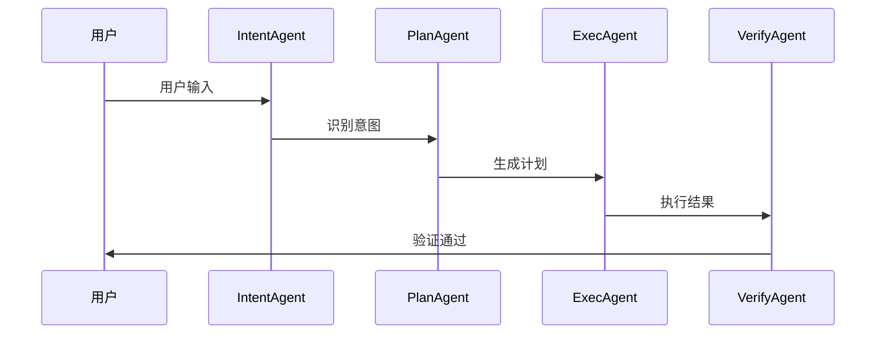
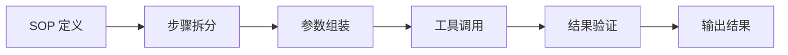
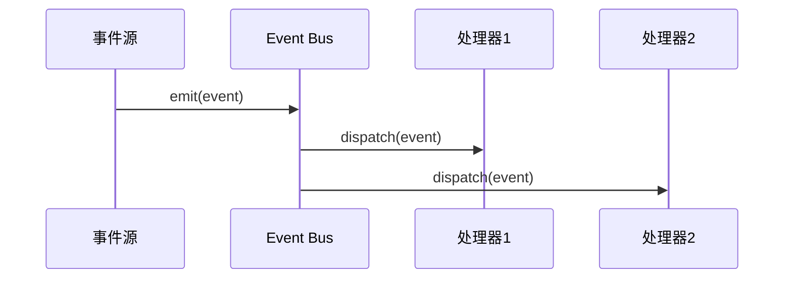
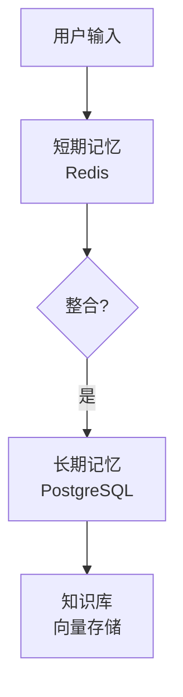

# OpsPilot 架构文档

## 文档概述

本文档详细描述了 OpsPilot 智能运维平台的系统架构。OpsPilot 采用 **多 Agent 协作** + **事件驱动** + **SOP 执行** 的核心架构，支持任务规划、工具调用、记忆管理、定价决策、客服对话等多种能力。

## 架构概览

## 模块文档

### 核心模块

| 模块 | 文档 | 说明 |
|------|------|------|
| 整体架构 | [01_overall.md](./01_overall.md) | 系统全景、技术栈、部署架构 |
| Core 核心 | [module-core.md](./module-core.md) | 编排器、状态机、SOP 执行器、事件系统 |
| Agent 智能体 | [module-agent.md](./module-agent.md) | 意图识别、任务规划、执行验证、协作机制 |
| Tool 工具层 | [module-tool.md](./module-tool.md) | 工具基类、电商工具、数据库工具、MCP 集成 |
| Memory 记忆 | [module-memory.md](./module-memory.md) | 短期/长期记忆、知识库、冲突检测、权重计算 |

### 业务模块

| 模块 | 文档 | 说明 |
|------|------|------|
| Pricing 定价 | [module-pricing.md](./module-pricing.md) | 成本定价、竞品定价、动态定价、博弈协商 |
| Customer Service 客服 | [module-customer-service.md](./module-customer-service.md) | 工单管理、FAQ 问答、会话管理、满意度分析 |

## 核心概念

### 1. 多 Agent 协作

OpsPilot 采用 **Intent → Plan → Exec → Verify** 四阶段协作：

### 2. SOP 执行

标准操作流程（SOP）定义了任务执行的标准化流程：

### 3. 事件驱动

系统通过事件总线实现组件解耦：

### 4. 记忆分层

## 技术栈

### 后端

| 技术 | 版本 | 用途 |
|------|------|------|
| Python | 3.10+ | 主语言 |
| FastAPI | 0.100+ | Web 框架 |
| Pydantic | 2.0+ | 数据验证 |
| SQLAlchemy | 2.0+ | ORM |
| Redis | 6.0+ | 缓存/消息队列 |
| PostgreSQL | 14+ | 主数据库 |
| Chroma | 0.4+ | 向量存储 |

### 前端

| 技术 | 版本 | 用途 |
|------|------|------|
| React | 18+ | UI 框架 |
| TypeScript | 5.0+ | 类型支持 |
| Tailwind CSS | 3.0+ | 样式框架 |
| Zustand | 4.0+ | 状态管理 |
| i18next | 23+ | 国际化 |

### Agent 框架

| 技术 | 用途 |
|------|------|
| LangChain | LLM 编排 |
| AgentScope | 多 Agent 框架 |
| Custom Agent | 自研 Agent |

## 快速导航

- **新手入门** → [01_overall.md](./01_overall.md)
- **开发指南** → 各模块文档
- **API 文档** → `/api/docs`
- **部署指南** → [01_overall.md](./01_overall.md#部署架构)

## 更新日志

| 日期 | 更新内容 |
|------|---------|
| 2026-02-25 | 架构文档全面重构，添加 Mermaid 图表 |
| 2026-02-20 | 新增 Pricing 模块文档 |
| 2026-02-15 | 新增 Customer Service 模块文档 |
| 2026-02-10 | 新增 Memory 模块文档 |
| 2026-02-05 | 新增 Tool 模块文档 |
| 2026-02-01 | 新增 Agent 模块文档 |
| 2026-01-25 | 新增 Core 模块文档 |
| 2026-01-20 | 初始版本 |