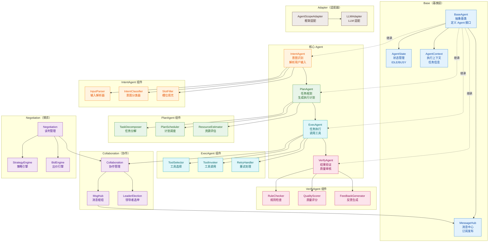
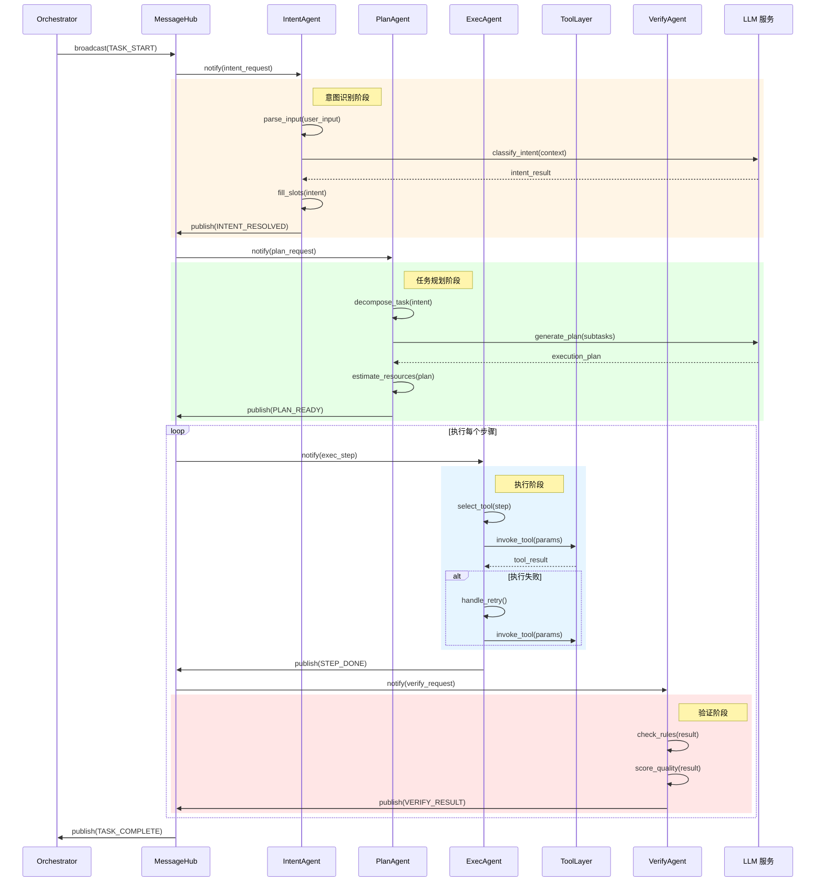
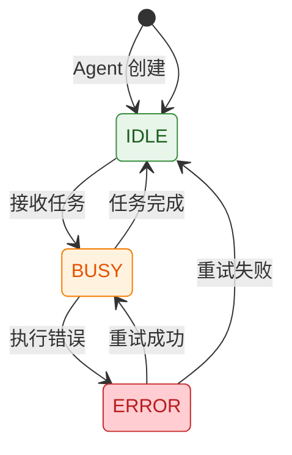
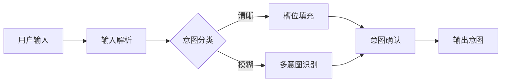
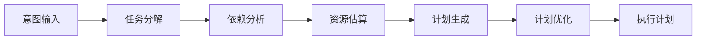
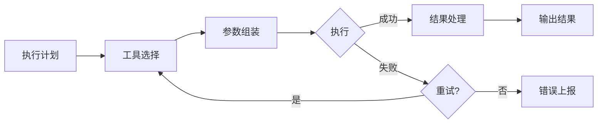
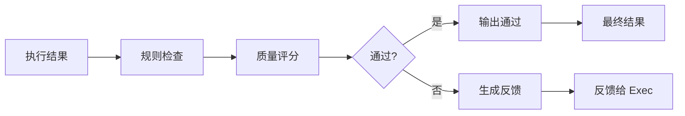
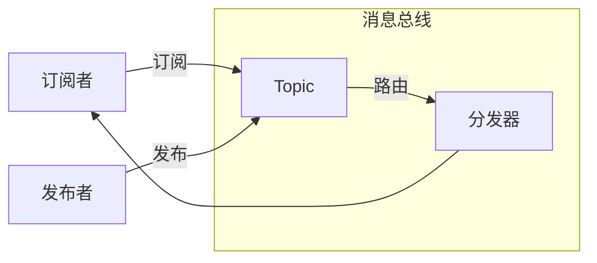
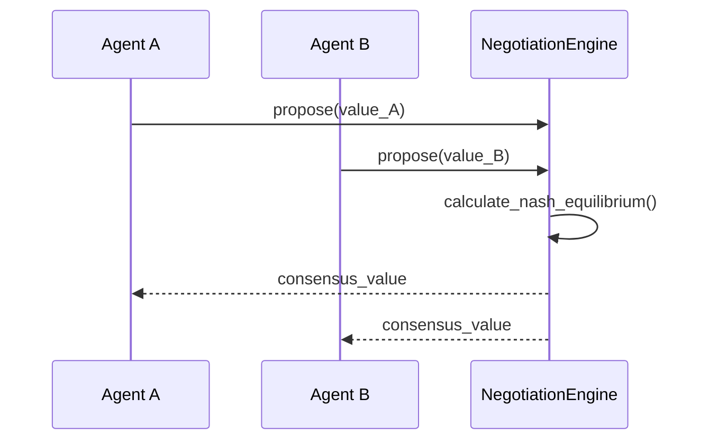

# Agent 模块架构

## 模块概述

Agent 模块是 OpsPilot 的智能执行核心，通过多 Agent 协作实现复杂任务的智能处理。模块包含 **IntentAgent（意图识别）**、**PlanAgent（任务规划）**、**ExecAgent（任务执行）** 和 **VerifyAgent（结果验证）** 四个核心 Agent，以及 **Collaboration（协作管理）** 和 **Negotiation（博弈协商）** 支持组件。

## 1. 组件架构



## 2. Agent 协作时序图



## 3. 文件清单

| 文件 | 类/函数 | 职责 |
|------|---------|------|
| `base.py` | `BaseAgent` | Agent 抽象基类 |
| `base.py` | `AgentState` | Agent 状态枚举 |
| `base.py` | `AgentContext` | Agent 上下文 |
| `intent_agent.py` | `IntentAgent` | 意图识别 Agent |
| `intent_agent.py` | `IntentClassifier` | 意图分类器 |
| `intent_agent.py` | `SlotFiller` | 槽位填充器 |
| `plan_agent.py` | `PlanAgent` | 任务规划 Agent |
| `plan_agent.py` | `TaskDecomposer` | 任务分解器 |
| `plan_agent.py` | `PlanScheduler` | 计划调度器 |
| `exec_agent.py` | `ExecAgent` | 任务执行 Agent |
| `exec_agent.py` | `ToolSelector` | 工具选择器 |
| `exec_agent.py` | `RetryHandler` | 重试处理器 |
| `verify_agent.py` | `VerifyAgent` | 结果验证 Agent |
| `verify_agent.py` | `QualityScorer` | 质量评分器 |
| `collaboration.py` | `Collaboration` | 协作管理器 |
| `collaboration.py` | `LeaderElection` | 领导者选举 |
| `negotiation.py` | `Negotiation` | 博弈谈判管理器 |
| `negotiation.py` | `StrategyEngine` | 策略引擎 |
| `msg_hub.py` | `MessageHub` | 消息中心 |
| `actor.py` | `Actor` | Agent 角色定义 |
| `agentscope_adapter.py` | `AgentScopeAdapter` | AgentScope 框架适配 |

## 4. Agent 生命周期

### 4.1 状态定义



### 4.2 状态说明

| 状态 | 说明 |
|------|------|
| IDLE | 空闲，等待任务 |
| BUSY | 执行中，处理任务 |
| ERROR | 错误，需要重试 |

## 5. 消息类型

### 5.1 消息格式

```python
class Message:
    id: str
    type: MessageType
    sender: str
    receiver: Optional[str]
    payload: Dict[str, Any]
    timestamp: float
```

### 5.2 消息类型定义

| 消息类型 | 发送者 | 接收者 | 说明 |
|---------|-------|-------|------|
| TASK_START | Orchestrator | All Agents | 任务开始通知 |
| INTENT_RESOLVED | IntentAgent | PlanAgent | 意图识别完成 |
| PLAN_READY | PlanAgent | ExecAgent | 执行计划就绪 |
| STEP_DONE | ExecAgent | VerifyAgent | 步骤执行完成 |
| VERIFY_RESULT | VerifyAgent | Orchestrator | 验证结果返回 |
| TASK_COMPLETE | VerifyAgent | All Agents | 任务完成通知 |
| ERROR | Any Agent | Error Handler | 错误通知 |

## 6. 核心 Agent 详解

### 6.1 IntentAgent（意图识别）



**核心能力**：
- 自然语言理解
- 意图分类（支持 100+ 意图类型）
- 槽位提取与填充
- 意图置信度评估

### 6.2 PlanAgent（任务规划）



**核心能力**：
- 任务自动分解
- 执行顺序优化
- 资源需求评估
- 备选方案生成

### 6.3 ExecAgent（任务执行）



**核心能力**：
- 智能工具选择
- 参数自动组装
- 失败自动重试
- 执行结果处理

### 6.4 VerifyAgent（结果验证）



**核心能力**：
- 规则引擎验证
- 质量评分模型
- 失败原因分析
- 自动修复建议

## 7. 协作机制

### 7.1 MessageHub 架构



### 7.2 领导者选举

采用 **Raft 简化版** 选举算法：
1. 所有 Agent 启动时为 Follower
2. 超时未收到心跳则转为 Candidate
3. 获得多数投票则成为 Leader
4. Leader 负责协调任务分配

## 8. 博弈协商（Negotiation）

### 8.1 应用场景

- 多 Agent 定价决策
- 资源竞争分配
- 冲突任务调度

### 8.2 协商流程



## 9. Agent 配置

### 9.1 配置参数

```python
class AgentConfig:
    name: str
    role: str
    max_retries: int
    timeout: int
    temperature: float
    system_prompt: str
    tools: List[str]
```