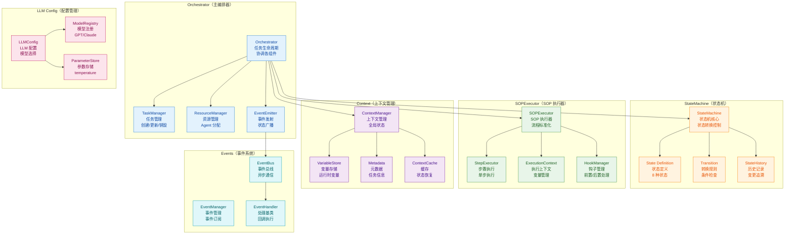
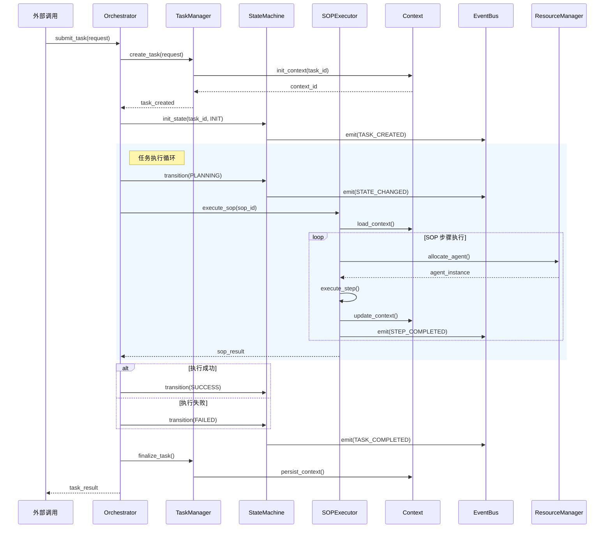
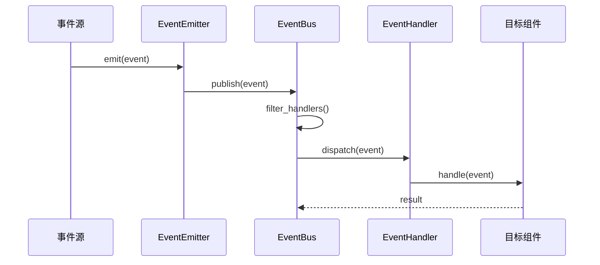
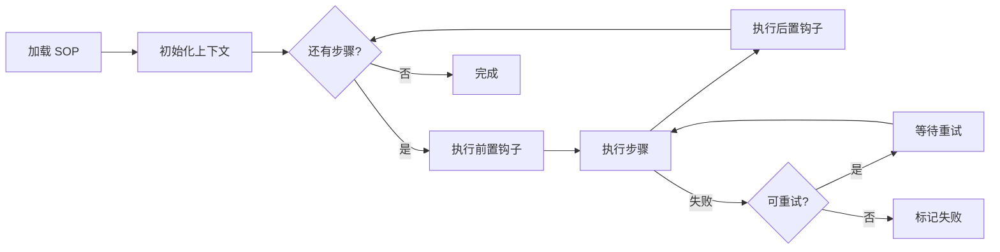

# Core 模块架构

## 模块概述

Core 模块是 OpsPilot 系统的核心引擎，负责任务编排、状态管理、事件驱动和执行上下文管理。该模块不依赖具体 Agent 实现，仅通过接口与上层 Agent 和下层存储交互，确保系统的可测试性和可替换性。

## 1. 组件架构



## 2. 核心流程时序图

### 2.1 任务创建与执行流程



### 2.2 事件驱动流程



## 3. 文件清单

| 文件 | 类/函数 | 职责 |
|------|---------|------|
| `orchestrator.py` | `Orchestrator` | 主编排器，协调各组件 |
| `orchestrator.py` | `TaskManager` | 任务生命周期管理 |
| `orchestrator.py` | `ResourceManager` | Agent 和工具资源管理 |
| `state_machine.py` | `StateMachine` | 状态机核心实现 |
| `state_machine.py` | `StateDefinition` | 状态定义枚举 |
| `state_machine.py` | `Transition` | 状态转换逻辑 |
| `sop_executor.py` | `SOPExecutor` | SOP 流程执行器 |
| `sop_executor.py` | `StepExecutor` | 单步骤执行器 |
| `sop_executor.py` | `ExecutionContext` | 执行上下文管理 |
| `context.py` | `Context` | 全局上下文管理器 |
| `context.py` | `VariableStore` | 运行时变量存储 |
| `events.py` | `EventEmitter` | 事件发射器 |
| `events.py` | `EventBus` | 异步事件总线 |
| `events.py` | `EventHandler` | 事件处理器基类 |
| `llm_config.py` | `LLMConfig` | LLM 配置管理 |
| `llm_config.py` | `ModelRegistry` | 模型注册表 |

## 4. 状态机设计

### 4.1 状态定义

```python
class TaskState(str, Enum):
    INIT = "INIT"           # 初始状态
    PLANNING = "PLANNING"   # 规划中
    AUDITING = "AUDITING"   # 待审核
    EXECUTING = "EXECUTING" # 执行中
    VERIFYING = "VERIFYING" # 验证中
    SUCCESS = "SUCCESS"     # 成功
    FAILED = "FAILED"      # 失败
    RETRY = "RETRY"        # 重试中
    REJECTED = "REJECTED"  # 已拒绝
```

### 4.2 状态转换规则

| 当前状态 | 事件 | 下一状态 | 条件 |
|---------|------|---------|------|
| INIT | START | PLANNING | - |
| PLANNING | PLAN_READY | AUDITING | 计划生成成功 |
| PLANNING | PLAN_FAILED | REJECTED | 计划生成失败 |
| AUDITING | APPROVE | EXECUTING | 审核通过 |
| AUDITING | REJECT | REJECTED | 审核拒绝 |
| EXECUTING | STEP_DONE | EXECUTING | 步骤未完成 |
| EXECUTING | EXEC_DONE | VERIFYING | 执行完成 |
| EXECUTING | NEED_RETRY | RETRY | 需要重试 |
| RETRY | RETRY_DONE | EXECUTING | 重试执行 |
| VERIFYING | PASS | SUCCESS | 验证通过 |
| VERIFYING | FAIL | FAILED | 验证失败 |
| FAILED | ALLOW_RETRY | RETRY | 允许重试 |
| FAILED | NO_RETRY | REJECTED | 不允许重试 |

## 5. 事件系统设计

### 5.1 事件类型

| 事件 | 触发时机 | 携带数据 |
|------|---------|---------|
| `TASK_CREATED` | 任务创建 | task_id, request |
| `STATE_CHANGED` | 状态变更 | task_id, old_state, new_state |
| `STEP_STARTED` | 步骤开始 | task_id, step_id |
| `STEP_COMPLETED` | 步骤完成 | task_id, step_id, result |
| `TASK_COMPLETED` | 任务完成 | task_id, final_state, result |
| `ERROR_OCCURRED` | 错误发生 | task_id, error, stack_trace |

### 5.2 事件总线特性

- **异步处理**：事件发布不阻塞主流程
- **订阅过滤**：支持按事件类型过滤
- **错误隔离**：单个处理器异常不影响其他处理器
- **顺序保证**：同一事件类型的处理器按注册顺序执行

## 6. SOP 执行器设计

### 6.1 SOP 结构

```python
class SOP:
    name: str
    description: str
    steps: List[SOPStep]
    variables: Dict[str, Any]
    hooks: SOPHooks

class SOPStep:
    name: str
    action: str
    tool: Optional[str]
    params: Dict[str, Any]
    condition: Optional[str]
    retry: RetryPolicy
```

### 6.2 执行流程



## 7. 上下文管理

### 7.1 上下文类型

| 类型 | 存储 | 生命周期 | 用途 |
|------|------|---------|------|
| TaskContext | Redis | 任务级别 | 任务执行状态 |
| ExecutionContext | 内存 | 步骤级别 | 当前执行变量 |
| AgentContext | Redis | Agent 级别 | Agent 私有数据 |

### 7.2 变量作用域

```python
# 优先级：局部 > 全局 > 默认
variables = {
    "task_id": "全局",
    "current_step": "执行上下文",
    "retry_count": "局部",
    "default_timeout": 300,  # 默认值
}
```

## 8. LLM 配置管理

### 8.1 支持的 LLM 提供商

| 提供商 | 模型 | 特性 |
|--------|------|------|
| OpenAI | GPT-4, GPT-3.5 | 流式输出 |
| Anthropic | Claude-3 | 长上下文 |
| DeepSeek | DeepSeek-Chat | 开源便宜 |
| Azure OpenAI | GPT-4 | 企业合规 |
| Ollama | 本地模型 | 离线部署 |

### 8.2 配置参数

```python
class LLMConfig:
    provider: str          # 提供商
    model: str             # 模型名称
    api_key: str          # API 密钥
    api_base: str         # API 地址
    temperature: float     # 0-2 随机性
    max_tokens: int       # 最大 token 数
    top_p: float          # 核采样
    timeout: int          # 超时秒数
```