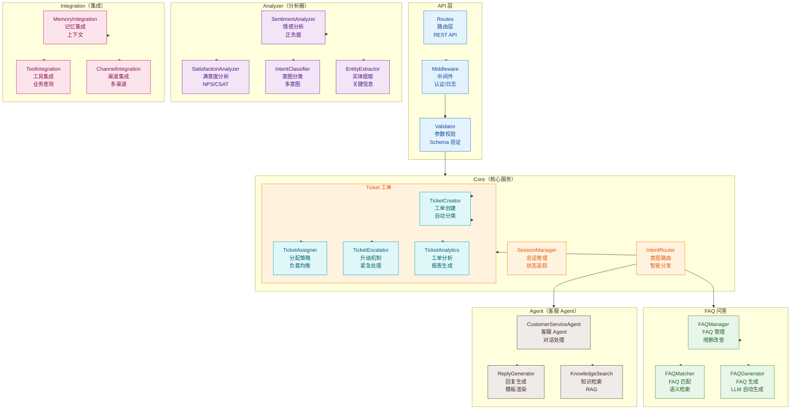
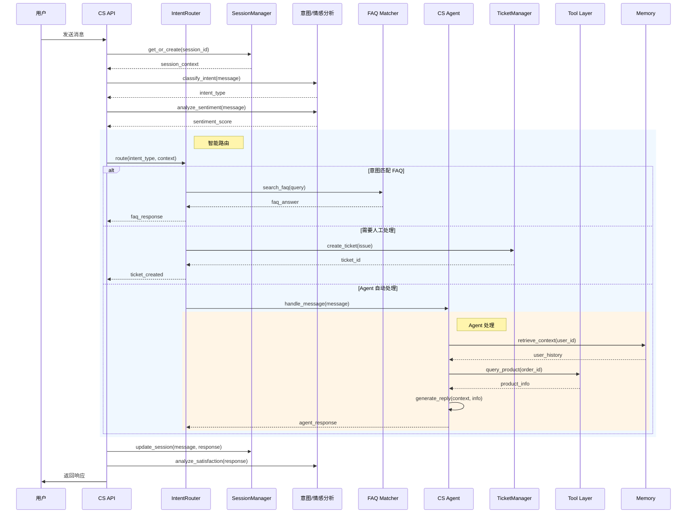
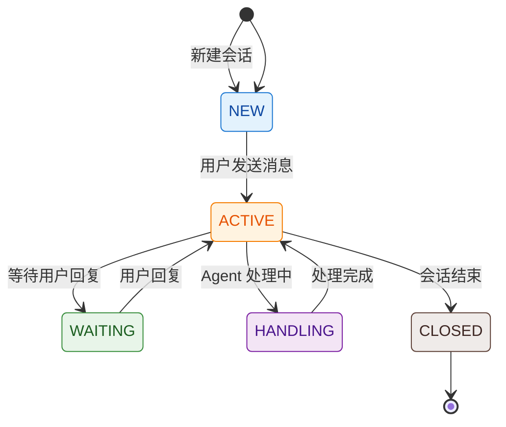
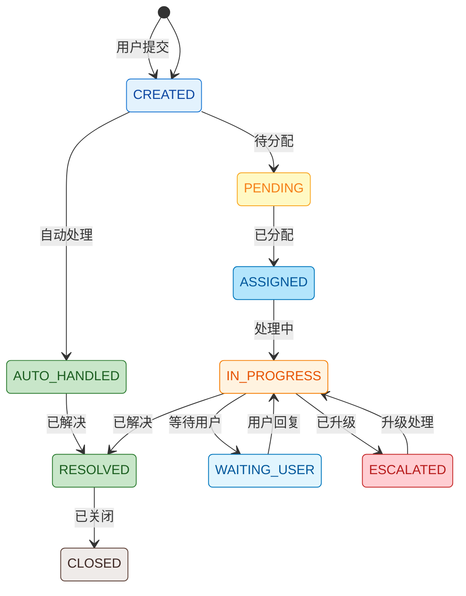
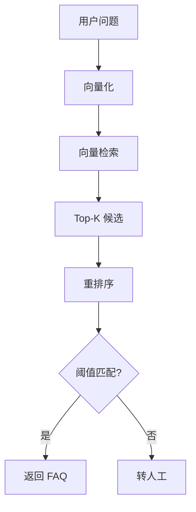
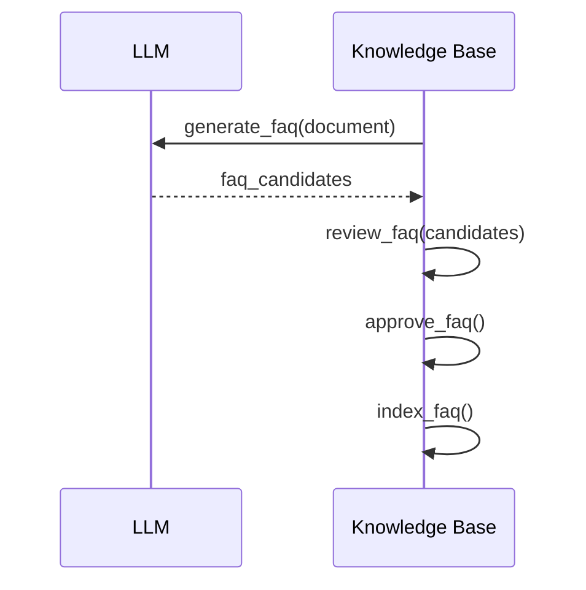

# Customer Service 模块架构

## 模块概述

Customer Service 模块是 OpsPilot 的智能客服核心，负责 **工单管理**、**FAQ 问答**、**会话管理**、**满意度分析** 等功能。模块支持多渠道接入（Web、API），并与 Memory 模块深度集成实现个性化服务。

## 1. 组件架构



## 2. 客服流程时序图



## 3. 文件清单

| 文件 | 类/函数 | 职责 |
|------|---------|------|
| `api.py` | `CSRouter` | 客服 API 路由 |
| `api.py` | `SessionEndpoint` | 会话端点 |
| `api.py` | `TicketEndpoint` | 工单端点 |
| `session.py` | `SessionManager` | 会话管理器 |
| `session.py` | `ConversationContext` | 会话上下文 |
| `ticket.py` | `TicketManager` | 工单管理器 |
| `ticket.py` | `TicketCreator` | 工单创建器 |
| `ticket.py` | `TicketAssigner` | 工单分配器 |
| `faq.py` | `FAQManager` | FAQ 管理器 |
| `faq.py` | `FAQMatcher` | FAQ 匹配器 |
| `faq.py` | `FAQGenerator` | FAQ 生成器 |
| `analyzer.py` | `IntentClassifier` | 意图分类器 |
| `analyzer.py` | `SentimentAnalyzer` | 情感分析器 |
| `analyzer.py` | `SatisfactionAnalyzer` | 满意度分析器 |
| `agent.py` | `CSAgent` | 客服 Agent |
| `agent.py` | `ReplyGenerator` | 回复生成器 |
| `channel.py` | `WebChannel` | Web 渠道 |
| `channel.py` | `APIChannel` | API 渠道 |

## 4. 会话管理

### 4.1 会话状态



### 4.2 会话数据结构

```python
class ConversationSession:
    session_id: str
    user_id: str
    channel: str  # web, api, wechat
    status: SessionStatus
    messages: List[Message]
    context: Dict[str, Any]
    created_at: datetime
    updated_at: datetime
    closed_at: Optional[datetime]
```

## 5. 工单管理

### 5.1 工单生命周期



### 5.2 工单优先级

| 优先级 | 说明 | SLA |
|--------|------|-----|
| P0 | 紧急（系统故障） | 15 分钟 |
| P1 | 高（影响业务） | 1 小时 |
| P2 | 中（部分影响） | 4 小时 |
| P3 | 低（轻微问题） | 24 小时 |

### 5.3 分配策略

| 策略 | 说明 | 适用场景 |
|------|------|---------|
| 负载均衡 | 分配给最空闲客服 | 客服水平相当 |
| 技能匹配 | 按技能分配 | 专业问题 |
| 轮询 | 轮流分配 | 简单问题 |
| 优先级 | 高优先级优先 | 紧急问题 |

## 6. FAQ 系统

### 6.1 FAQ 匹配流程



### 6.2 FAQ 自动生成



## 7. 智能分析

### 7.1 意图分类

| 类别 | 示例 | 处理方式 |
|------|------|---------|
| 咨询 | "这个产品怎么样" | FAQ/Agent |
| 投诉 | "东西坏了" | 创建工单 |
| 退货 | "我要退货" | 工单+流程 |
| 售后 | "订单在哪" | 工具查询 |
| 闲聊 | "你好" | 友好回复 |

### 7.2 情感分析

```python
class SentimentResult:
    label: str  # positive, neutral, negative
    score: float  # 0-1 置信度
    emotions: List[str]  # anger, sad, happy...
```

### 7.3 满意度分析

| 指标 | 说明 | 计算方式 |
|------|------|---------|
| CSAT | 客户满意度 | 评分/5 * 100% |
| NPS | 推荐意愿 | 推荐者% - 贬低者% |
| CES | 费力度 | 1-7 分，越低越好 |

## 8. 渠道集成

### 8.1 支持渠道

| 渠道 | 协议 | 特点 |
|------|------|------|
| Web | WebSocket | 实时对话 |
| API | REST | 批量处理 |
| WeChat | 微信公众号 | 微信生态 |
| DingTalk | 钉钉 | 企业集成 |

### 8.2 消息格式统一

```python
class UnifiedMessage:
    channel: str
    message_id: str
    sender: str
    content: Content  # 文本/图片/语音
    metadata: Dict[str, Any]
```