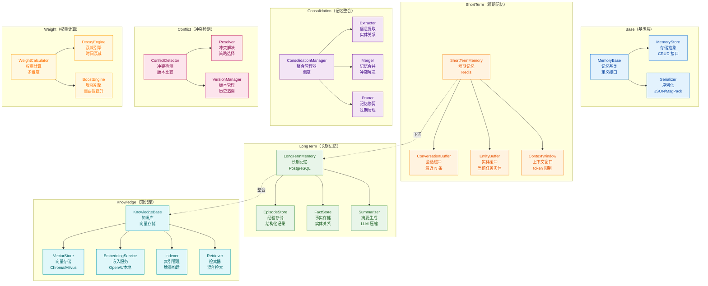
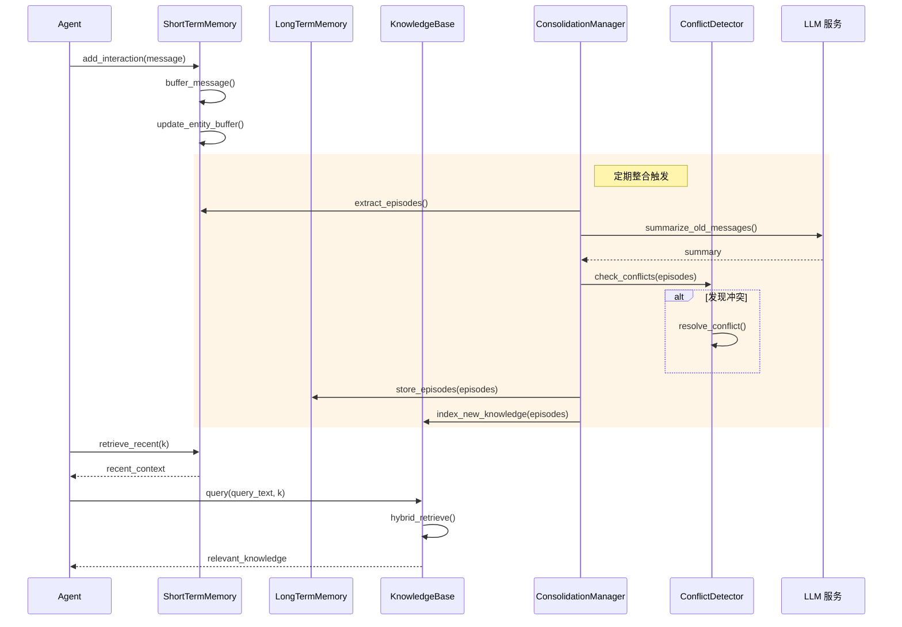
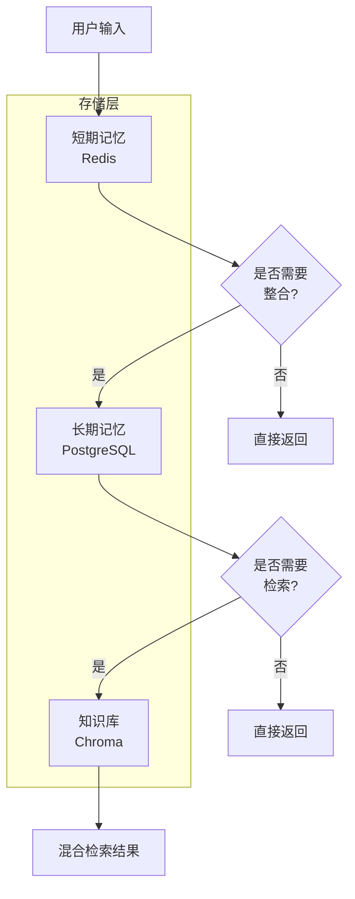
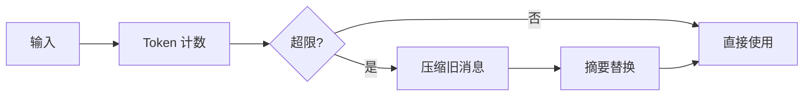
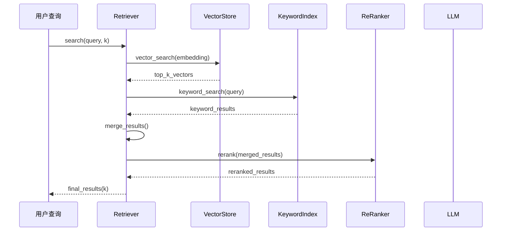
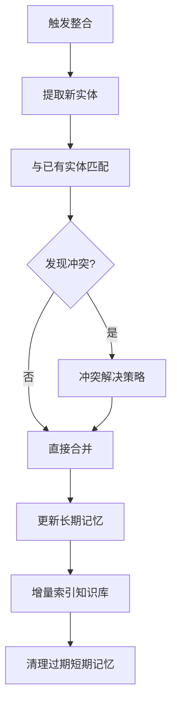

# Memory 模块架构

## 模块概述

Memory 模块是 OpsPilot 的记忆与知识管理核心，负责 **短期记忆**、**长期记忆**、**向量知识库**、**冲突检测**、**记忆 consolidation** 等功能。模块采用分层存储架构，支持 Redis 短期记忆、PostgreSQL 长期存储、Chroma 向量检索。

## 1. 组件架构



## 2. 记忆流转时序图



## 3. 文件清单

| 文件 | 类/函数 | 职责 |
|------|---------|------|
| `base.py` | `MemoryBase` | 记忆抽象基类 |
| `base.py` | `MemoryStore` | 存储接口定义 |
| `short_term.py` | `ShortTermMemory` | 短期记忆实现 |
| `short_term.py` | `ConversationBuffer` | 会话缓冲 |
| `long_term.py` | `LongTermMemory` | 长期记忆实现 |
| `long_term.py` | `EpisodeStore` | 经验存储 |
| `long_term.py` | `FactStore` | 事实存储 |
| `knowledge.py` | `KnowledgeBase` | 知识库管理 |
| `knowledge.py` | `VectorStore` | 向量存储接口 |
| `knowledge.py` | `Retriever` | 检索器 |
| `vectorstore.py` | `ChromaStore` | Chroma 向量存储 |
| `vectorstore.py` | `MilvusStore` | Milvus 向量存储 |
| `redis_store.py` | `RedisStore` | Redis 存储适配 |
| `consolidation.py` | `ConsolidationManager` | 整合管理器 |
| `consolidation.py` | `MemoryExtractor` | 信息提取器 |
| `conflict.py` | `ConflictDetector` | 冲突检测器 |
| `conflict.py` | `VersionManager` | 版本管理器 |
| `weight.py` | `WeightCalculator` | 权重计算器 |
| `weight.py` | `DecayEngine` | 衰减引擎 |

## 4. 记忆层次结构

### 4.1 分层架构



### 4.2 存储对比

| 类型 | 存储 | 容量 | 持久性 | 延迟 |
|------|------|------|--------|------|
| 短期 | Redis | ~10000 条 | ❌ | <1ms |
| 长期 | PostgreSQL | 无限制 | ✅ | <10ms |
| 向量 | Chroma | 百万级 | ✅ | <50ms |

## 5. 短期记忆设计

### 5.1 缓冲结构

```python
class ConversationBuffer:
    max_length: int = 100  # 最大消息数
    window_type: str = "sliding"  # 滑动窗口
    
    def add_message(self, message: Message):
        """添加消息到缓冲"""
        
    def get_context(self, k: int) -> List[Message]:
        """获取最近 k 条消息"""
        
    def get_entities(self) -> Set[Entity]:
        """提取当前实体"""
```

### 5.2 上下文窗口管理



## 6. 长期记忆设计

### 6.1 经验 Episode

```python
class Episode:
    id: str
    task_type: str
    start_time: datetime
    end_time: datetime
    steps: List[Step]
    result: Result
    summary: str  # LLM 生成的摘要
    importance: float  # 0-1 重要性
    embedding: List[float]  # 向量表示
```

### 6.2 事实 Fact

```python
class Fact:
    id: str
    entity: str
    relation: str
    value: Any
    confidence: float
    sources: List[str]
    timestamp: datetime
```

## 7. 知识库设计

### 7.1 向量检索流程



### 7.2 混合检索策略

| 策略 | 说明 | 权重 |
|------|------|------|
| 向量检索 | 语义相似度 | 0.6 |
| 关键词检索 | BM25 | 0.3 |
| Rerank | LLM 重排 | 0.1 |

### 7.3 支持的向量存储

| 存储 | 类型 | 特点 |
|------|------|------|
| Chroma | 本地 | 轻量易用 |
| Milvus | 分布式 | 亿级向量 |
| Pinecone | 云服务 | 托管运维 |
| Qdrant | 本地/云 | 高性能 |

## 8. 记忆整合机制

### 8.1 整合触发条件

| 条件 | 说明 |
|------|------|
| 定时触发 | 每小时/每天 |
| 数量触发 | 缓冲超过阈值 |
| 任务结束 | Agent 完成任务 |
| 手动触发 | API 调用 |

### 8.2 整合流程



## 9. 冲突检测与解决

### 9.1 冲突类型

| 类型 | 示例 | 处理策略 |
|------|------|---------|
| 事实冲突 | A 是 B 的父亲 vs A 是 B 的母亲 | 时间戳优先 |
| 数值冲突 | 库存 100 vs 库存 50 | 取最新 |
| 关系冲突 | 公司 A 收购 B vs 公司 B 收购 A | 置信度优先 |

### 9.2 解决策略

```python
class ConflictResolution:
    STRATEGY_TIME = "timestamp"     # 时间戳优先
    STRATEGY_CONFIDENCE = "confidence"  # 置信度优先
    STRATEGY_VOTE = "vote"          # 多数投票
    STRATEGY_MANUAL = "manual"      # 人工确认
```

## 10. 权重与衰减

### 10.1 权重计算因素

| 因素 | 权重 | 说明 |
|------|------|------|
| 时间衰减 | -0.1/天 | 随时间递减 |
| 重要性 | +0.3 | 任务关键程度 |
| 引用次数 | +0.2 | 被引用频率 |
| 验证通过 | +0.2 | 结果验证通过 |
| 用户反馈 | +0.3 | 人工标记重要 |

### 10.2 衰减曲线

```python
# 指数衰减
weight = initial_weight * exp(-decay_rate * days_since_access)

# 自适应衰减
decay_rate = base_rate * importance_multiplier
```