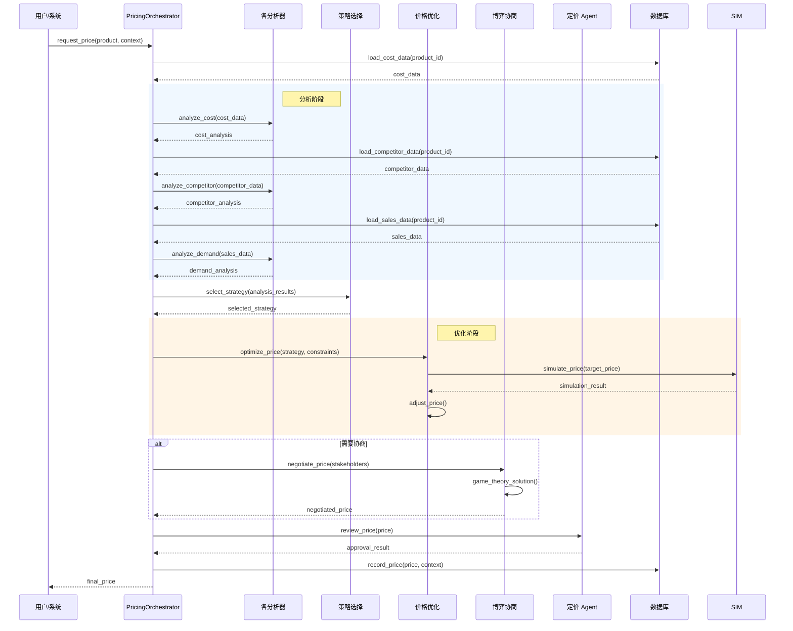
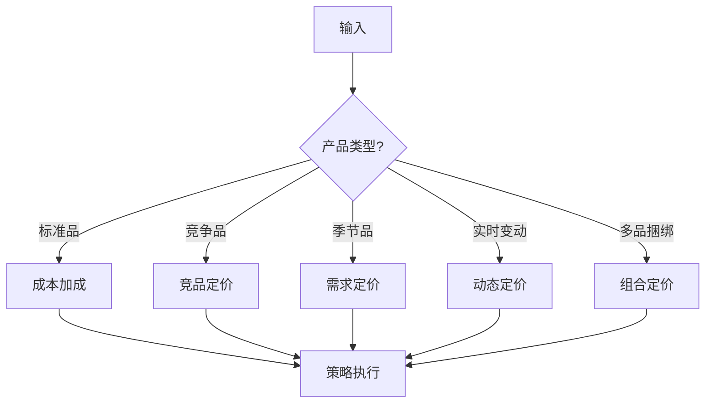
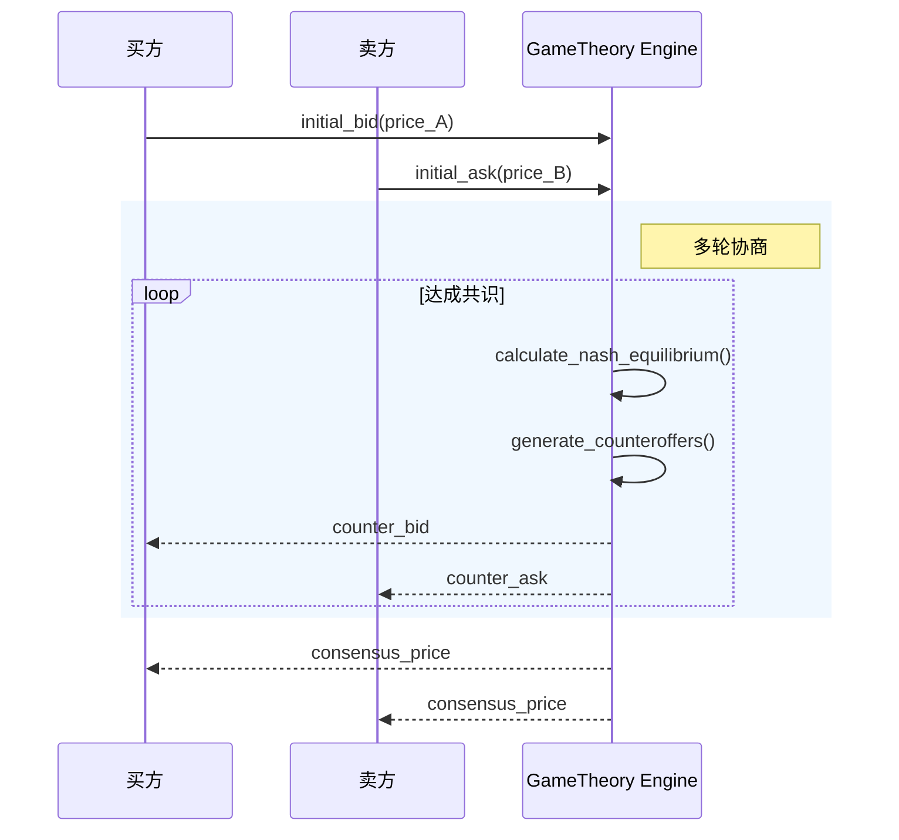
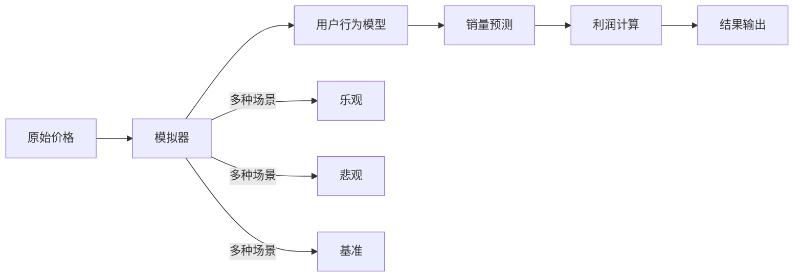
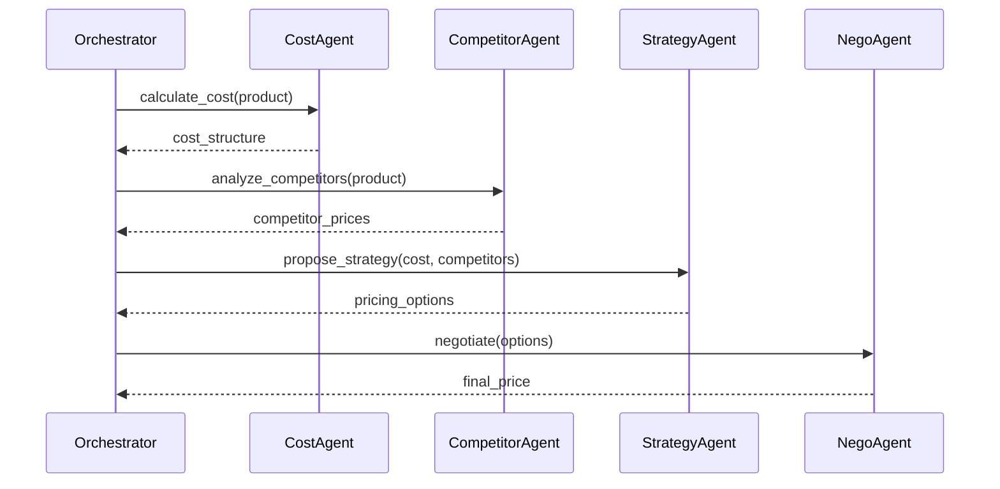

# Pricing 模块架构

## 模块概述

Pricing 模块是 OpsPilot 的智能定价核心，负责 **价格计算**、**博弈协商**、**多 Agent 定价协作**、**价格优化** 等功能。模块支持多种定价策略，包括成本加成定价、竞争对手定价、需求响应定价、动态定价等。

## 1. 组件架构

```mermaid
graph TB
    subgraph ORCHESTRATOR["Orchestrator（编排层）"]
        direction LR
        ORCH[PricingOrchestrator<br/>定价编排器<br/>协调各组件]
        STRAT[StrategySelector<br/>策略选择<br/>场景匹配]
        FLOW[PricingFlow<br/>定价流程<br/>流水线]
    end

    subgraph STRATEGY["Strategy（定价策略）"]
        direction LR
        COST[CostPlusPricing<br/>成本加成<br/>基础定价]
        COMP[CompetitorPricing<br/>竞品定价<br/>市场定位]
        DEMAND[DemandPricing<br/>需求定价<br/>弹性分析]
        DYNAMIC[DynamicPricing<br/>动态定价<br/>实时调整]
        BUNDLE[BundlePricing<br/>组合定价<br/>捆绑销售]
    end

    subgraph NEGOTIATION["Negotiation（博弈协商）"]
        direction LR
        GAME[GameTheory<br/>博弈论引擎<br/>策略求解]
        BID[BidEngine<br/>出价引擎<br/>多轮报价]
        CONSENSUS[ConsensusFinder<br/>共识寻找<br/>多方协商]
    end

    subgraph OPTIMIZER["Optimizer（优化器）"]
        direction LR
        OPT[PriceOptimizer<br/>价格优化<br/>利润最大化]
        SIM[Simulator<br/>价格模拟<br/>场景推演]
        SENS[SensitivityAnalyzer<br/>敏感度分析<br/>因素影响]
    end

    subgraph ANALYZER["Analyzer（分析器）"]
        direction LR
        COST_ANAL[CostAnalyzer<br/>成本分析<br/>边际成本]
        MARGIN[MarginAnalyzer<br/>毛利分析<br/>盈亏平衡]
        COMP_ANAL[CompetitorAnalyzer<br/>竞品分析<br/>市场情报]
        DEMAND_ANAL[DemandAnalyzer<br/>需求分析<br/>价格弹性]
    end

    subgraph DATA["Data（数据层）"]
        direction LR
        COST_DB[CostDB<br/>成本数据库<br/>历史数据]
        COMP_DB[CompetitorDB<br/>竞品数据库<br/>价格监控]
        SALES_DB[SalesDB<br/>销售数据库<br/>历史销售]
        PRICE_HIST[PriceHistory<br/>价格历史<br/>趋势分析]
    end

    subgraph AGENT["Agent（定价 Agent）"]
        direction LR
        COST_AGENT[CostAgent<br/>成本 Agent<br/>成本估算]
        COMP_AGENT[CompetitorAgent<br/>竞品 Agent<br/>市场分析]
        STRAT_AGENT[StrategyAgent<br/>策略 Agent<br/>方案生成]
        NEGO_AGENT[NegoAgent<br/>协商 Agent<br/>谈判执行]
    end

    %% 连接
    ORCH --> STRAT
    ORCH --> FLOW
    
    STRAT --> COST
    STRAT --> COMP
    STRAT --> DEMAND
    STRAT --> DYNAMIC
    STRAT --> BUNDLE
    
    NEGOTIATION --> GAME
    NEGOTIATION --> BID
    NEGOTIATION --> CONSENSUS
    
    OPTIMIZER --> OPT
    OPTIMIZER --> SIM
    OPTIMIZER --> SENS
    
    ANALYZER --> COST_ANAL
    ANALYZER --> MARGIN
    ANALYZER --> COMP_ANAL
    ANALYZER --> DEMAND_ANAL
    
    DATA --> COST_DB
    DATA --> COMP_DB
    DATA --> SALES_DB
    DATA --> PRICE_HIST
    
    ORCH --> NEGOTIATION
    ORCH --> OPTIMIZER
    ORCH --> ANALYZER
    ORCH --> DATA
    ORCH --> AGENT
    
    %% 样式
    classDef orch fill:#e3f2fd,stroke:#1976d2,color:#0d47a1
    classDef strategy fill:#fff3e0,stroke:#f57c00,color:#e65100
    classDef negotiation fill:#e8f5e9,stroke:#388e3c,color:#1b5e20
    classDef optimizer fill:#e0f7fa,stroke:#0097a7,color:#006064
    classDef analyzer fill:#f3e5f5,stroke:#7b1fa2,color:#4a148c
    classDef data fill:#fce4ec,stroke:#c2185b,color:#880e4f
    classDef agent fill:#efebe9,stroke:#5d4037,color:#3e2723

    class ORCH,STRAT,FLOW orch
    class COST,COMP,DEMAND,DYNAMIC,BUNDLE strategy
    class GAME,BID,CONSENSUS negotiation
    class OPT,SIM,SENS optimizer
    class COST_ANAL,MARGIN,COMP_ANAL,DEMAND_ANAL analyzer
    class COST_DB,COMP_DB,SALES_DB,PRICE_HIST data
    class COST_AGENT,COMP_AGENT,STRAT_AGENT,NEGO_AGENT agent
```



## 2. 定价流程时序图



## 3. 文件清单

| 文件 | 类/函数 | 职责 |
|------|---------|------|
| `pricing_orchestrator.py` | `PricingOrchestrator` | 定价编排器 |
| `pricing_orchestrator.py` | `StrategySelector` | 策略选择器 |
| `pricing_orchestrator.py` | `PricingFlow` | 定价流程 |
| `cost_plus.py` | `CostPlusPricing` | 成本加成定价 |
| `cost_plus.py` | `CostAnalyzer` | 成本分析 |
| `competitor.py` | `CompetitorPricing` | 竞品定价 |
| `competitor.py` | `CompetitorAnalyzer` | 竞品分析 |
| `demand.py` | `DemandPricing` | 需求定价 |
| `demand.py` | `DemandAnalyzer` | 需求分析 |
| `dynamic.py` | `DynamicPricing` | 动态定价 |
| `bundle.py` | `BundlePricing` | 组合定价 |
| `negotiation.py` | `GameTheory` | 博弈论引擎 |
| `negotiation.py` | `BidEngine` | 出价引擎 |
| `negotiation.py` | `ConsensusFinder` | 共识寻找 |
| `optimizer.py` | `PriceOptimizer` | 价格优化器 |
| `optimizer.py` | `Simulator` | 价格模拟器 |
| `optimizer.py` | `SensitivityAnalyzer` | 敏感度分析 |
| `data_loader.py` | `CostDB` | 成本数据库 |
| `data_loader.py` | `CompetitorDB` | 竞品数据库 |
| `data_loader.py` | `SalesDB` | 销售数据库 |

## 4. 定价策略

### 4.1 策略对比

| 策略 | 适用场景 | 优点 | 缺点 |
|------|---------|------|------|
| 成本加成 | 标准品 | 稳定可控 | 忽略市场 |
| 竞品定价 | 竞争市场 | 保持竞争力 | 价格战风险 |
| 需求定价 | 季节性商品 | 最大化利润 | 实施复杂 |
| 动态定价 | 实时调整 | 灵活响应 | 波动大 |
| 组合定价 | 捆绑销售 | 提升客单价 | 计算复杂 |

### 4.2 策略选择逻辑



## 5. 博弈协商机制

### 5.1 协商模型



### 5.2 博弈类型

| 类型 | 说明 | 适用场景 |
|------|------|---------|
| 纳什均衡 | 最优策略组合 | 双边协商 |
| 拍卖 | 价高者得 | 竞价场景 |
| 议价 | 多轮谈判 | B2B 定价 |
| 联盟博弈 | 多方合作 | 集团采购 |

## 6. 价格优化

### 6.1 优化目标

```python
class OptimizationObjective:
    MAXIMIZE_PROFIT = "profit"      # 利润最大化
    MAXIMIZE_REVENUE = "revenue"    # 营收最大化
    MAXIMIZE_VOLUME = "volume"      # 销量最大化
    MAINTAIN_MARGIN = "margin"      # 保持毛利
    COMPETITIVE_PRICE = "competitive"  # 保持竞争力
```

### 6.2 约束条件

```python
class PriceConstraints:
    min_price: float          # 最低价（成本价）
    max_price: float          # 最高价（市场价）
    margin_threshold: float   # 毛利阈值
    competitor_bound: float   # 竞品绑定比例
    volume_target: float       # 销量目标
```

### 6.3 模拟器



## 7. 多 Agent 定价协作

### 7.1 Agent 分工

| Agent | 职责 | 输出 |
|-------|------|------|
| CostAgent | 成本估算 | 成本结构 |
| CompetitorAgent | 市场分析 | 竞品价格 |
| StrategyAgent | 策略制定 | 定价方案 |
| NegoAgent | 谈判执行 | 谈判结果 |

### 7.2 协作流程



## 8. 数据分析

### 8.1 成本分析

| 指标 | 说明 |
|------|------|
| 固定成本 | 设备、场地、人员 |
| 变动成本 | 原料、运输、佣金 |
| 边际成本 | 每增加一单位的成本 |
| 盈亏平衡点 | 收支平衡的价格 |

### 8.2 需求分析

| 指标 | 说明 |
|------|------|
| 价格弹性 | 价格变动对销量的影响 |
| 交叉弹性 | 相关产品价格变动影响 |
| 收入弹性 | 收入变动对需求的影响 |

### 8.3 竞品分析

| 指标 | 说明 |
|------|------|
| 市场份额 | 各竞品的销售占比 |
| 价格区间 | 竞品价格分布 |
| 价格趋势 | 竞品价格走势 |