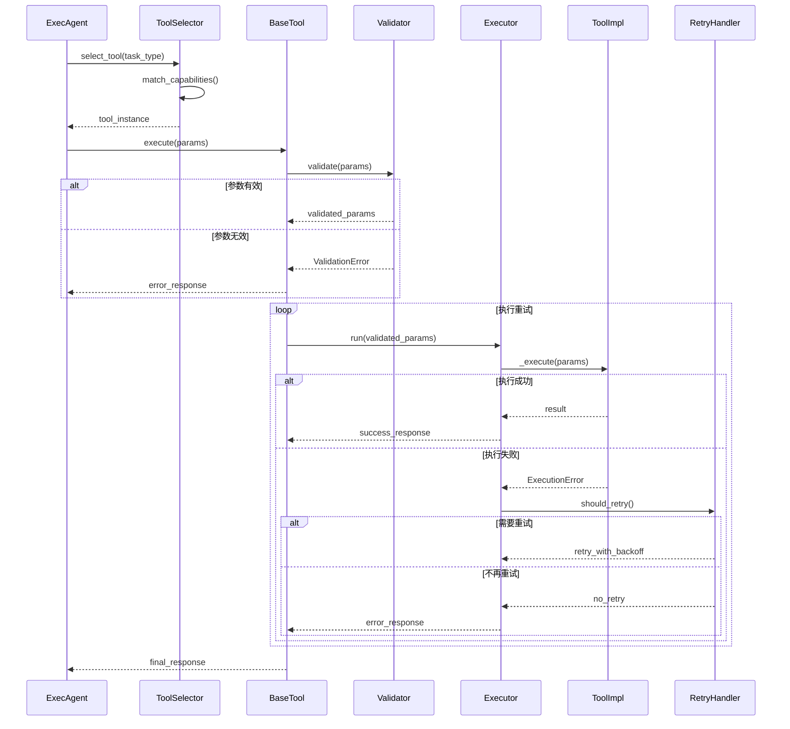
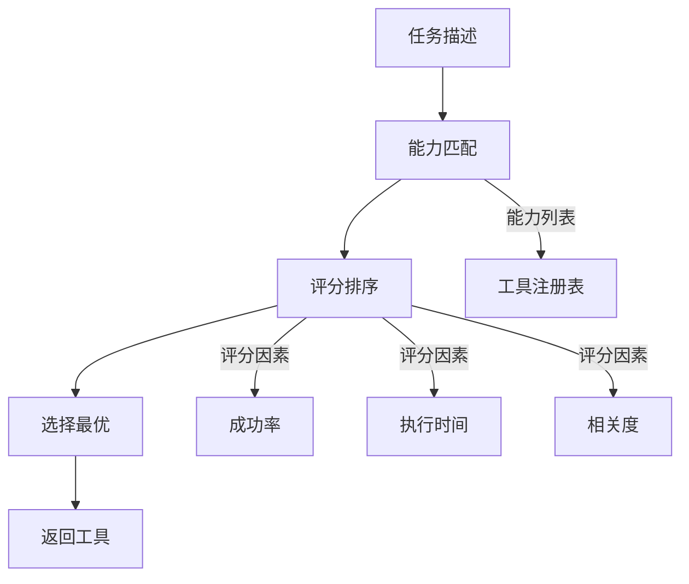

# Tool 模块架构

## 模块概述

Tool 模块是 OpsPilot 系统的能力扩展层，为 Agent 提供与外部系统交互的能力。模块采用 **工具基类** 统一接口规范，支持 **电商工具**、**数据库工具**、**HTTP 工具**、**文件工具**、**通知工具**、**MCP 工具** 等多种类型，共计 50+ 工具。

## 1. 组件架构

```mermaid
graph TB
    subgraph BASE["Base（工具基类）"]
        direction LR
        TOOL[BaseTool<br/>工具基类<br/>定义接口规范]
        SCHEMA[ToolSchema<br/>JSON Schema<br/>参数定义]
        VALID[Validator<br/>参数验证<br/>类型检查]
        EXEC[Executor<br/>执行器<br/>超时控制]
    end

    subgraph ECOMMERCE["Ecommerce（电商工具）"]
        direction LR
        PROD[ProductTool<br/>商品工具]
        ORDER[OrderTool<br/>订单工具]
        INV[InventoryTool<br/>库存工具]
    end

    subgraph DATABASE["Database（数据库工具）"]
        direction LR
        QUERY[QueryTool<br/>查询工具]
        MUTATE[MutateTool<br/>变更工具]
        TRANS[TransactionTool<br/>事务工具]
    end

    subgraph HTTP["HTTP（网络工具）"]
        direction LR
        HTTP_GET[GETTool<br/>GET 请求]
        HTTP_POST[POSTTool<br/>POST 请求]
        AUTH_MGR[AuthManager<br/>认证管理]
    end

    subgraph FILE["File（文件工具）"]
        direction LR
        READ[FileReader<br/>文件读取]
        WRITE[FileWriter<br/>文件写入]
        GLOB[FileGlobber<br/>文件搜索]
    end

    subgraph NOTIFY["Notification（通知工具）"]
        direction LR
        EMAIL[EmailNotifier<br/>邮件通知]
        SMS[SMSNotifier<br/>短信通知]
        WEBHOOK[WebhookNotifier<br/>Webhook]
    end

    subgraph HEALING["Healing（自愈工具）"]
        direction LR
        DIAG[DiagnosticTool<br/>诊断工具]
        FIX[FixTool<br/>修复工具]
        ROLLBACK[RollbackTool<br/>回滚工具]
    end

    subgraph MCP["MCP（外部工具）"]
        direction LR
        CLIENT[MCPClient<br/>MCP 客户端]
        MCP_DB[MCPDatabase<br/>外部数据源]
        SEARCH[MCPSearch<br/>外部检索]
    end

    subgraph RETRIEVAL["Retrieval（检索工具）"]
        direction LR
        VEC[VectorRetriever<br/>向量检索]
        HYB[HybridRetriever<br/>混合检索]
        CTX[ContextManager<br/>上下文管理]
    end

    subgraph EMBEDDING["Embedding（向量化）"]
        direction LR
        EMBED_OPEN[OpenAIEmbedding<br/>OpenAI 嵌入]
        EMBED_LOCAL[LocalEmbedding<br/>本地嵌入]
    end

    %% 连接
    TOOL --> SCHEMA
    TOOL --> VALID
    TOOL --> EXEC
    
    TOOL -.->|继承| ECOMMERCE
    TOOL -.->|继承| DATABASE
    TOOL -.->|继承| HTTP
    TOOL -.->|继承| FILE
    TOOL -.->|继承| NOTIFY
    TOOL -.->|继承| HEALING
    TOOL -.->|继承| MCP
    TOOL -.->|继承| RETRIEVAL
    TOOL -.->|继承| EMBEDDING
    
    RETRIEVAL --> VEC
    
    %% 样式
    classDef base fill:#e3f2fd,stroke:#1976d2,color:#0d47a1
    classDef ecommerce fill:#fff3e0,stroke:#f57c00,color:#e65100
    classDef database fill:#e8f5e9,stroke:#388e3c,color:#1b5e20
    classDef http fill:#e0f7fa,stroke:#0097a7,color:#006064
    classDef file fill:#f3e5f5,stroke:#7b1fa2,color:#4a148c
    classDef notify fill:#fce4ec,stroke:#c2185b,color:#880e4f
    classDef healing fill:#fff8e1,stroke:#ffa000,color:#ff6f00
    classDef mcp fill:#efebe9,stroke:#5d4037,color:#3e2723
    classDef retrieval fill:#f1f8e9,stroke:#558b2f,color:#33691e

    class TOOL,SCHEMA,VALID,EXEC base
    class PROD,ORDER,INV ecommerce
    class QUERY,MUTATE,TRANS database
    class HTTP_GET,HTTP_POST,AUTH_MGR http
    class READ,WRITE,GLOB file
    class EMAIL,SMS,WEBHOOK notify
    class DIAG,FIX,ROLLBACK healing
    class CLIENT,MCP_DB,SEARCH mcp
    class VEC,HYB,CTX,EMBED_OPEN,EMBED_LOCAL retrieval
```



## 2. 工具调用时序图



## 3. 文件清单

| 文件 | 类/函数 | 职责 |
|------|---------|------|
| `base.py` | `BaseTool` | 工具抽象基类 |
| `base.py` | `ToolSchema` | 工具 Schema 定义 |
| `base.py` | `Validator` | 参数验证器 |
| `ecommerce.py` | `ProductTool` | 商品操作工具 |
| `ecommerce.py` | `OrderTool` | 订单操作工具 |
| `ecommerce.py` | `InventoryTool` | 库存操作工具 |
| `database.py` | `QueryTool` | 数据库查询工具 |
| `database.py` | `MutateTool` | 数据库变更工具 |
| `http_client.py` | `HttpClientTool` | HTTP 请求工具 |
| `http_client.py` | `AuthManager` | 认证管理器 |
| `file_ops.py` | `FileReader` | 文件读取工具 |
| `file_ops.py` | `FileWriter` | 文件写入工具 |
| `notification.py` | `EmailNotifier` | 邮件通知工具 |
| `notification.py` | `WebhookNotifier` | Webhook 通知工具 |
| `healing.py` | `DiagnosticTool` | 诊断工具 |
| `healing.py` | `FixTool` | 修复工具 |
| `mcp.py` | `MCPClient` | MCP 客户端 |
| `mcp.py` | `MCPTool` | MCP 工具包装 |
| `mcp_db.py` | `MCPDatabase` | MCP 数据库工具 |
| `retriever.py` | `VectorRetriever` | 向量检索工具 |
| `retriever.py` | `HybridRetriever` | 混合检索工具 |
| `embeddings.py` | `OpenAIEmbedding` | OpenAI 嵌入工具 |
| `indexer.py` | `Indexer` | 索引构建工具 |
| `compressor.py` | `ContextCompressor` | 上下文压缩工具 |
| `context_manager.py` | `ToolContextManager` | 工具上下文管理 |
| `langchain_tools.py` | `LangchainToolWrapper` | Langchain 工具包装 |
| `internal.py` | `InternalTool` | 内部工具集 |
| `devops.py` | `DevopsTool` | 运维工具集 |

## 4. 工具分类

### 4.1 工具类型矩阵

| 分类 | 工具 | 输入 | 输出 | 特点 |
|------|------|------|------|------|
| 电商 | ProductTool | product_id | product_info | 同步 API |
| 电商 | OrderTool | order_params | order_id | 异步处理 |
| 数据库 | QueryTool | SQL, params | rows | 连接池 |
| 数据库 | MutateTool | SQL, params | affected_rows | 事务支持 |
| HTTP | GETTool | url, headers | response | 重试机制 |
| HTTP | POSTTool | url, data, headers | response | 认证支持 |
| 文件 | FileReader | file_path | content | 编码自动检测 |
| 文件 | FileWriter | file_path, content | success | 原子写入 |
| 通知 | EmailNotifier | to, subject, body | message_id | 模板支持 |
| 检索 | VectorRetriever | query, k | documents | ANN 搜索 |
| 向量 | EmbeddingTool | text | vector | 批量优化 |

## 5. 工具基类设计

### 5.1 基类接口

```python
from abc import ABC, abstractmethod
from typing import Any, Dict, Optional
from pydantic import BaseModel

class ToolSchema(BaseModel):
    name: str
    description: str
    parameters: Dict[str, Any]

class BaseTool(ABC):
    def __init__(self):
        self.schema = self.get_schema()
    
    @abstractmethod
    def get_schema(self) -> ToolSchema:
        """返回工具 Schema"""
        pass
    
    @abstractmethod
    async def execute(self, params: Dict[str, Any]) -> ToolResult:
        """执行工具"""
        pass
    
    def validate(self, params: Dict[str, Any]) -> bool:
        """验证参数"""
        pass
```

### 5.2 工具结果格式

```python
class ToolResult(BaseModel):
    success: bool
    data: Optional[Any] = None
    error: Optional[str] = None
    execution_time_ms: int = 0
    retries: int = 0
```

## 6. 工具选择机制

### 6.1 ToolSelector



### 6.2 选择策略

| 策略 | 说明 | 适用场景 |
|------|------|---------|
| 精确匹配 | 完全匹配工具能力 | 明确任务 |
| 模糊匹配 | 相似度最高的工具 | 模糊任务 |
| 多路选择 | 同时调用多个工具 | 结果验证 |
| 级联选择 | 串联多个工具 | 复杂任务 |

## 7. MCP 工具集成

### 7.1 MCP 协议

MCP（Model Context Protocol）是标准化外部工具接入的协议：


### 7.2 MCP 工具类型

| 类型 | 说明 | 示例 |
|------|------|------|
| database | 数据库查询 | PostgreSQL, MySQL |
| search | 搜索引擎 | Elasticsearch |
| api | 外部 API | ERP, CRM |
| filesystem | 文件系统 | 本地/远程 |

## 8. 重试机制

### 8.1 重试策略

```python
class RetryPolicy:
    max_retries: int = 3
    initial_delay: float = 1.0  # 秒
    max_delay: float = 60.0    # 秒
    exponential_base: float = 2.0
    jitter: bool = True
```

### 8.2 重试条件

| 条件 | 是否重试 |
|------|---------|
| 网络超时 | ✅ |
| 429 限流 | ✅ (退避) |
| 500 错误 | ✅ |
| 401 认证失败 | ❌ |
| 参数错误 | ❌ |

## 9. 工具注册

### 9.1 注册方式

```python
# 方式 1: 装饰器注册
@register_tool("product_query")
class ProductTool(BaseTool):
    ...

# 方式 2: 配置文件
# tools.yaml
tools:
  - name: product_query
    class: ProductTool
    enabled: true
```

### 9.2 工具发现

- 启动时自动扫描 `tools/` 目录
- 动态加载启用状态的工具
- 支持运行时热加载